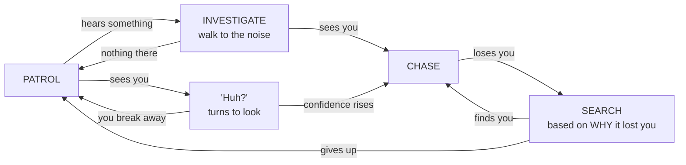
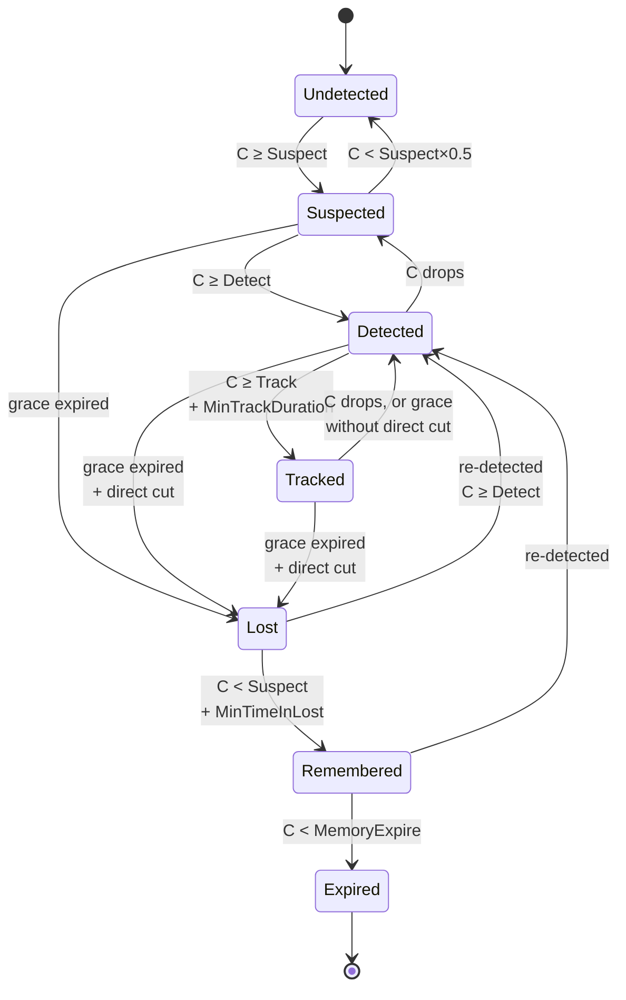
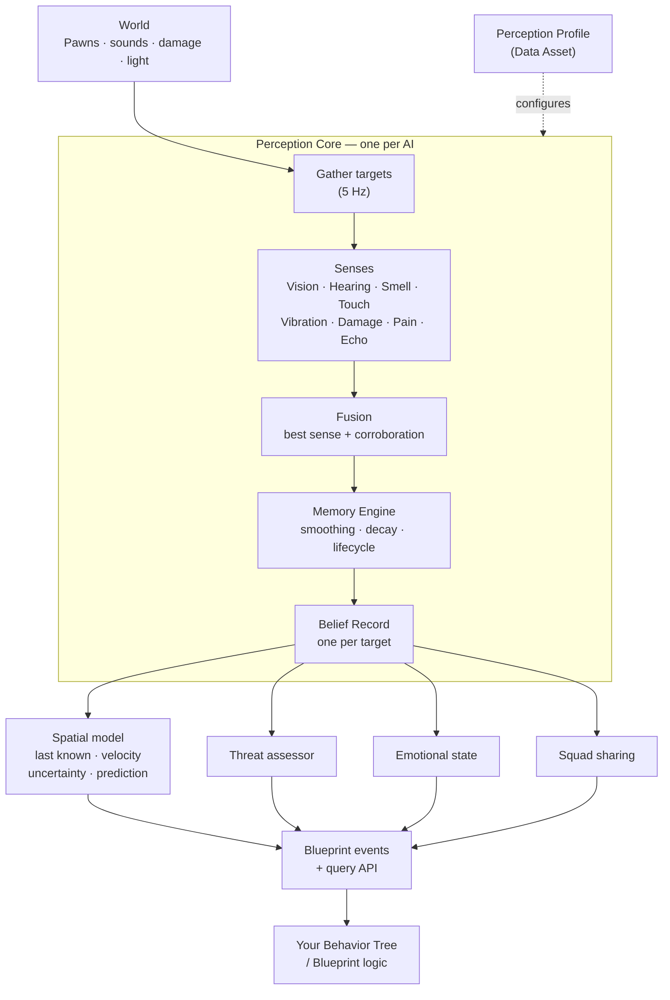
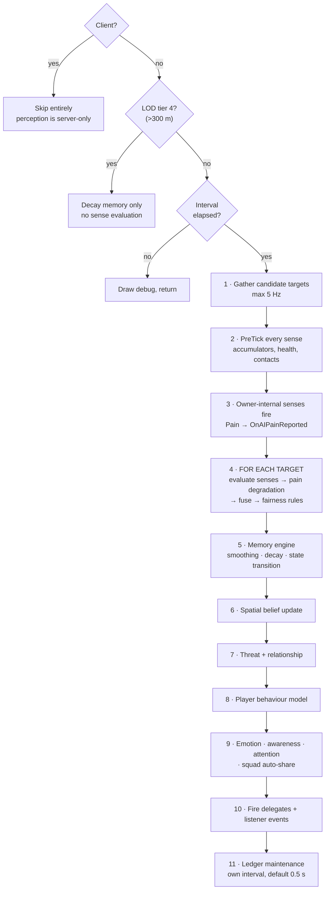
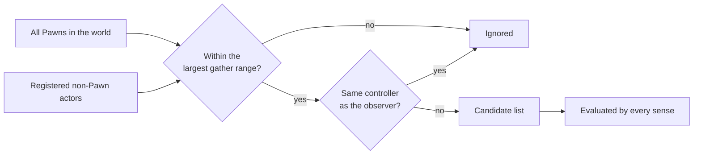

# APS — Advanced Perception System

**An 8-sense belief-based AI perception engine for Unreal Engine 5. Blueprint-first, zero C++ required.**

> **▶ Video walkthrough** — *What APS does (2 min).* Coming soon.
> When it is live, delete this block and uncomment the embed below.


APS is a drop-in replacement for Unreal's built-in `AIPerception` component. Instead of asking *"can this AI see the player: yes or no?"*, APS asks *"how confident is this AI that the player is at position X right now, and what is it going to do about it?"*

Every sense the AI owns produces a confidence value each tick. Those values are fused into one number per target. That number drives a lifecycle — **Undetected → Suspected → Detected → Tracked → Lost → Remembered → Expired** — and every transition fires a Blueprint event you can hook.

When the AI loses you, it does not simply forget. It records *why* it lost you (you broke line of sight / walked out of earshot / your scent faded), where you were, which direction you were heading, what cover object you ducked behind, and how long the chase lasted. All of that is readable from Blueprint and is exactly what a Behavior Tree needs to search intelligently instead of running a generic sweep.

Everything in this documentation is done in the Blueprint editor. C++ is optional and only mentioned where it adds something.

---

## The 60-second version

1. Create a **Perception Profile** data asset. It ships with Vision and Hearing already enabled.
2. Add the **Perception Core** component to your AI character. Assign the profile.
3. Add the **APS Perception Listener** component to the same character.
4. In the character's Event Graph, right-click → search **`OnAIDetect`** → override it.
5. Press Play. The AI sees you, builds confidence, and fires the event.

That is a working AI. Everything else in these docs is tuning and depth.

**→ Full setup walkthrough**

---

## Who it is for

- **Stealth games** — readable detection, safe rooms, reaction-time grace, telegraphed spotting.
- **Horror games** — creatures that hunt by sound, smell, ground vibration or echolocation with no line of sight.
- **Shooters** — peripheral vision, damage-aware threat scoring, squad intel sharing, combat roles.
- **Survival / animal AI** — wind-driven scent tracking, hearing-first predators, pack behaviour.
- **Anyone** who has hit the wall where Epic's perception "sees through a doorway" or "spots you the instant you enter the cone".

---

## What ships in the box

**8 built-in senses** — Vision, Hearing, Smell, Touch, Vibration, Damage, Pain, Echolocation. Up to 8 senses run per AI simultaneously, and you can add your own in Blueprint.

**Belief, not booleans** — continuous 0–1 confidence per target with a full lifecycle, smoothing, and configurable decay curves.

**Multi-point visibility** — the AI traces against head, chest, pelvis and shoulders (or your own socket list) and gets a *percentage exposed*, not a yes/no. Lean out of cover and only your head is visible — the AI reacts accordingly.

**Three vision cones** — a focal cone, an optional wider/weaker peripheral cone, and an optional rear cone that only registers *moving* targets. Plus keyhole vision (narrow at distance, wide up close).

**Vision bound to the mesh** — the cone origin and direction can come from a head socket, so head turns and aim offsets actually move the AI's gaze. A turn-rate limit stops the cone snapping to a target before the body has physically turned.

**Real occlusion** — multi-channel line-of-sight tests with per-physical-surface transmission. Glass is transparent, foliage dampens, concrete blocks. Optionally other pawns block sight too.

**Per-target lighting** — a shadow trace at the target's location, so a dark corner is genuinely dark, not just "night time".

**Spatial belief** — last known position, smoothed velocity and acceleration, an uncertainty radius that grows the longer you stay hidden, and predictive extrapolation of where you probably went.

**Episodic memory** — the last 5 engagements with each target: how it ended, where, which way you fled, peak threat.

**Emotional state** — five channels (Fear, Aggression, Curiosity, Alertness, Panic) driven by perception, with a dominant emotion and change events.

**Threat assessment** — a weighted composite score from confidence, damage taken, number of corroborating senses and relationship, mapped to five threat levels.

**Squad coordination** — range-gated intel sharing, positional alerts, and exclusive combat role claiming (Flanker, Suppressor, Investigator…).

**Player behaviour model** — observes how you play using only what the AI could legitimately perceive (movement style, engagement style, favourite hiding spots) and can persist it across sessions.

**Fairness rules** — first-spot reaction delay, telegraph events for "huh?" barks, off-screen hearing penalty, and designer-defined never-search zones for guaranteed safe rooms.

**Replication** — an opt-in compact per-target summary replicated to clients, so detection meters and spectator HUDs work without hand-rolled plumbing.

**7-mode debug suite** — on-screen overlays for Sense, Memory, Brain, Squad, Delegates, Player Model and Environment, plus a one-node print function for every single event.

---

## How it compares to Epic's AIPerception

| | Epic `AIPerception` | APS |
|---|---|---|
| Detection result | Boolean — seen / not seen | Continuous 0–1 confidence per target |
| Line of sight | One trace to capsule centre | Up to 5 weighted sample points → % exposed |
| Cover behaviour | Head fully exposed above a crate still reports "not seen" | Partial exposure produces partial confidence |
| Stance | Ignored | Crouched / prone can require more visible points |
| Vision cone | One symmetric 3D cone | Focal + peripheral + rear-motion + keyhole, separate vertical FOV |
| Cone origin | Actor root + fixed height | Optional mesh socket — follows head animation |
| Cone direction | Control rotation (snaps to MoveTo targets) | Actor / control / socket / blended, with a turn-rate limit |
| Occlusion | One collision channel | Multiple channels + per-surface transmission (glass, foliage, smoke) |
| Light | Not modelled | Global ambient *and* per-target sun-shadow tracing |
| Losing a target | Just stops reporting | Records loss reason, direction, cover actor, and an episode |
| Memory | Age-out only | Decay curves, long-term memory strength, refresh bonus, Remembered state |
| Prediction | None | Velocity/acceleration estimation, uncertainty radius, predicted position |
| Multi-sense | Senses reported independently | Fused into one confidence with a corroboration bonus |
| Threat / emotion | None | Weighted threat scoring, 5 emotion channels |
| Squad | None | Intel sharing, alerts, exclusive combat roles |
| Fairness tooling | None | Reaction delay, telegraph, off-screen penalty, safe rooms |
| Debug | Gameplay Debugger category | 7-mode overlay + per-event print nodes |

> **You can run both.** APS does not disable or interfere with `AIPerception`. If you already have systems bound to Epic's perception, they keep working while you migrate.

---

## Requirements

| | |
|---|---|
| **Engine version** | Unreal Engine 5.2 |
| **Project type** | Blueprint or C++ project — a Blueprint-only project works, the plugin ships its own compiled module |
| **Platforms** | Win64 (Editor + Game). Other platforms compile from source with the engine's normal toolchain. |
| **Module dependencies** | Core, CoreUObject, Engine, AIModule, GameplayTasks, GameplayTags, GameplayDebugger, PhysicsCore, NavigationSystem — all engine modules, no third-party code |
| **Network** | Server-authoritative. Perception does not run on clients. Optional replicated summary for client UI. |

APS has **no external dependencies**, ships **no content assets you are forced to use**, and adds **no required project settings**.

---

## What APS does *not* do

Being clear about scope saves you time:

- **It is not a Behavior Tree.** APS tells your AI *what it believes*. What the AI *does* about it is your BT or state machine. Behavior Trees shows the wiring.
- **It does not move your AI.** No pathfinding, no steering, no cover selection. It reports where to search; you drive the movement.
- **It does not play audio.** `Emit Sound` tells the AI a sound happened — you still play your own `Sound Cue` alongside it.
- **It does not manage health.** The Pain sense models *perception impairment*, not hit points. You call it from your own damage/health system.
- **It does not ship animations, meshes or a sample level** — it is a runtime system, not a template project.

---

# Documentation

## I want to…

| | Go to |
|---|---|
| …see whether this fits my project | You're on that page. Read up ↑ |
| …get something working right now | Install & Your First AI |
| …build a real guard end to end | Tutorial: A Complete Guard |
| …look up a node or a number, fast | Cheat Sheet |
| …do one specific thing | How-To Guides — 25 recipes |
| …move off Epic's `AIPerception` | Migrating from AIPerception |
| …understand why it behaves like that | Core Concepts · How It Works |
| …fix something that's wrong | Troubleshooting & FAQ |
| …make it faster | Performance |
| …copy a ready-made AI archetype | Archetype Cookbook |

---

## 🚀 Get started

| Page | What it covers | Time |
|---|---|---|
| **Install & Your First AI** | Install, a working detection, setup checklist | 15 min |
| **Tutorial: A Complete Guard** | Patrol → hear → investigate → chase → search → give up, with a Behavior Tree | 45 min |
| **Cheat Sheet** | Every node, event, threshold and fast fix on one page | — |

## 🔧 How-to

| Page | What it covers |
|---|---|
| **How-To Guides** | 25 task recipes — hearing, occlusion, search, squads, HUD meters, creatures, difficulty |
| **Migrating from AIPerception** | Concept mapping, step-by-step port, an Epic-parity profile |

## 💡 Understand

| Page | What it covers |
|---|---|
| **Core Concepts** | Confidence, fusion, the lifecycle, awareness, attention, loss reasons, memory |
| **How It Works** | Architecture, the tick pipeline, LOD, where state lives, extension points |

## 👁 Senses & configuration

| Page | What it covers |
|---|---|
| **The Senses** | All 8 senses, what feeds each one, per-sense formulas and tuning |
| **Perception Profile Reference** | Every setting on the profile data asset, with defaults |
| **Sound System** | Sound data assets, filters, the per-agent pipeline |
| **Pain & Damage** | Damage reactions, pain types, sense degradation |

## 🧠 Systems

| Page | What it covers |
|---|---|
| **Squad & Relationships** | Intel sharing, alerts, combat roles, teams |
| **Player Behavior Model** | AI that learns how you play, across sessions |
| **Environment & Fairness** | Light, weather, wind, safe rooms, reaction time, telegraphing |
| **Multiplayer** | Server authority, replicated detection meters, the relay component |

## ⌨ Scripting

| Page | What it covers |
|---|---|
| **Blueprint API** | Every Blueprint node, grouped by category |
| **Events Reference** | Every event, its parameters, exactly when it fires |
| **Behavior Trees** | Blackboard wiring, search behaviour driven by loss reason |

## 📦 Build & ship

| Page | What it covers |
|---|---|
| **Archetype Cookbook** | Copy-paste settings: stealth guard, dog, zombie, blind creature, sniper, camera, soldier, horror stalker |
| **Custom Senses** | Build your own sense in Blueprint or C++, and the stimulus bus |
| **Debugging** | The 7-mode overlay and the one-node print library |
| **Performance** | LOD tiers, tick budgets, scaling to hundreds of agents |
| **Troubleshooting & FAQ** | Every common failure, and the settings that are inert in v2.0 |
| **Enum & Type Reference** | Every enum value, struct field and constant |

---

## A note on accuracy

Every formula, default value and firing condition in these pages was read out of the v2.0 source rather than inferred from the property names. Where a setting exists in the editor but is not wired up, or where behaviour differs from what its name implies, it is flagged inline with ⚠ rather than quietly omitted. Troubleshooting collects those in one place.

---

*Documentation for APS v2.0 · Unreal Engine 5.2 · by AuraGame*


---

# Install & Your First AI

**For:** first-time users · **Time:** ~15 minutes · **Outcome:** an AI that detects you and fires Blueprint events.

> **▶ Video walkthrough** — *Install and first detection (6 min).* Coming soon.
> When it is live, delete this block and uncomment the embed below.


## Installation

### From Fab / Epic Games Launcher

1. In the Epic Games Launcher, open **Library → Fab Library**, find **APS — Advanced Perception System**, and click **Install to Engine**. Pick your 5.2 engine.
2. Open your project.
3. **Edit → Plugins**, search `APS`, tick **Enabled**.
4. Restart the editor when prompted.

### Manual install (into one project)

1. Close the editor.
2. Copy the `APS` folder into `YourProject/Plugins/APS/`. The `APS.uplugin` file must sit directly inside that folder.
3. Reopen the project. If you are on a Blueprint-only project the editor will offer to build the module — accept.
4. **Edit → Plugins → APS → Enabled**, restart.

### Verify it is working

Right-click in the Content Browser. You should see **Miscellaneous → Data Asset** offering `PerceptionProfile`, `SoundTypeDefinition`, `SoundFilterProfile` and `PainTypeDefinition` in the class picker.

Open any Blueprint, right-click in the graph and type `APS`. You should get a long list of nodes.

---

## Your first AI in 10 minutes

This gets you a guard that spots the player, builds confidence over time, and prints when it detects them. No C++, no Behavior Tree yet.

### Step 1 — Create a Perception Profile

Content Browser → right-click → **Miscellaneous → Data Asset** → choose **PerceptionProfile** → name it `DA_Profile_Guard`.

Open it. It already has **Vision** and **Hearing** in the `Sense Classes` array, and every other setting has a working default. **You do not have to change anything yet.**

> A brand-new profile is deliberately functional out of the box. An empty sense list would make the AI silently perceive nothing, which is the single most common first-run failure — so the two senses almost every game wants are already there.

### Step 2 — Add the component to your AI

Open your AI character Blueprint (a `Character` or `Pawn` — for example `BP_Guard`).

**Add Component → Perception Core.**

Select it, and in the Details panel set:

- **Profile** → `DA_Profile_Guard`
- **Debug Settings → b Enabled** → ✅ (turn this off before shipping; it is compiled out of Shipping builds anyway)

> **Put it on the Pawn, not the AIController.** It works on either, but AIControllers never replicate, so putting it on the Pawn keeps multiplayer simple. See Multiplayer.

### Step 3 — Add the Listener component

**Add Component → APS Perception Listener.**

That is the whole setup. This component gives you every perception event as an overridable Blueprint event with **no delegate binding**, exactly like the old `OnSeePawn` from `PawnSensing`.

### Step 4 — Handle an event

In `BP_Guard`'s Event Graph, right-click and search **`OnAIDetect`**. Add the **Event On AI Detect** node.

Drag off it and add a **Print String**. Wire `Target` into the string via **Get Display Name**.

Do the same for **Event On AI Lost** so you can see both sides.

### Step 5 — Make the player perceivable (optional but recommended)

Open your player character and **Add Component → APS Target Component**.

You do not strictly need this — APS automatically considers every `Pawn` in the world as a candidate target. The Target Component adds:

- proper multi-point visibility sampling from *your* skeleton's sockets,
- stance awareness (crouching actually hides you),
- a `Visibility Multiplier` for camouflage or cloaking,
- a `Light Level Override` if you have your own light-gem system.

Leave every setting at default for now.

### Step 6 — Play

Drop `BP_Guard` in the level, possess your player, walk into its vision cone.

You should see:

- a **vision cone** drawn on the ground,
- a **text block** above the guard showing per-sense confidence and lifecycle state,
- your **Print String** firing when confidence crosses the Detect threshold.

Walk behind a wall. Watch the state go `Detected → Lost`, then decay to `Remembered` and finally `Expired`.

---

## Adding hearing (the step everybody misses)

**Hearing does not work automatically.** APS never guesses that a footstep happened — you tell it. This is deliberate: it means your AI hears exactly what your game decides is audible, and nothing else.

### Step 1 — Create a sound type

Content Browser → **Data Asset → SoundTypeDefinition** → name it `DA_Sound_Footstep`.

| Setting | Value |
|---|---|
| Sound Name | `Footstep` |
| Category | `Enemy` |
| Alert Level | `Normal` |
| Base Loudness | `1.0` |
| Max Range | `800` |
| Max LOD Tier | `1` |

Make a second one, `DA_Sound_Gunshot`: Alert Level `Loud`, Base Loudness `3.0`, Max Range `4000`, Priority `9`, Max LOD Tier `3`.

### Step 2 — Emit it

In your **player character**, open the walk/run animation montage or the locomotion animation, add a **Footstep** anim notify, and in the character's `AnimNotify_Footstep` event:

```
Event AnimNotify_Footstep
  → Emit Sound
      World Context : Self
      Source        : Self
      Sound Type    : DA_Sound_Footstep
```

That is it. Every AI within `Max Range` that passes its own sound filter now hears it, attenuated by distance and muffled by any walls in between.

For a location-based sound with no source actor (explosion, trap, falling crate) use **Emit Sound At Location** instead.

> Play your actual audio however you normally would — `Emit Sound` only feeds the perception system.

---

## Setup checklist

Copy this into your project notes.

**On the AI:**
- [ ] `Perception Core` component added
- [ ] `Profile` assigned (not None)
- [ ] `APS Perception Listener` added (only if you want no-binding events)
- [ ] `APS Relationship` added (only if you use teams — Squad & Relationships)
- [ ] Squad ID set from Begin Play (only if you use squads)

**On the player / targets:**
- [ ] `APS Target Component` added (recommended)
- [ ] Non-Pawn actors call `Register Perceivable Actor` on Begin Play

**In the world:**
- [ ] Sound types created and `Emit Sound` called from footsteps / weapons
- [ ] `Set Sun Direction` called once from your level Blueprint if you use per-target lighting
- [ ] `Set Ambient Light` driven by your day/night cycle if you have one

---

## Where things live in the editor

| Thing | Where to find it |
|---|---|
| Perception Core | Add Component → search `Perception Core` |
| APS Perception Listener | Add Component → search `APS Perception Listener` |
| APS Target Component | Add Component → search `APS Target` |
| APS Relationship | Add Component → search `APS Relationship` |
| Perception Profile | Content Browser → Data Asset → `PerceptionProfile` |
| Sound Type / Filter | Content Browser → Data Asset → `SoundTypeDefinition` / `SoundFilterProfile` |
| Pain Type | Content Browser → Data Asset → `PainTypeDefinition` |
| Blueprint nodes | Right-click in any graph → type `APS` |
| World settings (light, wind, zones) | `Get APS Subsystem` → drag off it |

---


---

# Tutorial: A Complete Guard

**Time:** ~45 minutes
**You'll need:** Install & Your First AI done, a level with some cover, and a player character you can walk around with.
**No C++.**

> **▶ Video walkthrough** — *Build a complete guard (20 min).* Coming soon.
> When it is live, delete this block and uncomment the embed below.


---

## What you're building

By the end the guard runs a full perception loop, and every step of it is something you can watch happen:



The interesting part is `SEARCH`. A guard that always runs the same search looks stupid. This one checks the cover object you actually hid behind when it lost sight of you, and investigates the *area* — without chasing — when it only lost a sound.

---

# Part 1 — The profile (5 min)

Content Browser → right-click → **Miscellaneous → Data Asset** → **PerceptionProfile** → name it `DA_Profile_Guard`.

Open it and set these. Everything not listed stays at its default.

| Section | Setting | Value |
|---|---|---|
| Ranges | `Vision Max Range` | `2200` |
| Ranges | `Hearing Max Range` | `1800` |
| Detection | `Vision Half Angle Deg` | `55` |
| Detection \| Cones | `b Enable Peripheral Cone` | ✅ |
| Detection \| Eyes | `Eye Turn Rate Deg Per Sec` | `200` |
| Awareness | `Suspect Threshold` | `0.18` |
| Awareness | `Detect Threshold` | `0.40` |
| Awareness | `Track Threshold` | `0.65` |
| Loss | `Vision Loss → Grace Time` | `0.8` |
| Memory | `Min Time In Lost` | `8.0` |
| Fairness | `First Spot Reaction Time` | `0.4` |
| Fairness | `Telegraph Threshold` | `0.22` |

**Why these:** `Grace Time` at 0.8 means a thin pillar doesn't instantly erase you — the guard keeps staring at where you were. `Min Time In Lost` at 8 forces it to actually search rather than shrug and walk off. The two Fairness values are what make detection feel readable rather than arbitrary.

---

# Part 2 — The guard actor (5 min)

Open your AI character Blueprint (`BP_Guard`).

**Add Component ×2:**
- **Perception Core** → Details → `Profile` = `DA_Profile_Guard`
- **APS Perception Listener**

On the Perception Core, also set:
- `Debug Settings → b Enabled` ✅
- `Debug Settings → b Nearest AI Only` ✅

**On your player character:** Add Component → **APS Target Component**. Leave everything default.

> ### ✅ Checkpoint 1
> Press Play and walk into the guard's view. You should see a vision cone drawn on the ground and a text block above the guard reading something like `[DETECTED] 62% 1.4s` with a per-sense breakdown. If you don't, the profile isn't assigned — that's the cause 90% of the time.

---

# Part 3 — Make your footsteps audible (5 min)

Hearing does nothing until you emit sound. This is deliberate: the guard hears exactly what you decide is audible.

**1.** Content Browser → **Data Asset → SoundTypeDefinition** → `DA_Sound_Footstep`:

| Field | Value |
|---|---|
| `Sound Name` | `Footstep` |
| `Category` | `Enemy` |
| `Alert Level` | `Normal` |
| `Base Loudness` | `1.0` |
| `Max Range` | `900` |
| `Max LOD Tier` | `1` |

**2.** In your player's walk/run animation, add an anim notify named `Footstep`.

**3.** In the player Blueprint:

```
Event AnimNotify_Footstep
  └─► Emit Sound
        World Context : Self
        Source        : Self
        Sound Type    : DA_Sound_Footstep
```

> ### ✅ Checkpoint 2
> Stand behind a wall, out of sight, and walk on the spot. The guard's debug text should show `Hearing` climbing above 0%, and the state should reach `SUSPECTED`. Stop moving and watch it decay. If Hearing stays at 0%, your notify isn't firing — test it with a Print String first.

---

# Part 4 — Push perception into the Blackboard (10 min)

The pattern: **events write to the Blackboard, the Behavior Tree reads it.** Never poll APS from a BT service every tick when an event already tells you.

## 4a. Create the Blackboard

New **Blackboard** asset → `BB_Guard`. Add these keys:

| Key | Type |
|---|---|
| `TargetActor` | Object *(base class: Actor)* |
| `bHasTarget` | Bool |
| `LastKnownPosition` | Vector |
| `SearchRadius` | Float |
| `LossReason` | Enum → `ELossReason` |
| `LossDirection` | Vector |
| `LastCoverActor` | Object *(base class: Actor)* |
| `InvestigateLocation` | Vector |
| `PatrolPoint` | Vector |

## 4b. Wire the events

In `BP_Guard`'s Event Graph. Get the Blackboard once and promote it to a variable to keep the graph readable:

```
Event Begin Play
  └─► Get Controller → Cast to AIController → Get Blackboard
        └─► Promote to variable "BB"
```

### Attention changed → set the target

```
Event On Attention Changed (Old Target, New Target)
  ├─► BB → Set Value as Object ("TargetActor", New Target)
  └─► BB → Set Value as Bool   ("bHasTarget", New Target → Is Valid)
```

**Use this, not `On AI Detect`, for the target key.** Attention is sticky — it won't thrash between two equally-scored targets and force the tree to re-plan every tick.

### Telegraph → the "huh?" moment

```
Event On AI Telegraph (Target, Confidence)
  ├─► Play Sound at Location (your "hmm?" cue)
  └─► Get Controller → Cast to AIController → Set Focus (Target)
```

### Heard something → investigate, but don't interrupt a chase

```
Event On AI Hear (Location, Loudness, Sound Type Name)
  └─► Branch: BB → Get Value as Bool ("bHasTarget") == false
        True → BB → Set Value as Vector ("InvestigateLocation", Location)
```

### Lost the target → set up the search

This is the important one.

```
Event On AI Lost (Target, Last Known, Predicted, Last Cover Actor)
  └─► Sequence
        ├─ BB → Set Value as Vector ("LastKnownPosition", Last Known)
        ├─ BB → Set Value as Object ("LastCoverActor",    Last Cover Actor)
        ├─ BB → Set Value as Float  ("SearchRadius",
        │                             Perception Core → Get Uncertainty Radius (Target))
        ├─ BB → Set Value as Enum   ("LossReason",
        │                             Perception Core → Get Loss Reason (Target))
        └─ BB → Set Value as Vector ("LossDirection",
                                      Perception Core → Get Loss Direction (Target))
```

### Gave up → clear everything

```
Event On AI Forget (Target)
  ├─► BB → Set Value as Bool ("bHasTarget", false)
  ├─► BB → Clear Value ("TargetActor")
  ├─► BB → Clear Value ("LastKnownPosition")
  └─► Get Controller → Cast to AIController → Clear Focus (Gameplay)
```

> ### ✅ Checkpoint 3
> Add a temporary `Print String` to each of the five events. Play, get spotted, then break line of sight and hide. You should see the sequence:
> `Telegraph → Detect → Track → Lost → (8+ seconds) → Remember → Forget`.
>
> If `Lost` fires the instant you step behind cover, your `Vision Loss → Grace Time` didn't save. If `Forget` fires immediately after `Lost`, check `Min Time In Lost`.

---

# Part 5 — The Behavior Tree (15 min)

New **Behavior Tree** → `BT_Guard`, set its Blackboard to `BB_Guard`.

## The shape

```
Root
└── Selector
    ├── [Blackboard: bHasTarget is set]  ────────── CHASE
    ├── [Blackboard: LastKnownPosition is set]  ─── SEARCH
    ├── [Blackboard: InvestigateLocation is set]  ─ INVESTIGATE
    └── PATROL
```

A Selector runs its children left to right and stops at the first that succeeds. Because the decorators get progressively less specific, the guard naturally prioritises: chase beats search, search beats investigate, investigate beats patrol.

## CHASE branch

```
Sequence
├── Task: Move To         (Blackboard Key: TargetActor, Acceptable Radius: 150)
└── Task: Wait            (0.5)
```

Add a **Blackboard** decorator on the Sequence: Key `bHasTarget`, Key Query `Is Set`, and set **Observer Aborts → Both**. That last part matters — it lets the tree bail out of a chase the moment the target is lost.

## SEARCH branch — the part that makes it look smart

```
Selector  [decorator: LastKnownPosition Is Set, Observer Aborts: Lower Priority]
│
├── Sequence  [decorator: LossReason == Occluded]
│   ├── Move To (LastKnownPosition)
│   ├── Move To (LastCoverActor)          ← the actual object you hid behind
│   ├── Wait (2.0)
│   └── Task: Search Step  ×2
│
├── Sequence  [decorator: LossReason == SoundFaded]
│   ├── Move To (LastKnownPosition)
│   ├── Wait (3.0)
│   └── Task: Give Up                     ← investigate, don't chase
│
├── Sequence  [decorator: LossReason == OutOfRange]
│   ├── Move To (LastKnownPosition)
│   ├── Task: Move Along Loss Direction
│   └── Task: Search Step  ×3
│
└── Sequence                              ← default
    ├── Move To (LastKnownPosition)
    └── Task: Search Step  ×3
```

For the `LossReason` decorators use **Blackboard → Key: LossReason, Key Query: Is Equal To**, and pick the enum value.

### Task: Search Step

New **BTTask Blueprint** → `BTT_SearchStep`:

```
Event Receive Execute AI
  └─► Get Random Reachable Point In Radius
        Origin = BB "LastKnownPosition"
        Radius = BB "SearchRadius"
  └─► AI Move To (that point)
        On Success → Wait 1.0 → Finish Execute (Success)
        On Fail    → Finish Execute (Success)     // don't stall the tree
```

`SearchRadius` grows the longer you stay hidden, so repeating this task naturally spirals the search outward. No timer logic of your own.

### Task: Move Along Loss Direction

```
Event Receive Execute AI
  └─► Branch: BB "LossDirection" → Is Nearly Zero
        True  → Finish Execute (Success)          // target wasn't moving
        False → AI Move To (LastKnownPosition + LossDirection × 600)
                  → Finish Execute (Success)
```

### Task: Give Up

```
Event Receive Execute AI
  ├─► BB → Clear Value ("LastKnownPosition")
  ├─► BB → Clear Value ("InvestigateLocation")
  └─► Finish Execute (Success)
```

## INVESTIGATE branch

```
Sequence  [decorator: InvestigateLocation Is Set, Observer Aborts: Lower Priority]
├── Move To (InvestigateLocation)
├── Wait (3.0)
└── Task: Give Up
```

## PATROL branch

Whatever you already have. If you have nothing:

```
Sequence
├── Task: Pick Patrol Point     (Get Random Reachable Point In Radius around home, → BB PatrolPoint)
├── Move To (PatrolPoint)
└── Wait (2.0)
```

## Run the tree

In `BP_Guard`'s AI Controller:

```
Event On Possess
  └─► Run Behavior Tree (BT_Guard)
```

> ### ✅ Checkpoint 4
> Play. The guard should patrol. Walk into view — it turns and says "huh?", then commits and chases. Break line of sight behind a crate. It should go to the crate, look around, then spiral outward. After about 8 seconds it gives up and returns to patrol.
>
> Now hide *and stay still* somewhere it never had sight of you, and just make a noise. It should walk to the noise, look around for 3 seconds, and go back to patrol **without** chasing. That difference — chasing when it saw you, investigating when it only heard you — is the whole point.

---

# Part 6 — Watch what it's thinking (5 min)

Bind these to keys in your player controller for live inspection:

```
Key 1 → Perception Core → Debug Cycle Display Mode
Key 2 → Perception Core → Debug Toggle Freeze Snapshot
Key 3 → Perception Core → Debug Toggle Pause
```

Then cycle through the modes while playing:

| Mode | What to look for |
|---|---|
| **Sense** | Which sense is driving detection, and the fused vs smoothed values |
| **Memory** | Time since sensed, uncertainty radius growing while you hide |
| **Brain** | Threat level, dominant stimulus, encounter count |
| **Delegates** | Which event fired last and when — settles "is my BP not bound, or did it never fire?" |

Freezing the snapshot mid-chase and reading the Sense panel is the fastest way to understand why the guard did what it did.

---

## What to change next

You now have the full loop. Each of these is a small edit with a big behavioural change:

| Try this | Effect |
|---|---|
| `Min Time In Lost` → `20` | A far more persistent, tense guard |
| `b Keyhole Vision` ✅ | You can slip past at distance but not up close |
| Add `Sense: Vibration`, `Vibration Min Speed` `150` | Crouch-walking becomes meaningful |
| Add a second guard, `Set Squad ID` on both, `b Auto Share On Detect` ✅ | One spots you, both converge |
| `First Spot Reaction Time` → `0.0` | Feel how much less fair it becomes |
| Register a never-search zone around a room | A guaranteed safe space (see the recipe) |

Ready-made settings for other archetypes — dog, zombie, sniper, horror stalker — are in the Archetype Cookbook.

---


---

# Cheat Sheet

*Everything you use daily, on one page. Bookmark this one.*

---

## Minimum setup

```
1.  Data Asset → PerceptionProfile        →  DA_Profile_MyAI
2.  AI Character → Add Component          →  Perception Core     (assign the profile)
3.  AI Character → Add Component          →  APS Perception Listener
4.  Player       → Add Component          →  APS Target Component
5.  Footstep notify → Emit Sound (Self, DA_Sound_Footstep)
```

---

## The 10 nodes you will actually use

| Node | Returns | For |
|---|---|---|
| **Get Attention Target** | Actor | The target to chase. Use this, not `Get Top Target`. |
| **Get Last Known Position** | Vector | Where to search |
| **Get Loss Reason** | enum | **How** to search — branch on it |
| **Get Uncertainty Radius** | float | Search radius, grows over time |
| **Get Awareness Level** | enum | Alert music, weapon poses, HUD |
| **Get Belief Data** | struct | Everything about one target |
| **Get Sense Contributions** | map | Did it *see* me or only *hear* me? |
| **Emit Sound** | — | Make a noise the AI can hear |
| **Set Target Confidence** | — | Force a detection (raises only) |
| **Set Profile** | — | Hot-swap the whole perception setup |

## The 8 events you will actually use

| Event | Fires when | Typical response |
|---|---|---|
| **On AI Telegraph** | About to be noticed | "Huh?" bark, head turn |
| **On AI Suspect** | Something's there | Look, walk over |
| **On AI Detect** | Confirmed | Alert, take cover, call out |
| **On AI Track** | Locked on | Chase, shoot |
| **On AI Lost** | Contact broken | **Read `Get Loss Reason`**, then search |
| **On AI Forget** | Given up | Back to patrol |
| **On Attention Changed** | New focus target | Cancel pursuit, re-plan |
| **On AI Damaged** | Took a hit | React to unseen attacker |

---

## Loss reason → what the BT should do

| Loss Reason | Meaning | Action |
|---|---|---|
| `Occluded` | Broke line of sight | Go to last known, search **that cover object** |
| `OutOfRange` | Walked out of range | Move to last known, expand along `Get Loss Direction` |
| `SoundFaded` | Noise stopped | Investigate the area — **don't chase** |
| `ScentLost` | Scent dissipated | Follow `Get Loss Direction` as a trail |
| `SensorDropout` | Signal just stopped | Short look, resume patrol |
| `TargetDestroyed` | Actor gone | Clear the target |

---

## Sense → what feeds it

| Sense | Needs from you | Passes walls? |
|---|---|---|
| **Vision** | Nothing | No |
| **Hearing** | `Emit Sound` — **required** | No |
| **Smell** | Nothing | Partly |
| **Touch** | Nothing (auto-wired) | n/a |
| **Vibration** | Nothing for movement | **Yes** |
| **Damage** | Nothing (auto-wired) | **Yes** |
| **Pain** | `Report Pain From Definition` | n/a |
| **Echolocation** | Nothing | **Yes** |

---

## Default thresholds

```
0.00 ─────────────────────────────────────────────────── 1.00
     │        │           │              │         │
   0.15     0.25        0.35           0.60      0.85
  Suspect  Telegraph   Detect         Track    Fully Aware
```

| Confidence | Lifecycle state | Awareness level |
|---|---|---|
| ≥ 0.85 | Tracked | **Fully Aware** |
| ≥ 0.60 | **Tracked** | Alerted |
| ≥ 0.35 | **Detected** | Suspicious |
| ≥ 0.15 | **Suspected** | Peripheral |
| < 0.15 | Undetected | Unaware |

Step-downs need a **0.04** margin below the threshold (hysteresis).

---

## Difficulty dial

| Setting | Easy | Normal | Hard |
|---|---|---|---|
| Suspect / Detect / Track | 0.25 / 0.50 / 0.75 | 0.15 / 0.35 / 0.60 | 0.10 / 0.25 / 0.45 |
| Confidence Rise Rate | 3.0 | 5.0 | 7.0 |
| First Spot Reaction Time | 0.8 | 0.4 | 0.1 |
| Min Time In Lost | 3 | 8 | 15 |

Leave cone angles and occlusion **identical** across difficulties — the player's mental model of what a guard can see shouldn't change.

---

## Performance dial

| Lever | Effect |
|---|---|
| `Base Update Interval` 0.1 → 0.2 | **Halves** perception cost |
| Trim APS Target Component samples 5 → 3 | −40% vision traces |
| `Max Tracked Targets` 16 → 4 | Less memory, faster sorting |
| One occlusion channel instead of three | −66% trace count |
| LOD tier 4 (>300 m) | Suspended automatically |

---

## Debug in 4 keys

```
Perception Core → Debug Settings → b Enabled  ✅
                                 → b Nearest AI Only  ✅ (once you have 3+ AI)

F1 → Debug Cycle Display Mode     F3 → Debug Toggle Pause
F2 → Debug Toggle Freeze Snapshot F4 → Debug Print Belief State
```

**Sense** mode answers 90% of "why isn't it detecting me" questions.

---

## Fast fixes

| Symptom | Fix |
|---|---|
| Detects nothing at all | Profile not assigned, or `Sense Classes` empty |
| Hears nothing | You never called `Emit Sound` |
| Sees through doors | Add the channel to `Vision Occlusion Channels` |
| Sees you the instant you enter the cone | Set `First Spot Reaction Time` 0.3–0.5 |
| Sees you before it turns | Set `Eye Turn Rate Deg Per Sec` ≈ 200 |
| Forgets instantly | Raise `Vision Loss → Grace Time` to 0.8–1.5 |
| Never forgets | Raise `Default Decay Exponent` |
| Searches in a dumb circle | You're not branching on `Get Loss Reason` |
| Whole squad detects at once | Turn off `b Auto Share On Detect` |
| Client sees nothing | Use `Get Replicated Perception State` |
| Cone points at the sky | `Eye Socket Alignment` → **Automatic** |
| Crouch-walk is not hiding me | Set `Min Visible Points Crouched` to 2 |
| A setting seems to do nothing | Check the ⚠ list in Troubleshooting — five are inert in v2.0 |

---

## Things that surprise people

- **Confidence never falls while a sense is active.** It rises or holds. Decay starts only when every sense goes silent.
- **`Vision Sample Count` is ignored** for any target carrying an APS Target Component — that component brings its own 5 samples.
- **Never-search zones are advisory.** You must call `Is Location In Never Search Zone` in your BT; nothing is blocked automatically.
- **The Pain sense reads your health component automatically** (`GetHealthPercent` / `GetHealth`+`GetMaxHealth`) and degrades *all* senses.
- **A sound asset's `Sound Name` becomes a stimulus tag** — an explosion only shakes the ground for vibration senses if that field reads exactly `Explosion`.
- **100 damage in one hit = full confidence.** Scale to your damage numbers.
- **`Set Target Confidence` only raises.** It cannot clear a detection.

---


---

# How-To Guides

**For:** developers who know roughly what they want and need the specific steps.
**Assumes:** you've done Install & Your First AI.

Each recipe is self-contained. Skim the headings, take what you need.

---

## Detection

### Make the AI hear footsteps

1. Content Browser → **Data Asset → SoundTypeDefinition** → `DA_Sound_Footstep`.
   Set `Base Loudness` 1.0, `Max Range` 800, `Max LOD Tier` 1.
2. In your player's walk/run animation, add an anim notify called `Footstep`.
3. In the player Blueprint:
   ```
   Event AnimNotify_Footstep
     └─► Emit Sound (World Context: Self, Source: Self, Sound Type: DA_Sound_Footstep)
   ```
4. Confirm `Hearing Sense` is in the profile's `Sense Classes`.

**Why:** APS never infers sound from velocity. Nothing is audible until you emit it — which means your AI hears exactly what your game decides is audible, and nothing else.

---

### Make sprinting louder than walking

Create a second asset `DA_Sound_Sprint` (`Base Loudness` 1.8, `Max Range` 1600, `Alert Level` Loud), then branch in the same notify:

```
Event AnimNotify_Footstep
  └─► Get Velocity → Vector Length → Branch: > 450
        True  → Emit Sound (DA_Sound_Sprint)
        False → Emit Sound (DA_Sound_Footstep)
```

Add `DA_Sound_Crouch_Step` (`Loudness` 0.3, `Range` 300, `Alert Level` Whisper) on the crouched branch and you have a three-tier movement stealth system.

---

### Stop the AI seeing through doors, vehicles and other pawns

1. Profile → **Detection | Occlusion → `Vision Occlusion Channels`** → add the channel your doors and vehicles block. Empty means `Visibility` only.
2. For bodies blocking sight, tick **`b Pawns Block Sight`**.
3. Verify the geometry actually blocks that channel in its collision settings.

**Why:** Epic tests exactly one channel, which is why AI routinely see through props set to a custom channel. Each extra channel costs one more trace per sample point, so add only what you need.

---

### Make foliage and smoke partly conceal instead of fully hiding

Profile → **Detection | Occlusion → `Surface Vision Transmission`** → add entries:

| Physical surface | Value |
|---|---|
| `SurfaceType_Glass` | 1.0 |
| `SurfaceType_Foliage` | 0.4 |
| `SurfaceType_Smoke` | 0.15 |

**Why:** the value is the fraction of vision that *passes through*. Anything not listed blocks completely, so an empty map behaves exactly like normal occlusion. Transmission multiplies into the exposure ratio, so a player in tall grass produces genuine partial confidence.

---

### Make crouching actually hide the player

1. Player → **APS Target Component** → leave `b Auto Detect Stance` ticked.
2. Profile → **Detection | Visibility** → `Min Visible Points Crouched` = **2**, `Min Visible Points Prone` = **3**.

**Why:** all three default to 1, so adding the component never silently makes a character harder to see. Raising the crouched requirement means a crouched target behind cover must expose two sample points before it registers at all — the *Splinter Cell* rule.

---

### Make the AI's vision follow its head

Profile → **Detection | Eyes**:

| Setting | Value |
|---|---|
| `b Use Eye Socket` | ✅ |
| `Eye Socket Name` | `head` |
| `Eye Direction Mode` | `Socket Rotation` |
| `Eye Socket Alignment` | `Automatic` |
| `Eye Turn Rate Deg Per Sec` | `200` |

**Why:** `Automatic` reads the skeleton's reference pose and cancels the bone's rest orientation, so a raw bone name works on any rig with no hand-dialled offsets. The turn rate stops the cone snapping to a `MoveTo` target before the body has physically turned.

---

### Make a dark corner genuinely dark

1. Level Blueprint → `Event Begin Play` → **Get APS Subsystem** → **Set Sun Direction** (your directional light → `Get Forward Vector`).
2. Profile → **Detection | Light** → `b Use Per Target Light` ✅, `b Trace Sun Shadow` ✅, `Shadow Light Level` 0.25.
3. Optional, for exact control: set `Light Level Override` on the player's APS Target Component from your own light-gem system.

**Why:** global ambient only models day and night. The per-target path traces from the target toward the sun and applies the shadow level when that trace is blocked.

⚠ `Light Level Override` is only read when `b Use Per Target Light` is on.

---

## Fairness

### Give the player a beat to duck back out of sight

Profile → **Fairness → `First Spot Reaction Time`** = `0.4`.

**Why:** on first acquisition of a target, confidence does not start accumulating until the AI has held it for this long. It is reaction time. Note it applies only until that target has been detected once — afterwards re-acquisition is instant, which is correct.

---

### Warn the player before the AI commits

1. Profile → **Fairness → `Telegraph Threshold`** = `0.22` (between Suspect and Detect).
2. In the AI Blueprint:
   ```
   Event On AI Telegraph (Target, Confidence)
     ├─► Play Sound ("Hmm?")
     ├─► Set Focus (Target)          // head turns toward the player
     └─► show a detection pip on the HUD
   ```

**Why:** this is the highest-value fairness feature in the plugin. It converts *"the AI spotted me out of nowhere"* into *"I saw it start to notice me and I chose wrong."* It fires once per target and re-arms only when that target falls back to Undetected.

---

### Give the player a guaranteed safe room

1. Safe room volume → `Event Begin Play`:
   ```
   Get APS Subsystem → Register Never Search Zone (Center: Get Actor Location, Radius: 600)
   ```
2. **Then honour it — this part is required:**
   ```
   Event On AI Lost (Target, Last Known, …)
     └─► Is Location In Never Search Zone (Last Known)
           True  → do NOT set the search keys. Give up, return to patrol.
           False → search normally
   ```
3. Add the same check to any BT task that picks a search point.

⚠ **Zones are advisory.** Registering one does not stop anything by itself — the plugin gives you the query, your BT does the honouring.

---

## Search behaviour

### Investigate a noise without abandoning a chase

```
Event On AI Hear (Location, Loudness, Sound Type Name)
  └─► Branch: Blackboard "bHasTarget" == false
        True → Set Blackboard Vector "InvestigateLocation" = Location
```

**Why:** without the guard, a distant footstep interrupts an active pursuit every time it fires.

---

### Search the exact corner the player hid behind

```
Event On AI Lost (Target, Last Known, Predicted, Last Cover Actor)
  └─► Blackboard
        ├─ Set Vector "LastKnownPosition"  = Last Known
        ├─ Set Object "LastCoverActor"     = Last Cover Actor
        ├─ Set Enum   "LossReason"         = Get Loss Reason (Target)
        ├─ Set Vector "LossDirection"      = Get Loss Direction (Target)
        └─ Set Float  "SearchRadius"       = Get Uncertainty Radius (Target)
```

Then branch the BT on `LossReason` — see the table in Cheat Sheet or the full tree in Behavior Trees.

**Why:** `Last Cover Actor` is the actual object the AI traced against when it lost you. Sending the AI to flank *that object* rather than a generic point is the single biggest perceived-intelligence win available.

---

### Widen the search the longer the player stays hidden

```
BT Task: Search Step
  └─► Get Random Reachable Point In Radius
        Origin = Blackboard "LastKnownPosition"
        Radius = Blackboard "SearchRadius"
  └─► MoveTo → Look Around (1s)
```

Loop it 3–4 times. With EQS, expose `SearchRadius` as the generator radius instead.

**Why:** `Uncertainty Radius` grows at `Uncertainty Growth Rate` cm/s while the target is lost, up to `Max Uncertainty Radius`, and grows up to 3× faster if the target was sprinting. The search naturally spirals outward without any timer logic of your own.

---

### Make the AI search longer before giving up

Profile → **Memory → `Min Time In Lost`** = `8.0` (or `25.0` for a horror stalker).

**Why:** the target cannot move from `Lost` to `Remembered` until it has spent this long in `Lost`, no matter how far confidence has decayed. This is the "how stubborn is this AI" dial.

---

## Reactions & UI

### Show a detection meter on the HUD

**Single player:**
```
Widget Tick (or a 0.1s timer)
  └─► Perception Core → Smoothed Confidence  →  Progress Bar Percent
```

Or for a specific target: `Get Belief Data (Player)` → break → `Smoothed Confidence`.

**Multiplayer:** see the next recipe — perception does not run on clients.

---

### Show a detection meter in multiplayer

1. Profile → **Replication** → `b Replicate Perception State` ✅, `Max Replicated Targets` 1, `Replication Interval` 0.25.
2. On the client:
   ```
   Event On Replicated State Changed
     └─► Get Replicated Perception State
           → Out Targets (array) → find yours → Confidence → update widget
   ```

**Why:** perception is server-authoritative and skipped entirely on clients. `Get Replicated Perception State` resolves the relay automatically, so it works whether the component sits on the Pawn or the AIController.

---

### React differently to seeing vs hearing

```
Event On AI Detect (Target, Threat Level, Stimulus)
  └─► Switch on EStimulusSource (Stimulus)
        ├─ Vision      → engage immediately
        ├─ Hearing     → move to investigate, weapon lowered
        ├─ Damage      → take cover first, then look
        └─ SharedIntel → approach cautiously, don't fire yet
```

Or for finer detail, `Get Sense Contributions (Target)` returns a map of `Vision → 0.7, Hearing → 0.3`.

---

### React to being shot from an unknown direction

```
Event On AI Damaged (Instigator, Amount, Damage Type Tag, Hit Location)
  ├─► Play flinch montage
  ├─► Set Blackboard Vector "InvestigateLocation" = Hit Location
  └─► Report Pain From Definition (DA_Pain_Bleeding, Amount / 200)
```

For hardcore stealth, set `b Auto Confidence From Damage` to **false** first, so a silenced hit hurts without revealing the shooter — then `Set Target Confidence` yourself only for loud weapons.

---

## Squads

### Make one AI alert the others

1. Both AI: `Event Begin Play → Set Squad ID ("Patrol_A")`.
2. Profile → **Brain | Squad** → `b Auto Share On Detect` ✅, `Squad Share Range` 3000.

**Why:** auto-share on Detect is horde behaviour — one zombie sees you, the pack converges.

---

### Make a squad converge without becoming telepathic

1. Profile → set **both** `b Auto Share On Detect` and `b Auto Share On Track` to **false**.
2. Share only after a visible call-out:
   ```
   Event On AI Detect
     └─► Play "Contact!" montage
           └─► (montage notify) → Share Target With Squad (Target)
   ```
3. On the receiving side, branch on `Stimulus == Shared Intel` and approach cautiously.

**Why:** without step 3 a squad becomes telepathic — one guard spots you and four others headshot you through a wall. The branch is what makes them feel coordinated instead of psychic.

---

### Divide up combat roles automatically

```
Event On AI Detect
  └─► Request Combat Role (Flanker)
        True  → Blackboard "Role" = Flanker
        False → Request Combat Role (Suppressor)
                  True  → Blackboard "Role" = Suppressor
                  False → Blackboard "Role" = Approacher

Event On AI Forget
  └─► Release Combat Role
```

**Why:** roles are exclusive per squad, so four guards spotting you naturally produce one flanker, one suppressor and two approachers — with no manager actor. Restrict what an archetype may claim with the profile's `Eligible Roles`.

---

## Creature archetypes

### Build a guard dog that tracks by scent

1. Profile `Sense Classes`: **Smell, Hearing, Vision**.
2. `Sense Weights`: Smell `1.5`, Hearing `1.3`, Vision `0.5`.
3. `Smell Max Range` 1400, `Smell Accumulation Rate` 0.25, `Smell Decay Rate` 0.03.
4. `Smell Loss → Grace Time` 30.
5. Tag your player with the actor tag `Scent.Human` so `On AI Smell` reports it.

**Wind:** create a Blueprint subclass of `SenseUnit_Smell`, set `Wind Direction` and `Downwind Bonus` 2.5 in its Class Defaults, and put *that* class in `Sense Classes`.

⚠ `Set Wind State` on the subsystem controls wind *speed* only — the directional bonus reads the sense's own `Wind Direction` property.

**Why:** standing upwind drops the scent signal to **0.1×**, a 10× penalty. That asymmetry is what makes wind a real mechanic rather than a modifier.

---

### Build a creature that hunts by ground vibration

1. `Sense Classes`: **Hearing, Vibration, Vision, Touch**.
2. `Vibration Detect Range` 1200, `Vibration Min Speed` **150**.
3. `Hearing Max Range` 2500 — needed so distant targets are gathered at all.
4. Tag surfaces on the player with `Surface.Metal` / `Surface.Water` / `Surface.Ground` to drive `On AI Sense Vibration`.

**Why:** `Vibration Min Speed` at 150 *is* the stealth mechanic — walk and it feels you, crouch-walk and it does not. Vibration passes through walls and ignores light entirely.

⚠ Vibration declares a fixed 800 cm gather range, so another sense on the profile must reach far enough to pull distant targets into evaluation.

---

### Build a blind creature (echolocation)

1. `Sense Classes`: **Echolocation, Hearing, Vibration** — no Vision at all.
2. `Echo Range` 2200, `b Echo Directional` ✅.
3. `Sense Intervals` → Echolocation `0.4`.
4. `Hearing Max Range` 3000 (gather range, as above).

**Why:** with no Vision sense, light is irrelevant — the room can be pitch black. The player mechanic is *stand still*: vibration drops instantly and echolocation alone accumulates too slowly. The slow pulse interval gives readable windows between pings.

---

## Advanced

### Blind an AI with a flashbang

1. **Data Asset → PainTypeDefinition** → `DA_Pain_Flashbang`.
   `Decay Rate` 0.8, `Amount Override` 1.0, `Sense Effects`: `Vision Sense → 1.0`, `Hearing Sense → 0.7`.
2. On the grenade:
   ```
   Sphere Overlap Actors (radius 800)
     └─► ForEach → Get Component By Class (Perception Core)
           └─► Branch: Line Trace clear to grenade?
                 True → Report Pain From Definition (DA_Pain_Flashbang, 1.0)
   ```

**Why:** guards behind cover are unaffected; guards looking at it are blind for about a second. No special-case AI code — the perception system simply stops feeding them vision, and because the sense goes inactive the memory system correctly starts its loss timer.

---

### Hot-swap perception for an alert state

```
Alarm triggered
  └─► ForEach guard → Set Profile (DA_Profile_Guard_Alerted)
```

`DA_Profile_Guard_Alerted` = a copy with longer ranges, lower thresholds, wider cones.

⚠ `Set Profile` rebuilds senses and **resets the ledger, emotions and attention**. Don't call it every tick, and avoid swapping mid-engagement — gate it on `Has Any Detection == false` if that matters.

---

### Add a custom sense (thermal)

1. **Blueprint Class → All Classes → `SenseUnit`** → `BP_Sense_Thermal`.
2. Override **Get Sense ID** → return `"Thermal"`.
3. Override **Evaluate**:
   ```
   Distance = Vector Distance (Context.Owner Location, Target Location)
   Branch: Distance > 3000 → return
   Confidence = (1 - Distance / 3000) × HeatValue
   Set Out Result: b Is Active = Confidence > 0.1
                   Confidence, Estimated Location = Target Location
                   Location Accuracy = 0.8, Sense ID = "Thermal"
   ```
4. Add `BP_Sense_Thermal` to the profile's `Sense Classes`.

It now fuses with every other sense, drives the lifecycle, feeds threat, and appears in the debug overlay. Full detail and the C++ limits are in Custom Senses.

---

### Tune difficulty without changing what the AI can see

Make one profile per difficulty and swap on Begin Play. Vary only:

| Setting | Easy | Normal | Hard |
|---|---|---|---|
| Suspect / Detect / Track | 0.25 / 0.50 / 0.75 | 0.15 / 0.35 / 0.60 | 0.10 / 0.25 / 0.45 |
| Confidence Rise Rate | 3.0 | 5.0 | 7.0 |
| First Spot Reaction Time | 0.8 | 0.4 | 0.1 |
| Min Time In Lost | 3.0 | 8.0 | 15.0 |

**Why:** leave cone angles, ranges and occlusion identical. The player builds a mental model of what a guard can see; changing that between difficulties feels arbitrary. Changing how *fast* it acts on what it sees feels fair.

---

### Perceive something that isn't a Pawn

```
Turret / vehicle / prop, Event Begin Play
  └─► Get APS Subsystem → Register Perceivable Actor (Self)

Event End Play
  └─► Get APS Subsystem → Unregister Perceivable Actor (Self)
```

Or just add an **APS Target Component** with `b Auto Register As Perceivable` ticked — it does both for you.

**Why:** all Pawns are candidates automatically. Non-Pawn actors need registering.

---


---

# Migrating from AIPerception

**For:** anyone with a working `AIPerception` setup they want to move across.
**Time:** 20–40 minutes for a typical guard.
**Risk:** low — the two systems run side by side, so you can migrate one behaviour at a time and roll back at any point.

---

## You do not have to switch all at once

APS does not disable, replace or interfere with `AIPerception`. Both components can live on the same actor and both will fire their events. The sane migration is:

1. Add APS alongside your existing setup.
2. Move **one** behaviour across (usually sight).
3. Confirm it behaves, then unbind the Epic equivalent.
4. Repeat for hearing, damage, and so on.
5. Remove the `AIPerception` component when nothing is bound to it.

---

## Concept mapping

| Epic `AIPerception` | APS equivalent |
|---|---|
| `AIPerception` component | **Perception Core** component |
| `AISenseConfig_Sight` | `Vision Sense` in the profile's `Sense Classes` + the Detection sections |
| `AISenseConfig_Hearing` | `Hearing Sense` + **Sound Type Definition** assets |
| `AISenseConfig_Damage` | `Damage Sense` (auto-wires all UE damage events) |
| `AISenseConfig_Touch` | `Sense: Touch` (auto-wires collisions) |
| `AISenseConfig_Prediction` | `b Enable Prediction` in the **Spatial** section |
| `AISenseConfig_Team` | Squad system — `Set Squad ID` + `Share Target With Squad` |
| Sight Radius | `Vision Max Range` |
| Lose Sight Radius | `Vision Loss → Grace Time` + `Default Decay Exponent` (see below) |
| Peripheral Vision Half Angle | `Vision Half Angle Deg` (plus a real peripheral cone if you want one) |
| Auto Success Range From Last Seen | No direct equivalent — use `Min Exposure To Register` and the cones |
| Detection by Affiliation | **APS Relationship** component + `Team Relationships` |
| Max Age | `Default Decay Exponent`, `Memory Expire Threshold`, `Min Time In Lost` |
| `OnPerceptionUpdated` | `On Target State Changed`, or the individual lifecycle events |
| `OnTargetPerceptionUpdated` | `On AI Detect` / `On AI Lost` |
| `GetCurrentlyPerceivedActors` | `Get Targets Sorted By Score` |
| `GetActorsPerception` | `Get Belief Data` |
| `RequestStimuliListenerUpdate` | Not needed — APS runs on its own interval |
| `UAISense_Hearing::ReportNoiseEvent` | `Emit Sound` / `Emit Sound At Location` |
| `UAISense_Damage::ReportDamageEvent` | Nothing — damage is auto-wired |
| Gameplay Debugger category | `Debug Settings → b Enabled`, 7 modes |

---

## Step-by-step port

### 1. Create a profile from your existing sight config

Content Browser → **Data Asset → PerceptionProfile** → `DA_Profile_<YourAI>`.

Copy your Epic values across:

| From `AISenseConfig_Sight` | To profile |
|---|---|
| Sight Radius | `Ranges → Vision Max Range` |
| Peripheral Vision Half Angle Degrees | `Detection → Vision Half Angle Deg` |
| Lose Sight Radius | *(see "What has no direct equivalent")* |
| Detection by Affiliation | Add an **APS Relationship** component instead |

Everything else already has a working default.

### 2. Add the components

On the AI actor:

- **Perception Core** → assign the profile
- **APS Perception Listener** (optional but easiest for events)

Leave `AIPerception` in place for now.

### 3. Move sight events across

Wherever you handle `OnTargetPerceptionUpdated` and check `Stimulus.WasSuccessfullySensed()`:

```
BEFORE
  On Target Perception Updated (Actor, Stimulus)
    └─► Branch: Stimulus.Was Successfully Sensed
          True  → SetTarget(Actor)
          False → ClearTarget()

AFTER
  Event On AI Detect (Target, Threat Level, Stimulus)  →  SetTarget(Target)
  Event On AI Lost   (Target, Last Known, …)           →  begin search
  Event On AI Forget (Target)                          →  ClearTarget()
```

Note this is already an upgrade: Epic gives you one boolean flip, APS gives you *detected*, *lost with a reason and a last known position*, and *finally gave up* as three separate moments.

### 4. Move hearing across

Every `Report Noise Event` call becomes an `Emit Sound` call with a Sound Type Definition:

```
BEFORE  Report Noise Event (Location, Loudness: 1.0, Instigator, MaxRange: 800)
AFTER   Emit Sound (Source: Self, Sound Type: DA_Sound_Footstep)
```

Put loudness, range, category, alert level, priority and LOD tier on the **asset**, not the call site. You then tune every footstep in the game from one place.

### 5. Delete the old component

Once nothing is bound to `AIPerception`, remove it. Nothing in APS depends on it.

---

## What has no direct equivalent (and why)

### Lose Sight Radius

Epic uses a second, larger radius: you're seen inside `Sight Radius` and unseen outside `Lose Sight Radius`. APS has no such concept because it does not model detection as a boolean.

Instead, losing a target is governed by:

| Setting | Role |
|---|---|
| `Vision Loss → Grace Time` (0.3) | Seconds of no signal before the AI drops you |
| `Vision Loss → Confidence Decay Multiplier` (3.0) | How fast belief falls once it does |
| `Default Decay Exponent` (0.3) | Base decay rate |
| `Min Time In Lost` (0.0) | Minimum search time before giving up |

**Practical translation:** if your `Lose Sight Radius` was much larger than `Sight Radius` — meaning "keep tracking well after they've left" — raise `Vision Loss → Grace Time` to 1.0–1.5 and set `Min Time In Lost` to 5–10.

### Auto Success Range From Last Seen Location

Epic's "always succeed within this range of where I last saw them" is a workaround for its single-trace visibility. APS does not need it: partial exposure produces partial confidence, so a target half behind cover is already handled continuously.

### Max Age

Epic ages stimuli out on a fixed timer. APS decays belief on a curve and expires the slot when confidence falls below `Memory Expire Threshold`. If you want a hard timer, `Min Time In Lost` plus a steep `Default Decay Exponent` approximates it.

### Dominant Sense

Epic lets one sense override another's location. APS fuses instead: the strongest active sense sets the confidence floor, and `Last Known Position` comes from whichever active sense has the highest **Location Accuracy**. A precise gunshot beats a vague scent automatically, with no configuration.

---

## What changes behaviourally

Expect these differences the first time you play:

| You will notice | Because |
|---|---|
| Detection is no longer instant | Confidence accumulates. Raise `Confidence Rise Rate` if you want Epic's snap. |
| The AI keeps looking where you were | `Vision Loss → Grace Time`. Lower it to 0.1 for Epic-like instant loss. |
| Partial cover now matters | Multi-point visibility. Set `Vision Sample Count` to 1 for Epic-equivalent binary sight. |
| The AI no longer sees through doors | If you added occlusion channels. This is the fix people want most. |
| The cone lags the body | Only if you set `Eye Turn Rate Deg Per Sec`. `0` restores Epic's instant snapping. |
| Events fire more often | Sense events fire every tick a sense is active. Use lifecycle events for one-shot reactions. |

### Making APS behave exactly like Epic

If you want a strict baseline before tuning, this profile is close to `AIPerception`:

| Setting | Value |
|---|---|
| `Sense Classes` | Vision, Hearing only |
| `Vision Sample Count` | `1` |
| `Eye Direction Mode` | `Control Rotation` |
| `Eye Turn Rate Deg Per Sec` | `0` |
| `Confidence Rise Rate` | `10.0` |
| `Suspect / Detect / Track` | `0.05 / 0.10 / 0.15` |
| `Vision Loss → Grace Time` | `0.0` |
| `b Use Per Target Light` | ❌ |
| `Corroboration Bonus` | `0.0` |
| `b Enable Prediction` | ❌ |
| All emotion `Max` values | `0.0` |

Start there, confirm parity, then turn features on one at a time. That way any behaviour change is traceable to a single setting.

⚠ With an APS Target Component on the target, `Vision Sample Count` is ignored — trim that component's `Visibility Samples` to one entry instead, or don't add the component while establishing parity.

---

## Migration checklist

- [ ] Profile created, `Vision Max Range` and `Vision Half Angle Deg` copied over
- [ ] **Perception Core** added and profile assigned
- [ ] **APS Perception Listener** added
- [ ] Sight events moved to `On AI Detect` / `On AI Lost` / `On AI Forget`
- [ ] `Report Noise Event` calls replaced with `Emit Sound`
- [ ] Sound Type Definition assets created for each noise kind
- [ ] Affiliation replaced with an **APS Relationship** component
- [ ] `AIPerception` component removed
- [ ] `Debug Settings → b Enabled` used to confirm cones and confidence look right
- [ ] Occlusion channels added — the reason most people migrate in the first place

---


---

# Core Concepts

Read this page once and the rest of the system explains itself. Everything APS does revolves around six ideas: **confidence**, **fusion**, **the lifecycle**, **awareness**, **attention** and **memory**.

---

## 1. Confidence

Every sense, every tick, produces a number from **0.0 to 1.0** for every target it can perceive. That number is *how strongly this sense believes the target is there right now*.

- Vision at 5 m in bright light, target fully exposed → ~0.9
- Vision at 30 m, only a shoulder visible behind cover → ~0.15
- Hearing a footstep two rooms away through a wall → ~0.2
- Being shot → ~1.0

Confidence is not "distance" and it is not "visibility". It is a belief value that already accounts for distance falloff, angle falloff, light level, occlusion, target speed, and the sense's own quirks.

---

## 2. Fusion — how senses combine

Multiple senses do not average, and they do not multiply. **The strongest active sense sets the floor, and every additional active sense adds a small flat corroboration bonus on top.**

```
FusedConfidence = (best active sense × its weight)
                + (number of other active senses × CorroborationBonus)
```

```
Sense confidences this tick          Fused result
─────────────────────────────        ──────────────────────────────
Vision   ████████░░  0.80   ─┐
Hearing  ███░░░░░░░  0.30   ─┼─►  best (0.80)
Smell    ██░░░░░░░░  0.20   ─┘    + 2 extra active × 0.10
Touch    ░░░░░░░░░░  0.00  (silent — contributes nothing)
                                  = 1.00
```

Worked example with `Corroboration Bonus = 0.1`:

| Situation | Result |
|---|---|
| Vision 0.8, nothing else | **0.80** |
| Vision 0.8 + Hearing 0.3 | **0.90** — hearing corroborates what it sees |
| Vision 0.8 + Hearing 0.3 + Smell 0.2 | **1.00** |
| Hearing 0.3 alone | **0.30** |
| Vision 0.0 (blocked) + Hearing 0.3 | **0.30** — a blind sense never drags the total down |

Two rules follow from this and they matter:

- **A silent sense costs you nothing.** Adding Smell to a guard cannot make it *worse* at seeing. Senses only ever add.
- **Corroboration is what makes multi-sense AI feel smart.** Something heard *and* half-seen is treated as more certain than either alone — which is exactly how people work.

Per-sense weights live in the profile's `Sense Weights` map. A guard dog might have `Smell → 1.5, Vision → 0.6`.

### Rise and decay

Raw fused confidence is then **smoothed** into `Smoothed Confidence`, and that is the value that drives everything downstream.

The rule that surprises people: **while any sense is active, confidence never goes down.** It rises, or it holds. Reduction happens only once every sense has gone silent.

```
confidence
   1.0 ┤                     ╭────────────╮
       │                   ╭─╯            ╰╮
  0.60 ┼ ─ ─ ─ ─ ─ ─ ─ ─ ╭╯ ─ ─ ─ ─ ─ ─ ─ ─╰╮─ ─ ─ ─ ─  Track
       │                ╭╯                  ╰╮
  0.35 ┼ ─ ─ ─ ─ ─ ─ ─╭╯ ─ ─ ─ ─ ─ ─ ─ ─ ─ ─ ╰─╮─ ─ ─ ─  Detect
       │             ╭╯                        ╰─╮
  0.15 ┼ ─ ─ ─ ─ ─ ╭─╯ ─ ─ ─ ─ ─ ─ ─ ─ ─ ─ ─ ─ ─ ╰──╮─ ─  Suspect
       │        ╭──╯                                 ╰────
   0.0 ┼────────╯                                          time
       └──────────────────────────────────────────────────►
        │◄ rise ►│◄──── hold ────►│◄────── decay ─────────►
         sense active               all senses silent
```

**Rising** (fused > smoothed, sense active):

```
Smoothed = Lerp(Smoothed, Fused, clamp(ConfidenceRiseRate × dt, 0, 1))
Smoothed += DwellRate × Fused × dt

where DwellRate = Lerp(StandingDwellRate, MovingDwellRate, clamp(TargetSpeed / 600, 0, 1))
```

**Holding** (fused ≤ smoothed, sense still active): nothing changes. This is deliberate — ray sampling noise makes fused confidence dip a few percent between ticks, and reacting to that would make the AI flicker.

**Decaying** (no sense active, or fused < 0.02):

```
no curve:   Smoothed ×= exp(-DefaultDecayExponent × SenseDecayMultiplier × dt)
with curve: Smoothed = Lerp(Smoothed, LastActiveConfidence × DecayCurve(TimeSinceLastSensed),
                            clamp(SenseDecayMultiplier × dt, 0, 1))
```

`SenseDecayMultiplier` is the `Confidence Decay Multiplier` from the **Loss** config of the sense that was last dominant.

> ⚠ **Two profile settings in the Fusion section do nothing in v2.0:** `Confidence Decay Smoothing` and `Confidence Reduce Delay` are not read by any code path. Ignore them; use `Confidence Rise Rate` and the per-sense `Confidence Decay Multiplier` instead.

---

## 3. The lifecycle

Each tracked target sits in exactly one of seven states. Transitions fire Blueprint events.



| State | Meaning | Typical AI response |
|---|---|---|
| **Undetected** | Slot exists, confidence below threshold | Nothing |
| **Suspected** | Above `Suspect Threshold` (default 0.15) | Turn head, "what was that?", investigate slowly |
| **Detected** | Above `Detect Threshold` (default 0.35) | Confirmed contact — alert, take cover, call out |
| **Tracked** | Above `Track Threshold` (default 0.60) for `Min Track Duration` | Full engagement — chase, shoot, flank |
| **Lost** | Senses went silent, grace period expired | Search. **Read `Loss Reason` to know how.** |
| **Remembered** | Stale belief decaying in long-term memory | Patrol near last known position, stay alert |
| **Expired** | Below `Memory Expire Threshold` — slot freed | Fully forgotten. Return to normal patrol. |

The thresholds are all on the profile, so a jumpy civilian and a disciplined soldier can use exactly the same code with different numbers.

### Grace time and direct cut

When every sense goes quiet, the AI does not drop the target instantly. Each sense declares a **grace time** and whether it allows a **direct cut** to `Lost`:

| Sense | Grace | Direct cut | Why |
|---|---|---|---|
| Vision | 0.3 s | Yes | You ducked behind a wall — gone, immediately |
| Echolocation | 0.6 s | Yes | Sonar pulse missed |
| Touch | 0.5 s | No | Contact ended, fades out |
| Hearing | 3.0 s | No | The sound is still ringing in its ears |
| Damage | 8.0 s | No | It remembers being shot for a while |
| Smell | 20.0 s | No | The scent cloud lingers |
| Vibration | 0.0 s | No | You stopped moving — signal gone instantly |

**Direct cut = true** means it jumps straight to `Lost`. **False** means confidence decays down through `Tracked → Detected → Suspected` first, which reads as the AI gradually losing certainty. All of these are editable per archetype in the profile's **Loss** section.

### The exact transition rules

Worth knowing, because they explain most "why didn't it fire?" questions:

| From | To | Condition |
|---|---|---|
| Undetected | Suspected | `C ≥ SuspectThreshold` — also increments `Detection Count` and sets `b Was Ever Detected` |
| Suspected | Detected | `C ≥ DetectThreshold` |
| Suspected | Lost | No sense active and grace expired — **regardless of direct cut** |
| Suspected | Undetected | Sense active but `C < SuspectThreshold × 0.5` |
| Detected | Tracked | `C ≥ TrackThreshold` **and** `TimeInCurrentState ≥ MinTrackDuration` |
| Detected | Lost | No sense active, grace expired, **and direct cut** |
| Detected | Suspected | `C < SuspectThreshold − 0.04` |
| Tracked | Lost | No sense active, grace expired, **and direct cut** |
| Tracked | Detected | Grace expired without direct cut, **or** `C < DetectThreshold − 0.04` |
| Lost | Detected | Sense active **and** `C ≥ DetectThreshold` — clears loss reason and direction |
| Lost | Remembered | `C < SuspectThreshold` **and** `TimeInCurrentState ≥ MinTimeInLost` |
| Remembered | Detected | Sense active **and** `C ≥ DetectThreshold` |
| Remembered | Expired | `C < MemoryExpireThreshold` |

Two things fall out of this table:

- **A non-direct-cut sense can never jump straight to `Lost` from `Detected` or `Tracked`.** It always steps down first. That is what "gradual fade" means in practice.
- **Re-detection needs `DetectThreshold`, not `SuspectThreshold`.** A faint re-contact will not pull a target out of `Lost`.

All step-downs carry a **0.04 hysteresis margin** — confidence must fall that far *below* a threshold before the state drops. With `DetectThreshold` at 0.35, the step down happens at 0.31. This is what stops the state flickering when confidence hovers on a boundary.

---

## 4. Loss reason — the most useful thing in the plugin

When a target goes `Lost`, APS writes down **why**. Read it with **Get Loss Reason** and branch your search behavior on it.

| Loss Reason | What happened | What your BT should do |
|---|---|---|
| `Occluded` | Broke line of sight behind geometry | The AI knows exactly where you hid — go to `Last Known Position` and search the cover there |
| `OutOfRange` | Walked out of sense range | Move toward last known position and expand the search outward. Use `Get Loss Direction`. |
| `SoundFaded` | The noise stopped | Investigate the sound's area — do **not** chase |
| `ScentLost` | Scent dissipated | Follow `Loss Direction` as a scent trail; patrol the zone |
| `SensorDropout` | Signal just stopped, no geometric reason | Short investigation, then resume patrol |
| `TargetDestroyed` | The actor is gone | Clear the target entirely |
| `Unknown` | Fallback | Generic area search |

This one branch is the difference between an AI that runs to the exact corner you hid behind and an AI that wanders in a circle.

**`Get Loss Direction`** is written at every loss, not only for `OutOfRange` and `ScentLost`: it is the AI's smoothed velocity estimate for the target, normalised, at the moment contact was lost. It is the zero vector when the target was not moving — so always branch on `Is Nearly Zero` before using it.

---

## 5. Awareness level

While the lifecycle is **per target**, awareness is **per AI**. It is derived from the **top-scoring target's** smoothed confidence (see *Sort score* below), mapped onto five bands:

| Awareness | Condition |
|---|---|
| `Fully Aware` | `C ≥ Full Aware Threshold` (0.85) |
| `Alerted` | `C ≥ Track Threshold` (0.60) |
| `Suspicious` | `C ≥ Detect Threshold` (0.35) |
| `Peripheral` | `C ≥ Suspect Threshold` (0.15) |
| `Unaware` | below that, or no targets |

So awareness reuses the same thresholds as the lifecycle — tune those and awareness follows automatically.

Use it for global reactions: alert music, weapon-ready poses, HUD detection meters, lighting changes.

- **Get Awareness Level** → the AI's overall state
- **Get Awareness Level For Target** → the state relative to one specific actor
- **On AI Awareness Changed** → fires on every change with previous and new value

---

## 6. Attention — the target the AI is committed to

An AI may track eight targets at once. It can only *chase* one.

`Get Top Target` returns whichever target scores highest **this tick** — that flickers when two targets are close in score.

`Get Attention Target` returns the target the AI is **committed to**, and is the one your Behavior Tree should use. Attention is deliberately sticky:

- **Attention Stickiness Time** — the minimum seconds before the AI will even consider switching. Guard 2 s, zombie 5 s, robot 0.5 s, boss 1 s.
- **Attention Switch Threshold** — how much *better* a rival target's score must be to steal focus (default 0.2).

Attention also switches immediately if the current target goes `Lost`/`Remembered`/`Expired`, and you can force it with **Force Attention Target** — use that when the player shoots this specific AI, or trips a scripted trigger.

**On Attention Changed** gives you old and new target so the BT can cancel a pursuit and re-plan.

### Sort score

Which target *is* "top"? A weighted blend, configured in the profile's Performance section:

```
SortScore = Confidence × SortWeightConfidence      (default 0.5)
          + Recency    × SortWeightRecency         (default 0.3)
          + Proximity  × SortWeightProximity       (default 0.2)
```

Raise proximity weight for melee enemies, raise confidence weight for snipers.

---

## 7. Spatial belief — where the AI thinks you are

Even with zero senses active, APS keeps a model of the target's position.

| Value | What it is |
|---|---|
| **Last Known Position** | Position reported by the active sense with the **highest `Location Accuracy`** — not the highest confidence. A precise-but-faint gunshot beats a strong-but-vague scent. |
| **Estimated Velocity** | Smoothed velocity (EMA — see `Velocity EMA Weight`) |
| **Estimated Acceleration** | Rate of change of that velocity, smoothed at half the EMA weight |
| **Predicted Position** | While sensing: identical to last known. While lost with prediction on: `LastKnown + v·T + ½·a·T²`, where `T = clamp(PredictionHorizon, 0.1, MaxPredictionTime)`. Only extrapolates when the target was moving faster than ~10 cm/s. |
| **Uncertainty Radius** | While sensing: shrinks toward 0 in proportion to location accuracy. While lost: grows at `Uncertainty Growth Rate` cm/s up to `Max Uncertainty Radius`. With `b Velocity Scaled Uncertainty`, that rate is multiplied by `clamp(speed / 600, 1, 3)` — so a fleeing sprinter produces up to a 3× faster-growing search area. |

Uncertainty radius is your search radius. Feed it straight into an EQS query or a `GetRandomReachablePointInRadius` and the AI's search naturally widens the longer you stay hidden.

Prediction is **off by default** (`b Enable Prediction`) because for a slow patrolling guard it makes the AI feel psychic. Turn it on for pursuit-focused enemies. With it off, `Predicted Position` always equals `Last Known Position`.

---

## 8. Memory

Two layers:

**Short-term** — the smoothed confidence decaying after loss, driven by `Decay Curve` (or exponential fallback via `Default Decay Exponent`). This is the `Lost → Remembered` slide.

**Long-term** — `Long Term Memory Strength`, decaying far more slowly on its own curve. This is what makes an AI stay twitchy for a minute after an encounter.

Two knobs matter most:

- **Memory Refresh Bonus** — re-detecting a previously lost target gives a confidence head start. The AI locks back on faster the second time.
- **Min Time In Lost** — force the AI to spend at least N seconds searching before it is allowed to give up and move to `Remembered`.

### Episodic memory

Separately, the last **5 engagements** with each target are recorded. Read them with **Get Recent Episodes** or **Get Last Episode**:

| Field | Use |
|---|---|
| `How Lost` | The loss reason for that engagement |
| `State When Lost` | Was it `Tracked` or only `Detected`? |
| `Location When Lost` | Exact world position |
| `AI Camera Direction` | Which way the AI was facing — reveals its own blind spot |
| `Target Flee Direciton` | Which way you ran |
| `Engagement Duration` | **Cumulative** time this target has ever spent in `Tracked` — not the length of this one engagement. It only grows across episodes. |
| `Peak Threat Level` | How bad it got |
| `World Time Stamp` | For "was this recent?" checks |

The payoff: *"the last three times I lost this player, they were `Occluded` within 200 cm of the same pillar"* → bias the search there first.

---

## 9. Threat and emotion

**Threat** is a composite score per target, mapped onto `None / Low / Medium / High / Critical`:

```
ThreatScore = SmoothedConfidence            × ThreatWeight_Confidence      (0.35)
            + clamp(DamageReceived / 100)   × ThreatWeight_DamageReceived  (0.30)
            + (ActiveSenses / 8)            × ThreatWeight_Senses          (0.15)
            + RelationshipModifier          × ThreatWeight_Relationship    (0.10)
            + ApproachModifier              × ThreatWeight_Approach        (0.10)
```

Four details that matter when tuning:

- **100 points of damage saturates the damage term.** Scale your damage numbers to match, or reweight.
- **Sense corroboration divides by 8** — the maximum sense slots, not the number of senses this AI actually owns. A two-sense guard can never contribute more than `0.25` to that term.
- **Relationship modifier:** `Feared` 1.5 · `HighValue` 1.2 · `Enemy` 1.0 · `Unknown` 0.5 · `Neutral` 0.3 · `Friendly`/`Teammate` 0.
- **Approach modifier is effectively a constant in v2.0** — `1.0` while `Detected`/`Tracked`, `0` otherwise. With the default weight of 0.10 it acts as a flat bonus for having an active contact rather than a measure of closing speed.

`Friendly` and `Teammate` targets short-circuit to threat `None` with a score of 0, however confident the AI is and however much damage it has taken. So do `Expired` records.

While a target is unsensed, the accumulated damage term decays by `Threat Damage Decay Rate` and zeroes out once it falls below 1 point.

**Emotion** is five independent 0–1 channels on the AI itself, each with its own rise rate, decay rate and cap:

| Channel | Rises when | Decays when |
|---|---|---|
| **Fear** | Damage received from any target, **or** more than 2 active targets, **or** any `Critical` threat, **or** `Fear Input > 0` | No `High`+ threat **and** zero active targets |
| **Aggression** | Damage received, **or** any target `Tracked`, **or** any `High`+ threat | Zero active targets **and** no damage |
| **Curiosity** | A `Suspected` target, especially one heard but not seen | Any target reaches `Tracked`/`Lost`/`Expired`, or no targets |
| **Alertness** | Any target `Detected` or `Tracked` | Otherwise — always ticking down |
| **Panic** | `Fear > 0.8` with more than one active target, **or** `Fear Input > 0.9` | `Fear < 0.5` **and** `Fear Input < 0.3` |

`Set Fear Input` scales the fear rise rate by `(1 + FearInput)` as well as forcing it to rise, so it is both a trigger and an amplifier.

The **Dominant Emotion** is the highest channel strictly above `Emotion Active Threshold` — `Calm` if none qualify. `Panic` above `Panic Override Threshold` overrides everything and reports `Panicked`. Ties resolve in the order Fear → Aggression → Curiosity → Alertness.

Set every emotion cap to 0 on a robot archetype and it becomes emotionless without touching any code.

---

## 10. The tick

APS does **not** run every frame. The component ticks, but the perception pipeline only runs every `Base Update Interval` seconds (default 0.1 s), scaled by distance-based LOD.

Order of operations per perception tick:

1. Gather candidate targets (every Pawn in max sense range, plus registered non-Pawn actors) — refreshed on its own slower cadence
2. `PreTick` every sense — accumulators, persistent contacts, health sampling
3. Owner-internal senses fire their events (Pain)
4. For each target: evaluate every sense → apply pain degradation → fuse → apply fairness rules
5. Memory engine: smoothing, decay, lifecycle transitions
6. Spatial belief update
7. Threat assessment, relationship resolution
8. Player behavior model update
9. Emotion update, awareness update, attention update, squad auto-share
10. Fire delegates and listener events
11. Ledger maintenance (on its own interval)

Perception runs **server-side only** and is skipped entirely on clients.

---


---

# How It Works

**For:** developers who want the mental model before they start tuning, and anyone extending the plugin.
**Read this if:** you've hit behaviour you can't explain from the settings alone.

---

## The system in one picture



The important shape: **senses produce numbers, the core turns numbers into belief, belief fires events, and your code decides what to do.** APS never moves your AI or makes a behavioural decision for you.

---

## The perception tick

The component ticks every frame, but the pipeline only *runs* every `Base Update Interval` seconds (default 0.1 s), scaled by distance LOD.



Two consequences worth internalising:

- **Your events fire on the perception tick, not the frame tick.** At the default 0.1 s interval, an event can be up to 100 ms late. That is fine for AI behaviour and is why the plugin scales; it is not fine if you expected frame-accurate reactions.
- **Fusion happens after pain degradation.** A blinded AI's vision contributes nothing to the fused value, and its sense is marked inactive — which is what lets the memory system correctly start losing you.

---

## Distance LOD

The subsystem assigns every agent a tier from its distance to the player camera, and the tier scales the tick interval. No setup.

| Tier | Distance | Interval | Behaviour |
|---|---|---|---|
| **0** | < 30 m | ×1 | Full rate |
| **1** | 30–80 m | ×2 | |
| **2** | 80–150 m | ×5 | |
| **3** | 150–300 m | ×20 | Barely evaluating |
| **4** | > 300 m | — | **Suspended.** Memory still decays. |

Tiers also gate sounds and stimuli: a sound whose `Max LOD Tier` is 1 is never even considered by a tier-2 agent. Setting sensible LOD tiers on sound assets is a free, large saving.

---

## Where state lives

| State | Lives in | Lifetime |
|---|---|---|
| Per-target belief | `FBeliefRecord` in the ledger | Until `Expired` and the slot is reused |
| Per-sense accumulators | The sense object itself | Component lifetime |
| Emotion | `FEmotionalState` on the component | Component lifetime |
| Squad membership & roles | The world subsystem | World lifetime |
| Environment (light, wind, weather) | The world subsystem | World lifetime |
| Never-search zones | The world subsystem | World lifetime |
| Player behaviour models | The component, keyed by target | Optionally saved to `Saved/APS/` |

**The ledger is pre-allocated** at `Max Tracked Targets` and slots are reused, so steady-state perception performs no heap allocation.

When the ledger is full, a new target evicts the lowest-scoring `Expired` or `Remembered` slot. If none exists, it may evict an active slot with a worse sort score. That is why `Max Tracked Targets` matters: set it too low in a crowd and the AI churns targets.

---

## How a target becomes visible to the system



- **Pawns are automatic.** No registration needed.
- **Non-Pawn actors** must call `Register Perceivable Actor`, or carry an APS Target Component with auto-register on.
- **Gather range** is the largest of `Vision Max Range`, `Hearing Max Range`, and each sense's *declared* maximum. Vibration declares 800 cm and Echolocation 2000 cm regardless of their profile settings — so a long-range vibration build needs another sense reaching far enough to pull targets in.
- Targets already in the ledger stay in the candidate list even when out of range, so memory decays coherently instead of freezing.

---

## The sense contract

Every sense — built-in or yours — implements the same four-stage contract. `PerceptionCore` never casts to a concrete sense type, which is why adding one requires no changes anywhere else.

| Stage | Called | Purpose |
|---|---|---|
| `PreTick` | Once per AI | Accumulators, persistent contacts, health sampling |
| `Evaluate` | Once per target | Produce confidence, location, accuracy |
| `GetSenseDelegatePayload` | If active | Which built-in event to fire |
| `PostTickFlush` | After all targets | Clear per-tick caches |

A sense also declares its loss behaviour (grace time, direct-cut, loss reason) and its maximum sensing range. Blueprint subclasses can override `Evaluate` and `Get Sense ID`; the rest is C++ only. See Custom Senses.

---

## What the model looks like

The three pictures that explain most behaviour — how senses fuse, how confidence rises and decays, and the lifecycle state machine — live in Core Concepts. This page covers the machinery underneath them.

Two properties of the machinery are worth stating here because they explain surprises:

- **Fusion runs after pain degradation**, so a suppressed sense contributes nothing *and* is marked inactive — which is what lets the memory system correctly start losing the target rather than freezing on a stale detection.
- **The memory engine is stateless.** It operates on a belief record passed by reference and holds nothing of its own, which is why swapping profiles at runtime is safe and why the same code serves every archetype.

---

## Threading and cost

- Everything runs on the **game thread**. There is no async trace path.
- The dominant cost is **line traces**: `sample points × occlusion channels`, per target, per evaluation.
- Sound emission is O(agents) with a squared-distance cull first, so distant agents cost almost nothing.
- Idle AI with no targets in range cost a distance check and an early out.

Full budget guidance is in Performance.

---

## Extension points

| You want to | Do this |
|---|---|
| Add a sense | Subclass `SenseUnit` (Blueprint or C++) |
| React to a custom stimulus | `Emit Stimulus` + a C++ sense with `GetStimulusTags` |
| Change how targets are scored | Sort weights in the profile's **Performance** section |
| Change confidence directly | `Set Target Confidence` (raises only) |
| Replace perception wholesale for a state | `Set Profile` at runtime |
| Read everything about a target | `Get Belief Data` |

---


---

# The Senses

An AI runs up to **8 senses at once**. Which ones it has is decided entirely by the `Sense Classes` array on its Perception Profile — so a guard, a zombie and a guard dog are three data assets, not three code paths.

## Adding and removing senses

Open your profile → **Senses | Setup** → `Sense Classes`.

| Class (as shown in the dropdown) | Sense ID | Needs input from you? |
|---|---|---|
| **Vision Sense** | `Vision` | No — fully automatic |
| **Hearing Sense** | `Hearing` | **Yes** — call `Emit Sound` |
| **Smell Sense (Custom Example)** | `Smell` | No — automatic while in range |
| **Sense: Touch** | `Touch` | No if auto-wiring is on, otherwise report contacts |
| **Sense: Vibration** | `Vibration` | No for moving targets; optional explicit events |
| **Damage Sense** | `Damage` | No — all UE damage events are auto-wired |
| **Sense: Pain / Health** | `Pain` | **Yes** — call `Report Pain From Definition` |
| **Sense: Echolocation / Sonar** | `Echolocation` | No — fully automatic |

Order in the array is the slot index. The first 8 entries are used; extras are ignored.

### Sense weights

**Senses | Setup → Sense Weights** — a map of sense class → multiplier. Anything not listed is `1.0`.

```
Guard dog:   Smell 1.5,  Hearing 1.2,  Vision 0.6
Sniper:      Vision 1.3,  Hearing 0.8
Zombie:      Hearing 1.4,  Vibration 1.3,  Vision 0.4
```

### Sense intervals

**Senses | Setup → Sense Intervals** — a map of sense class → seconds between evaluations. Anything not listed uses that sense's own default (Vision 0.15 s, Hearing 0.1 s, Smell 0.25 s, Echolocation 0.3 s).

Slowing an expensive sense down is the cheapest performance win available. Vision at 0.3 s on background AI is usually indistinguishable from 0.15 s.

---

## ⚠ Tuning a sense's own properties

Most sense tuning lives on the **Perception Profile** (ranges, angles, thresholds, loss behaviour). But a few senses — **Smell** and **Touch** in particular — also carry their own `EditAnywhere` properties on the sense class itself.

Because `Sense Classes` holds a **class**, not an instance, those properties come from the **class defaults**. To change them:

1. Content Browser → right-click → **Blueprint Class**
2. Search for the sense (e.g. `SenseUnit_Smell`) and pick it as the parent
3. Name it `BP_Sense_Smell_Bloodhound`, open it, edit the values in **Class Defaults**
4. Put **your Blueprint** into `Sense Classes` instead of the base class

This is also how you make two archetypes that share a profile shape but differ in one sense's internals.

---

# Vision

**Fully automatic.** Nothing to call — if the target is in range, in the cone, lit, and not occluded, confidence rises.

### What it evaluates, in order

1. **Camouflage** — a `Visibility Multiplier` of 0 on the target's APS Target Component exits immediately, before any traces are spent
2. **Range** — distance falloff, optionally shaped by `Vision Distance Curve`
3. **Cone** — focal first, then peripheral, then rear-motion. Outside all three, the sense returns nothing.
4. **Visibility** — traces to the weighted sample points → a continuous **exposure ratio** 0–1
5. **Stance gate** — is the number of visible points enough for the target's current stance?
6. **Light** — global ambient, or a per-target sun-shadow trace
7. **Motion bonus** — a faster target is easier to spot, shaped by `Motion Bonus Curve`

### The confidence formula

Everything multiplies. Any single factor at zero means no detection:

```
Confidence = DistanceFalloff × AngleFalloff × ExposureRatio × LightFactor
           × MotionBonus × WeatherMod × VisibilityMultiplier × ConeScale
```

| Factor | Default behaviour (no curve assigned) |
|---|---|
| `DistanceFalloff` | `1 − (dist / coneRange)²` — quadratic, so confidence holds up well until roughly two-thirds of range |
| `AngleFalloff` | `cos(normalisedAngle × 90°)` — full at dead centre, zero at the cone edge |
| `ExposureRatio` | Weighted fraction of sample points with a clear line |
| `LightFactor` | `Lerp(DarknessMinDetection, 1.0, lightLevel)` |
| `MotionBonus` | `Lerp(1.0, 1.3, clamp(speed / 600, 0, 1))` — up to a 30% bonus for a sprinting target |
| `WeatherMod` | The subsystem's weather modifier |
| `ConeScale` | `1.0` focal · `Peripheral Confidence Scale` · `Rear Motion Confidence Scale` |

Assigning `Vision Distance Curve`, `Vision Angle Curve` or `Motion Bonus Curve` replaces the corresponding default. Curve outputs are clamped to `[0,1]` for distance and angle, and `[0.5, 1.5]` for motion.

The angle test is measured against the **first sample point** — the head, by convention — not the actor's centre. A target whose head clears cover is evaluated as a head, not a pelvis.

### Multi-point visibility

Epic traces one ray to the capsule centre. Stand behind a waist-high crate with your head fully exposed and you register as *not seen*. APS traces a **set** of points and returns the weighted fraction that have a clear line.

```
                                              ○ head      w 1.0   ✓ clear
   AI eye                        ┄┄┄┄┄┄┄┄┄┄┄┄►
      ●┄┄┄┄┄┄┄┄┄┄┄┄┄┄┄┄┄┄┄┄┄┄┄┄►  ○ shoulder  w 0.6   ✓ clear
       ┆ ┄┄┄┄┄┄┄┄┄┄┄┄┄┄╳         ○ chest      w 0.9   ✗ blocked
       ┆ ┄┄┄┄┄┄┄┄┄┄┄┄┄┄╳         ○ shoulder   w 0.6   ✗ blocked
       ┆ ┄┄┄┄┄┄┄┄┄┄┄┄┄┄╳ ██████  ○ pelvis     w 0.7   ✗ blocked
                         crate

   exposure = (1.0 + 0.6) ÷ (1.0 + 0.9 + 0.7 + 0.6 + 0.6) = 0.41

   →  41% exposed  →  confidence scaled to 41%  →  a slow, uncertain detection
      Epic would report:  "not seen"
```

Peek your head over the crate and exposure climbs; duck fully and it snaps to zero. That continuous middle ground is the whole reason partial cover feels like cover.

Where the points come from, in priority order:

1. The target's **APS Target Component** `Visibility Samples` — which ships **pre-filled with 5 entries**, so a component that exists always wins
2. The observing profile's `Default Visibility Samples`, if you filled that array in
3. A built-in head / chest / pelvis / shoulders set, count-limited by `Vision Sample Count`

> ⚠ **`Vision Sample Count` only limits option 3.** Any target carrying an APS Target Component is traced against all of that component's samples — five by default — no matter what `Vision Sample Count` says. To cut trace cost on targets that have the component, remove entries from **its** `Visibility Samples` array. See Performance.

The component's defaults are `head` (weight 1.0), a chest offset (0.9), a pelvis offset (0.7), and `clavicle_l` / `clavicle_r` (0.6 each). Points are resolved from **mesh sockets** each evaluation, so they follow animation — leaning out of cover genuinely exposes your head. An entry whose socket does not exist on the skeleton falls back to its local-space offset rather than being dropped, so a mis-typed bone name degrades instead of silently disabling the sample.

Two gates control what counts:

- **Min Exposure To Register** — the minimum weighted exposure before the target registers at all. `0` = any non-zero exposure is enough. Raise it so a sliver of shoulder is not a full detection.
- **Min Visible Points (Standing / Crouched / Prone)** — the count of points that must be visible per stance. All three default to `1`, so adding a Target Component never silently makes a character harder to see. Set Crouched `2` and Prone `3` for stance-aware stealth.

A point only counts toward the *stance* threshold when more than **50%** of vision survives the path to it. A point behind heavy foliage still adds to the exposure ratio, but does not count as "visible" for the stance gate.

Results are exposed on the sense result as `Exposure Ratio` and `Visible Point Count`. Exposure is smoothed with an EMA so a player standing at a geometry edge does not make confidence flicker — but it **snaps instantly** when exposure hits zero, or when it changes by more than 0.4. Ducking fully behind a wall is registered immediately; stepping fully into the open is too.

### The three cones

```
                              forward
                                 ▲
                                 │
          ╲                      │                      ╱
            ╲      FOCAL         │        FOCAL       ╱
              ╲   ×1.00 conf     │      ×1.00 conf  ╱
                ╲   full range   │     full range ╱
                  ╲              │              ╱
    ╲               ╲────────────┼────────────╱               ╱
      ╲   PERIPHERAL  ╲          │          ╱  PERIPHERAL   ╱
        ╲  ×0.45 conf   ╲        │        ╱   ×0.45 conf  ╱
          ╲  0.6× range    ╲     │     ╱    0.6× range  ╱
            ╲                 ╲  │  ╱                 ╱
              ╲─────────────────╲│╱─────────────────╱
                                 ●  AI
                              ╱  │  ╲
                            ╱    │    ╲
                          ╱  REAR-MOTION ╲
                        ╱   ×0.25 conf    ╲
                      ╱     0.35× range     ╲
                    ╱   moving targets only   ╲
                                 ▼
```

Cones are resolved in order — focal first, then peripheral, then rear-motion. Outside all three, vision returns nothing at all.

| Cone | Setting | Purpose |
|---|---|---|
| **Focal** | `Vision Half Angle Deg` (60°) | The main cone. Full confidence. Note: with `b Use Separate Vertical FOV` **off**, the focal test carries a 10% tolerance — a 60° setting admits targets out to 66°. |
| **Peripheral** | `b Enable Peripheral Cone` → `Peripheral Half Angle Deg` (110°) | Wider, weaker, shorter. `Peripheral Confidence Scale` 0.45, `Peripheral Range Scale` 0.6. Catches movement at the edge of sight. |
| **Rear motion** | `b Enable Rear Motion Cone` → `Rear Motion Half Angle Deg` (60° measured from directly behind) | Only registers targets moving faster than `Rear Motion Min Speed`. Confidence scale 0.25, range scale 0.35. Stops players walking up behind a guard with total impunity, without making it omniscient. |

`b Use Separate Vertical FOV` gives the cone a distinct pitch half-angle, making it elliptical instead of perfectly round — essential in games with verticality.

The detection reports which cone produced it via `Detected By Cone` on the sense result.

### Keyhole vision

`b Keyhole Vision` makes the cone **narrow at distance and wide up close** — the shape used in *The Last of Us*.

```
        near (≤ 400 cm)                    far (max range)
              ╱                                   ╲
        ╱                                            ╲
   ╱         90° wide                    15° narrow    ╲
  ●═══════════════════════════════════════════════════════►
  AI    ╲                                             ╱
        ╲                                            ╱
              ╲                                   ╱

   you can slip past at 20 m by drifting off centre …
   … but at 3 m the guard catches you in a wide arc
```

| Setting | Meaning |
|---|---|
| `Keyhole Near Angle` (90°) | Half-angle at close range |
| `Keyhole Far Angle` (15°) | Half-angle at max range |
| `Keyhole Near Distance` (400) | Distance at which the near angle is fully applied |

The practical effect: you can sneak past a guard at 20 m by staying slightly off his centre line, but at 3 m he catches you in a wide arc. It reads as far more natural than a fixed cone.

### Eye origin and facing

Epic anchors the cone to the actor root plus a fixed height, facing the **control rotation** — which has no connection to the mesh. Head turns, aim offsets and lean animations never move it, and the cone snaps instantly to a `MoveTo` target before the body has turned.

**Detection | Eyes** fixes both halves:

| Setting | What it does |
|---|---|
| `b Use Eye Socket` | Take the cone's **origin** from a mesh socket instead of `Eye Height Offset` |
| `Eye Socket Name` | Typically `head`, `eyes`, or your own socket |
| `Eye Direction Mode` | Where the **facing** comes from: `Actor Rotation` (default, cheapest), `Control Rotation` (Epic's behaviour), `Socket Rotation` (follows the head bone), `Blended` |
| `Eye Socket Alignment` | How the socket's rotation becomes a look direction — **leave on `Automatic`** |
| `Eye Socket Rotation Weight` | Blended mode only: 0 = pure actor rotation, 1 = pure socket |
| `Eye Turn Rate Deg Per Sec` | Degrees/second the facing may turn. `0` = instant. **Set this near your mesh's real turn rate** so the AI cannot see you before it has physically turned to look. |

> **Why `Automatic` matters.** A bone's local axes are arbitrary. On Epic's mannequin the head bone's X axis runs *up the neck*, so binding a cone straight to it aims the AI at the sky. `Automatic` reads the skeleton's reference pose, works out how the bone is oriented relative to the character, and cancels it. You can point `Eye Socket Name` at a raw bone name like `head` on any rig with zero other setup.

### Occlusion

| Setting | What it does |
|---|---|
| `Vision Occlusion Channels` | Which collision channels block sight. Empty = `Visibility` only. Epic tests one channel, which is why AI routinely sees through doors and vehicles. |
| `b Pawns Block Sight` | Other perceivable actors become occluders — bodies block sight |
| `Surface Vision Transmission` | Map of physical surface → fraction of vision that **passes through** [0–1]. `1` = glass, `0.4` = foliage or smoke, `0` = solid. Surfaces not listed block completely. |

Per-surface transmission is what lets a player hide in tall grass and be *partly* visible instead of fully hidden or fully exposed.

### Light

| Setting | What it does |
|---|---|
| `Darkness Min Detection` | Vision floor in total darkness. `0` = fully blind in the dark; `0.1` default. |
| `b Use Per Target Light` | Sample light **at the target** instead of one global value. Without this a dark corner is indistinguishable from broad daylight. |
| `b Trace Sun Shadow` | Trace from the target toward the sun to decide if it is in shadow. Requires **Set Sun Direction** on the subsystem. |
| `Shadow Light Level` | Light level applied when the target is in shadow (0.25) |
| `Sun Trace Distance` | How far the shadow trace reaches (5000) |

Resolution order, when `b Use Per Target Light` is **on**:

1. The target's **APS Target Component → Light Level Override**, if it is ≥ 0
2. The sun-shadow trace, if `b Trace Sun Shadow` is on **and** `Set Sun Direction` has been called — a blocked trace yields `min(ambient, ShadowLightLevel)`, so shadow can only darken, never brighten
3. Global ambient light

> ⚠ **`Light Level Override` does nothing while `b Use Per Target Light` is off.** The whole per-target light path is skipped and global ambient is used. If you drive lighting from your own light-gem system, you must still tick this box.

### Loss behaviour

Grace 0.3 s, **direct cut**, decay multiplier ×3, loss reason `Occluded`. Vision sees instantly and loses instantly.

---

# Hearing

**Event-driven. Sounds only exist if you emit them.** There is no passive velocity-based hearing.

### Emitting sound

Two Blueprint nodes, both static (no component reference needed):

| Node | Use for |
|---|---|
| **Emit Sound** (`Source`, `Sound Type`) | Sounds attached to an actor — footsteps, reloads, grunts, vehicles |
| **Emit Sound At Location** (`Sound Location`, `Sound Type`) | Sourceless sounds — explosions, traps, breaking glass, falling objects |

Both take a **Sound Type Definition** data asset, which carries loudness, range, category, alert level, priority and LOD tier. See Sound System for the full workflow.

### Per-agent pipeline

When a sound is emitted, every agent goes through this filter chain — cheapest first, so distant AI cost almost nothing:

1. **Range** — beyond `Sound Type → Max Range`? skipped
2. **LOD tier** — agent LOD above `Sound Type → Max LOD Tier`? skipped
3. **Category** — does the agent's `Sound Filter` accept this category?
4. **Alert level** — is it at or above the filter's `Min Alert Level`?
5. **Team** — same team as the source and `b Filter Friendly Team` is on? skipped
6. **Wall trace** — occlusion check, done last because it is the expensive one

### The confidence formula

```
Confidence = Loudness × DistanceAttenuation × WallFactor × WeatherMod

Loudness              = SoundType.BaseLoudness × SoundFilter.LoudnessMultiplier
DistanceAttenuation   = 1 − (dist / SoundType.MaxRange)²
WallFactor            = 1.0 if the path was clear, else exp(−WallAbsorptionCoeff)  (≈0.67 at the default 0.4)
```

Two things follow:

- **The wall penalty is binary, not per-wall.** A sound from the sound system either had a clear path or it did not; one wall and five walls attenuate identically. (The per-wall counting path only runs for legacy sounds emitted without a Sound Type Definition.)
- **Loudness above 1.0 mainly extends useful range, not peak confidence.** Confidence is clamped to 1, so a `Base Loudness` of 3.0 does not make a close gunshot "three times louder" — it keeps confidence pinned at 1.0 out to a much greater distance. That is usually what you want; just do not expect the number to behave linearly.

### Accumulation

Hearing builds. One footstep is a blip; a series of them in the same place is a detection. The final value is `max(instant, accumulated)`, so accumulation can only ever help.

| Setting | What it does |
|---|---|
| `Sound Accumulation Rate` | Confidence built per second from repeated sounds (0.5) |
| `Sound Accumulation Hold Time` | Seconds of silence tolerated before accumulated confidence starts decaying (1.0) |
| `Sound Accumulation Decay Rate` | Decay per second after hold expires (0.2) |
| `Wall Absorption Coeff` | Occlusion penalty exponent (0.4) |

Accumulation is tracked **per source actor**. Sounds emitted with `Emit Sound At Location` have no source actor and therefore do not accumulate — they are evaluated as instant signals only.

> ⚠ **Two settings in this section do nothing in v2.0:** `Hearing Base Threshold` and `b Sound Event Only Mode` are not read by any code path. Hearing is *always* event-only, and there is no noise floor — use `Suspect Threshold` and the sound filter's `Min Alert Level` to control sensitivity instead.

### A quirk worth knowing about location sounds

`Emit Sound At Location` produces no source actor, so the hearing sense does not match it against a specific target — **every** candidate target the AI evaluates that tick picks up the same location-sound confidence. In practice that means a nearby explosion can nudge the AI's belief about an unrelated pawn.

It is rarely a problem (the estimated location points at the blast, not the pawn), but if it matters to you, prefer `Emit Sound` with an explicit source actor.

### Sound filter profile

Attach a **Sound Filter Profile** data asset to `Detection → Sound Filter` to give an archetype specific ears:

- `Accepted Categories` — an AI that ignores `Animal` sounds but reacts to `Enemy` ones
- `Min Alert Level` — set to `Loud` and the AI only reacts to gunshots and above
- `Loudness Multiplier` — 2.0 for a dog, 0.5 for an old man
- `b Filter Friendly Team` — ignore your own squad's footsteps

### Loss behaviour

Grace 3.0 s, no direct cut, decay ×1.0, loss reason `SoundFaded`. Sound lingers, and confidence steps down gradually rather than cutting.

---

# Smell

**Automatic while in range.** Also the reference example for writing your own sense — the source is heavily commented for that reason.

### The confidence formula

```
Confidence = max(instant, accumulated)

instant = (BaseScentIntensity / ScentThreshold)
        × (1 − dist / SmellMaxRange)          linear falloff — scent disperses slowly
        × WindFactor
        × exp(−WallAbsorptionCoeff × wallCount)
        × WeatherMod
        × EnvironmentSmellMultiplier
```

`WindFactor = Lerp(0.1, DownwindBonus, (dot + 1) / 2)`, where `dot` compares the wind direction against the target→observer direction.

**The upwind penalty is the important half.** Standing directly upwind of a dog drops its scent signal to **0.1×** — a 10× penalty, not merely "no bonus". Perfect downwind gives the full `Downwind Bonus` (2.0). That asymmetry is what makes wind direction a real mechanic rather than a modifier.

`EnvironmentSmellMultiplier` comes from the subsystem: **1.2× indoors**, and falling from 1.0× to 0.25× as wind *speed* climbs to 800 cm/s.

Note the base term: with the defaults (`BaseScentIntensity` 1.0 / `ScentThreshold` 0.4) the formula starts at **2.5×**, so scent saturates at full confidence well before the target reaches point-blank range. Lowering `Scent Threshold` makes the sense *more* sensitive.

Smell is **unaffected by light** — it works in total darkness — and produces deliberately poor location accuracy (0.15–0.4), so the AI knows roughly where a scent comes from, never exactly.

### Tuning

Range and accumulation come from the profile when set (`Smell Max Range` 400, `Smell Accumulation Rate` 0.1, `Smell Decay Rate` 0.05), falling back to the sense's own values. The rest live only on the sense class — subclass it in Blueprint to change them:

| Property | Default | Meaning |
|---|---|---|
| `Max Smell Range` | 400 | Fallback range when the profile's is 0 |
| `Wind Direction` | zero | World direction the wind blows **from**. Zero disables the wind factor entirely (returns 1.0). |
| `Downwind Bonus` | 2.0 | Multiplier at perfect downwind |
| `Base Scent Intensity` | 1.0 | How strongly targets smell. Raise for animals, sewage, explosives. |
| `Scent Threshold` | 0.4 | Divisor on intensity — **lower is more sensitive** |
| `Wall Absorption Coeff` | 0.25 | Per-wall exponent. Lower than hearing, since scent seeps under doors. |

> ⚠ **`Set Wind State` on the subsystem does not drive the directional wind bonus.** It sets wind *speed* (which dampens scent globally through the environment multiplier) but the direction used for the upwind/downwind calculation is the `Wind Direction` property on the **sense instance**. There is currently no Blueprint path to reach a live sense instance, so in practice you set it as a class default on a Blueprint subclass of `SenseUnit_Smell`. If you need runtime wind direction, that requires a small C++ addition.

### Scent tags

The `On AI Smell` event returns a `Scent Tag`. It is taken from the **first actor tag on the target that starts with `Scent.`** — so tag your player `Scent.Human`, a deer `Scent.Prey`, a corpse `Scent.Blood`, and branch on it.

### Loss behaviour

Grace **20 s**, no direct cut, decay ×0.3, loss reason `ScentLost`. Scent persists long after the target has gone.

---

# Touch

Physical contact. Instant, maximum-certainty detection at zero range.

### Getting contacts in

**The easy way** — profile → **Senses | Touch** → `b Auto Wire Touch Events` (**on by default**). APS hooks the owner's collision hits and overlaps automatically. Turn on `b Auto Wire Overlap As Grab` to treat overlaps as persistent contact.

**The manual way** — call these from your own collision events:

| Node | Call from |
|---|---|
| **Report Touch Contact** (`Instigator`, `Type`, `Strength`, `b Persistent`, `Contact Location`) | `OnComponentBeginOverlap` / `OnActorHit` |
| **Report Touch Contact With Impulse** (`Instigator`, `Type`, `Impulse`) | physics `OnComponentHit` — maps impulse magnitude to strength automatically |
| **End Touch Contact** (`Instigator`) | `OnComponentEndOverlap`, to end a persistent contact |

### Contact types and priority

`Explosion` > `Grab` > `Collision` > `Bump`. When several contacts land in one tick, the highest priority sets the confidence.

### Persistent contacts

A one-shot hit is a spike. A **persistent** contact (a grab, an ongoing overlap) holds and accumulates:

```
Confidence = Strength + min(Duration × PersistentAccumulationRate, MaxPersistentBonus)

Strength = reported strength × ContactTypeStrengthMultiplier[type]
         (or |Impulse| / TouchMaxImpulseForFullStrength when reported with an impulse)
```

| Setting | Default | Meaning |
|---|---|---|
| `Touch Max Impulse For Full Strength` | 1000 | Physics impulse that maps to strength 1.0 |
| `Touch Persistent Accumulation Rate` | 0.3 | Confidence gained per second while held |
| `Touch Max Persistent Bonus` | 0.5 | Cap on that bonus |

These three profile values overwrite the equivalents on the sense class each tick, so the profile wins over a Blueprint subclass for them. `Contact Type Strength Multiplier` lives only on the sense — subclass it to change per-type weighting.

Touch reports `Location Accuracy` of 1.0 — contact is the only sense that knows exactly where the target is.

> ⚠ **`Touch Confidence` in the profile does nothing in v2.0.** It is not read anywhere. Strength comes from the report call and the per-type multiplier instead.

### Loss behaviour

Grace 0.5 s, no direct cut, decay ×2.0, loss reason `SensorDropout`.

---

# Vibration

Ground-transmitted movement detection. **Passes through walls. No line of sight needed.** The primary sense for zombies, burrowing creatures, blind bosses and anything that hunts by feel.

### How it works

Any target moving faster than `Vibration Min Speed` (default 10 cm/s) within `Vibration Detect Range` (default 800 cm) produces a signal. There is no occlusion test at all.

```
polling:  Confidence = (1 − dist / VibrationDetectRange) × clamp(speed / 600, 0, 1)
events:   Confidence = Strength × (1 − dist / VibrationDetectRange)
```

The `speed / 600` term is the design lever: a target at 150 cm/s produces only a quarter of the signal of one at 600 cm/s, regardless of distance. **Walking versus sprinting matters more than proximity.**

> ⚠ **Raising `Vibration Detect Range` above 800 needs a matching range elsewhere.** Candidate targets are gathered within the largest of `Vision Max Range`, `Hearing Max Range` and each sense's declared maximum — and Vibration declares a fixed 800 cm for that purpose regardless of the profile value. If you set `Vibration Detect Range` to 1500 on an AI whose vision and hearing are both shorter than that, targets beyond 800 cm never reach the sense. Raise `Hearing Max Range` to cover it.

### Surface detection

The reported surface comes from the target's **actor tags**: `Surface.Metal`, `Surface.Water` or `Surface.Ground`. Tag your characters (or re-tag them from your footstep logic as they move between materials) and the `On AI Sense Vibration` event tells you what they are walking on.

### Explicit events

For vibration **not** caused by a moving actor — a grenade, a collapsing wall, a vehicle impact — call **Report Vibration Event** (`Location`, `Strength`, `Surface`). These carry their own surface value directly.

### Stimulus bus

Vibration also listens on the stimulus bus for `Stimulus.Vibration.*` **and** `Stimulus.Sound.Explosion` — explosions shake the ground, so a vibration-only creature still feels a distant blast. See Custom Senses for the bus.

### Loss behaviour

Grace **0.0 s**, no direct cut, decay ×5.0, loss reason `SensorDropout`. Stop moving and the signal is gone instantly — stand still and a vibration-hunter loses you.

---

# Damage

A passive broadcaster. Add it and **every** UE5 damage path — `ApplyDamage`, `ApplyPointDamage`, `ApplyRadialDamage` — is wired up automatically. No setup.

### Two modes

`Ranges → b Auto Confidence From Damage`:

- **True (default)** — confidence toward the instigator is set to `clamp(DamageAmount / 100, 0, 1)`. **100 points of damage in one hit means instant full detection.** Multiple hits from the same instigator within one tick accumulate before that division. Scale to your game's damage numbers: if your rifle does 25 damage, one shot buys 0.25 confidence — enough to cross `Suspect` but not `Detect`.
- **False** — damage fires the **On AI Damaged** event only, and *you* decide. Call `Set Target Confidence` with your own value, or ignore it entirely for an AI that can be shot without ever locating you.

Reported hits carry a `Location Accuracy` of 0.95 — the AI knows almost exactly where the hit came from.

### The On AI Damaged event

Fires on every damage event with `Instigator`, `Amount`, `Damage Type Tag` (derived from the `UDamageType` class name — `Fire`, `Explosion`, …) and `Hit Location`. Typical wiring:

```
On AI Damaged
  ├─► Report Pain From Definition (DA_Pain_Bleeding, Amount / 100)
  └─► Set Target Confidence (Instigator, 0.9)
```

Damage instigators are always included in the target list **regardless of range** — a sniper 200 m away still becomes a tracked target the moment they land a hit.

### Loss behaviour

Grace **8.0 s**, no direct cut, decay ×0.5, loss reason `OutOfRange`. An AI remembers being hit for a long time.

---

# Pain / Health

**Pain is not health.** It is a perception *impairment* that you trigger. Flashbang a guard and it should be temporarily near-blind; set it on fire and it should be too distracted to hear well.

This sense is **owner-internal** — it evaluates the AI itself, not targets, and runs once per tick rather than once per target.

### Pain type data assets

Create one **Pain Type Definition** asset per kind of pain (`DA_Pain_Burning`, `DA_Pain_Bleeding`, `DA_Pain_Stunned`, `DA_Pain_Deafened`).

| Field | Meaning |
|---|---|
| `Display Name` | Shown in the debug overlay |
| `Debug Color` | Overlay colour |
| `Decay Rate` | Level lost per second. `0.05` bleeding lingers, `0.2` burning fades, `1.0` stun wears off fast, `0` never decays (manual clear only) |
| `Sense Effects` | Array of *sense class → effect [0–1]*. At full pain, effect `1.0` drops that sense to its floor. |
| `Max Level` | Cap for this pain type |
| `Amount Override` | If > 0, every report adds this fixed amount instead of the caller's value — useful for binary pain types |

Example — `DA_Pain_Flashbang`: Decay Rate `0.8`, Sense Effects `[Vision Sense → 1.0, Hearing Sense → 0.7]`.

### Using it

| Node | Purpose |
|---|---|
| **Report Pain From Definition** (`Pain Def`, `Pain Amount`) | Add pain. Always fires **On AI Pain Reported**. |
| **Get Pain Level From Definition** (`Pain Def`) | Current level 0–1 for one type |
| **Get Total Pain Level** | Combined level across all active types |
| **Clear Pain From Definition** (`Pain Def`) | Remove one type |
| **Clear All Pain** | Remove everything |
| **Set Pain Type Enabled From Definition** (`Pain Def`, `b Enabled`) | Turn a type on/off — e.g. an enemy immune to fire |

### How degradation is calculated

```
start:            Deg = Lerp(SenseFloor, 1.0, HealthRatio)
per pain type:    Deg = max(Deg × (1 − PainLevel × Effect), SenseFloor)
final:            SenseConfidence ×= clamp(Deg, SenseFloor, 1.0)
```

`SenseFloor` is `Pain Vision Floor` for the Vision sense (and any Blueprint subclass of it) and **0 for every other sense**.

Two consequences:

- **Health degrades every sense, not just vision.** At 50% health a non-vision sense is already at 0.5× — halved — because its floor is 0. If you do not want that, keep `Health Ratio` at 1.
- **Pain types stack multiplicatively.** Burning at 0.5 with effect 0.4, plus smoke at 0.8 with effect 0.9, compounds rather than adding.

When pain suppresses a sense to effectively zero, APS clears that sense's active flag, so the memory system correctly starts its loss timer. A blinded AI genuinely *loses* you rather than freezing on a stale detection.

**`Get Total Pain Level` sums** the levels of all enabled types and clamps to 1 — two types at 0.6 each report 1.0, not 0.6.

Only **one** `On AI Pain Reported` event fires per perception tick. If you report several pain types in the same frame, the first one is broadcast and the rest are applied silently. Poll `Get Pain Level From Definition` if you need per-type reactions.

### Automatic health detection

Every tick, the Pain sense scans the owning actor's components for a health accessor and reads the ratio automatically. It looks for, in order:

1. `GetHealthPercent()` returning a float
2. `GetHealth()` **and** `GetMaxHealth()`
3. `GetCurrentHealth()` **and** `GetMaxHealth()`

If your health component Blueprint has any of these — and most do — **health-based sense degradation works with zero setup**. You do not need to call `Set Health Ratio` at all.

> This also means `Set Health Ratio` is overwritten each tick when a matching component exists. If you want manual control, make sure no component on the AI exposes one of those function names.

The legacy query API — **Get Health Ratio** and **Get Pain State** (`Healthy` >0.75 · `Wounded` >0.40 · `Critical` >0.15 · `Near Death`) — reads the same value, and works as a cheap Behavior Tree condition for "retreat when Critical".

---

# Echolocation

Pulse-based detection. **No line of sight required** — sonar bounces around geometry. For bats, aliens, blind bosses, cave creatures and sonar robots.

### How it works

The AI emits a sphere pulse every `Sense Interval` (default 0.3 s). Any Pawn within `Echo Range` (default 1500 cm) returns it. No occlusion test.

```
Confidence       = (1 − dist / EchoRange)²
LocationAccuracy = (1 − dist / EchoRange) × 0.85
```

Quadratic falloff means echolocation is precise up close and drops off hard — at half range confidence is only 0.25.

`Detection → b Echo Directional` restricts the pulse forward, but loosely: it rejects targets more than about **101°** off the AI's facing, not a strict 90° hemisphere. It also uses the actor's rotation rather than the resolved eye facing, so head-socket settings do not move the pulse.

> Same range caveat as Vibration: the sense declares 2000 cm for target gathering. Setting `Echo Range` beyond that needs another sense with a longer range on the same profile, or targets past 2000 cm are never evaluated.

Echolocation fires **On AI See** — from the AI's point of view it *is* sight. Bind it exactly as you would vision.

### Loss behaviour

Grace 0.6 s, **direct cut**, decay ×2.0, loss reason `OutOfRange`.

---

## Which senses for which archetype

| Archetype | Senses | Key weights |
|---|---|---|
| Stealth guard | Vision, Hearing | Vision 1.0, Hearing 1.0 |
| Guard dog | Smell, Hearing, Vision | Smell 1.5, Hearing 1.2, Vision 0.6 |
| Zombie | Hearing, Vibration, Vision, Touch | Hearing 1.4, Vibration 1.3, Vision 0.4 |
| Blind creature | Echolocation, Hearing, Vibration | Echo 1.2, Hearing 1.0, Vibration 1.0 |
| Turret / camera | Vision, Damage | Vision 1.0 |
| Soldier | Vision, Hearing, Damage, Pain | Vision 1.0, Hearing 1.0 |
| Boss | Vision, Hearing, Damage, Pain, Touch | tuned per fight |

Full copy-paste settings for each are in the Archetype Cookbook.

---


---

# Perception Profile Reference

The **Perception Profile** is a Data Asset that defines everything about how one AI archetype perceives the world. Swap it at runtime with **Set Profile** to instantly change an AI's entire perceptual character.

Create one: Content Browser → right-click → **Miscellaneous → Data Asset** → `PerceptionProfile`.

> **Every setting below ships with a working default.** Create a profile, assign it, press Play — you get a functional AI. Only open the sections you actually need.

**Section map:** Senses|Setup · Ranges · Detection · Loss · Fusion · Memory · Awareness · Attention · Spatial · Performance · Brain|Emotions · Brain|Threat · Brain|Squad · Brain|PlayerModel · Senses|Pain · Senses|Touch · Fairness · Replication

---

## Senses | Setup

| Setting | Default | Meaning |
|---|---|---|
| `Sense Classes` | Vision, Hearing | Which senses this AI has. Order = slot index, first 8 used. An empty list means the AI perceives nothing at all. |
| `Sense Weights` | empty (= 1.0) | Map of sense class → confidence multiplier |
| `Sense Intervals` | empty (= sense default) | Map of sense class → seconds between evaluations |

---

## Ranges

| Setting | Default | Meaning |
|---|---|---|
| `Vision Max Range` | 2000 cm | Maximum sight distance |
| `Hearing Max Range` | 1500 cm | Maximum hearing distance. Individual sound assets define their own per-type range. |
| `Smell Max Range` | 400 cm | Maximum scent distance |
| `Vibration Detect Range` | 800 cm | Ground vibration range. Passes through walls. |
| `Echo Range` | 1500 cm | Sonar pulse range |
| `b Auto Confidence From Damage` | true | Damage automatically builds confidence toward the instigator. Set false to handle damage yourself via `On AI Damaged`. |

---

## Detection | Vision

| Setting | Default | Meaning |
|---|---|---|
| `Vision Half Angle Deg` | 60° | Focal cone half-angle |
| `Vision Sample Count` | 5 | Ray samples per target (1–5) — **only for the built-in fallback set**. Ignored for targets carrying an APS Target Component, and when `Default Visibility Samples` is filled in. |
| `Darkness Min Detection` | 0.1 | Vision floor in total darkness. `0` = fully blind. |
| `Eye Height Offset` | 64 cm | Eye height above the actor root, when not using a socket |
| `Vision Distance Curve` | none | X = normalised distance [0–1], Y = confidence multiplier |
| `Vision Angle Curve` | none | X = normalised angle [0–1], Y = confidence multiplier |
| `Motion Bonus Curve` | none | X = target speed (cm/s), Y = detectability multiplier [0.5–1.5] |

## Detection | Eyes

| Setting | Default | Meaning |
|---|---|---|
| `b Use Eye Socket` | false | Take the cone origin from a mesh socket instead of `Eye Height Offset` |
| `Eye Socket Name` | `head` | Socket or bone the eyes sit on |
| `Eye Direction Mode` | Actor Rotation | `Actor Rotation` · `Control Rotation` (Epic's behaviour) · `Socket Rotation` (follows the head bone) · `Blended` |
| `Eye Socket Alignment` | Automatic | How the socket's rotation becomes a look direction. **Leave on Automatic** — it derives the correction from the skeleton's reference pose and works on any rig with a raw bone name. |
| `Eye Socket Rotation Offset` | zero | Manual correction, used only with `Manual Offset` alignment |
| `Eye Socket Rotation Weight` | 0.5 | Blended mode: 0 = pure actor rotation, 1 = pure socket |
| `Eye Turn Rate Deg Per Sec` | 0 | Degrees/second the facing may turn. `0` = instant. Set near your mesh's real turn rate so the AI cannot see you before it has turned. |

## Detection | Visibility

| Setting | Default | Meaning |
|---|---|---|
| `Default Visibility Samples` | empty | Sample points used when the target has no APS Target Component. Offsets are local-space, so they rotate with the target. Empty = built-in head/chest/pelvis/shoulders set. |
| `Min Exposure To Register` | 0.0 | Minimum weighted exposure before a target counts as seen at all |
| `Min Visible Points Standing` | 1 | Points that must be visible when standing |
| `Min Visible Points Crouched` | 1 | …when crouched. Raise to 2 for stance-aware stealth. |
| `Min Visible Points Prone` | 1 | …when prone. Raise to 3. |

> All three default to 1 on purpose: adding an APS Target Component must never silently make a character harder to see.

## Detection | Occlusion

| Setting | Default | Meaning |
|---|---|---|
| `Vision Occlusion Channels` | empty (= Visibility) | Collision channels tested for line of sight. Add channels so doors, vehicles and props actually block sight. |
| `b Pawns Block Sight` | false | Other perceivable actors become occluders |
| `Surface Vision Transmission` | empty | Map of physical surface → fraction of vision passing through [0–1]. `1` glass, `0.4` foliage/smoke, `0` solid. Unlisted surfaces block completely. |

## Detection | Cones

| Setting | Default | Meaning |
|---|---|---|
| `b Use Separate Vertical FOV` | false | Make the cone elliptical instead of round |
| `Vision Vertical Half Angle Deg` | 40° | Pitch half-angle |
| `b Enable Peripheral Cone` | false | A wider, weaker cone outside the focal one |
| `Peripheral Half Angle Deg` | 110° | Should exceed `Vision Half Angle Deg` |
| `Peripheral Confidence Scale` | 0.45 | Confidence multiplier for peripheral detections |
| `Peripheral Range Scale` | 0.6 | Fraction of `Vision Max Range` the peripheral cone reaches |
| `b Enable Rear Motion Cone` | false | A rear cone that only registers **moving** targets |
| `Rear Motion Half Angle Deg` | 60° | Measured from directly behind |
| `Rear Motion Min Speed` | 300 cm/s | Minimum target speed to register |
| `Rear Motion Confidence Scale` | 0.25 | Keep low — this is a hint, not sight |
| `Rear Motion Range Scale` | 0.35 | Fraction of `Vision Max Range` |

## Detection | Light

| Setting | Default | Meaning |
|---|---|---|
| `b Use Per Target Light` | false | Sample light at the target instead of one global value |
| `b Trace Sun Shadow` | true | Trace toward the sun to detect shadow. Requires **Set Sun Direction**. |
| `Shadow Light Level` | 0.25 | Light level applied when the target is in shadow |
| `Sun Trace Distance` | 5000 cm | How far the shadow trace reaches |

## Detection | Keyhole

| Setting | Default | Meaning |
|---|---|---|
| `b Keyhole Vision` | false | Narrow at distance, wide up close |
| `Keyhole Near Angle` | 90° | Half-angle at close range |
| `Keyhole Far Angle` | 15° | Half-angle at maximum range |
| `Keyhole Near Distance` | 400 cm | Distance at which the near angle is fully applied |

## Detection | Hearing

| Setting | Default | Meaning |
|---|---|---|
| ⚠ `Hearing Base Threshold` | 0.3 | **Not used in v2.0.** There is no noise floor — control sensitivity with `Suspect Threshold` and the sound filter's `Min Alert Level`. |
| `Wall Absorption Coeff` | 0.4 | Occlusion exponent. For sound-system sounds this is **binary** — `exp(-coeff)` when the path is blocked, `1.0` when clear — not a per-wall count. Smell does count walls. |
| ⚠ `b Sound Event Only Mode` | true | **Not used in v2.0.** Hearing is always event-only regardless of this value. |
| `Sound Filter` | none | Sound Filter Profile asset — which categories and alert levels this AI hears |
| `Sound Accumulation Rate` | 0.5 | Confidence built per second from repeated sounds |
| `Sound Accumulation Hold Time` | 1.0 s | Silence before accumulated confidence starts decaying |
| `Sound Accumulation Decay Rate` | 0.2 | Decay per second after hold expires |

## Detection | Smell, Vibration, Touch, Echolocation

| Setting | Default | Meaning |
|---|---|---|
| `Smell Accumulation Rate` | 0.1 | Scent confidence built per second in range |
| `Smell Decay Rate` | 0.05 | Decay per second out of range |
| `Vibration Min Speed` | 10 cm/s | Minimum target speed to produce detectable vibration |
| ⚠ `Touch Confidence` | 1.0 | **Not used in v2.0.** Contact strength comes from the report call and the per-type multiplier. |
| `Touch Max Impulse For Full Strength` | 1000 | Physics impulse mapping to strength 1.0 |
| `Touch Persistent Accumulation Rate` | 0.3 | Confidence per second while a contact is held |
| `Touch Max Persistent Bonus` | 0.5 | Cap on that bonus |
| `b Echo Directional` | false | Restrict the sonar pulse to the front hemisphere |

---

## Loss

One `Sense Loss Config` per sense. Each has three fields:

- **Grace Time** — seconds after the sense goes silent before transitioning to `Lost`
- **b Direct Cut** — `true` jumps straight to `Lost`; `false` decays down through the thresholds
- **Confidence Decay Multiplier** — how much faster confidence falls once this sense goes quiet

| Setting | Grace | Direct cut | Decay × |
|---|---|---|---|
| `Vision Loss` | 0.3 s | ✅ | 3.0 |
| `Hearing Loss` | 3.0 s | ❌ | 1.0 |
| `Smell Loss` | 20.0 s | ❌ | 0.3 |
| `Touch Loss` | 0.5 s | ❌ | 2.0 |
| `Vibration Loss` | 0.0 s | ❌ | 5.0 |
| `Damage Loss` | 8.0 s | ❌ | 0.5 |
| `Echolocation Loss` | 0.6 s | ✅ | 2.0 |

**Tuning tip:** raising `Vision Loss → Grace Time` to 1.0–1.5 s makes an AI that keeps looking at where you were instead of instantly losing you behind a thin pillar. Great for tense stealth; frustrating if overdone.

---

## Fusion

| Setting | Default | Meaning |
|---|---|---|
| `Corroboration Bonus` | 0.1 | Flat bonus per extra active sense. Keep in 0.05–0.15. `0` = best-sense-only. |
| `Confidence Rise Rate` | 5.0 | How fast confidence climbs while a sense is active. Higher = snappier. |
| `Standing Dwell Rate` | 0.02 | Extra confidence climb per second for a stationary target |
| `Moving Dwell Rate` | 0.12 | Extra confidence climb per second for a target at 600+ cm/s |
| ⚠ `Confidence Decay Smoothing` | 1.5 | **Not used in v2.0** — no code path reads it |
| ⚠ `Confidence Reduce Delay` | 3.0 s | **Not used in v2.0** — no code path reads it |

While any sense is active, confidence rises or holds — it never falls. Reduction happens only once every sense is silent, driven by `Default Decay Exponent` / `Decay Curve` and scaled by the last dominant sense's `Confidence Decay Multiplier`. See Core Concepts.

---

## Memory

| Setting | Default | Meaning |
|---|---|---|
| `Decay Curve` | none | X = seconds since last sensed, Y = decay multiplier. Null = exponential fallback. |
| `Long Term Decay Curve` | none | Much slower curve for long-term memory |
| `Default Decay Exponent` | 0.3 | Exponential decay rate when no curve is set. Higher = forgets faster. |
| `Memory Refresh Bonus` | 0.1 | Confidence head start when re-detecting a previously lost target |
| `Memory Expire Threshold` | 0.05 | Confidence below which a Remembered target expires and its slot is freed |
| `Min Time In Lost` | 0.0 s | Minimum seconds in `Lost` before the AI may move to `Remembered`. Raise it to force longer searches. |

---

## Awareness

| Setting | Default | Meaning |
|---|---|---|
| `Suspect Threshold` | 0.15 | Confidence to enter `Suspected` |
| `Detect Threshold` | 0.35 | Confidence to enter `Detected` |
| `Track Threshold` | 0.60 | Confidence to enter `Tracked` |
| `Full Aware Threshold` | 0.85 | Confidence for the `Fully Aware` awareness level |
| `Min Track Duration` | 0.5 s | Minimum time in `Detected` before `Tracked`. Prevents instant lock-on. |

**Difficulty tuning lives here.** Easy: 0.25 / 0.50 / 0.75. Hard: 0.10 / 0.25 / 0.45.

---

## Attention

| Setting | Default | Meaning |
|---|---|---|
| `Attention Stickiness Time` | 2.0 s | Minimum focus time before considering a switch. Guard 2 · zombie 5 · robot 0.5 · animal 3 · boss 1 |
| `Attention Switch Threshold` | 0.2 | How much better a rival target must score to steal focus |

---

## Spatial

| Setting | Default | Meaning |
|---|---|---|
| `b Enable Spatial Model` | true | Last known position, predicted position, uncertainty radius |
| `b Enable Prediction` | false | Extrapolate where the target went after loss. Off by default — on a slow patrolling guard it feels psychic. |
| `Prediction Horizon` | 1.0 s | Seconds ahead to project |
| `Max Prediction Time` | 3.0 s | Hard cap on prediction |
| `Uncertainty Growth Rate` | 50 cm/s | How fast the search radius expands after loss |
| `Max Uncertainty Radius` | 500 cm | Cap on that radius |
| `b Velocity Scaled Uncertainty` | true | Fast-moving targets produce larger uncertainty when lost |
| `Velocity EMA Weight` | 0.3 | Velocity smoothing. Lower = smoother, higher = more reactive. |

---

## Performance

| Setting | Default | Meaning |
|---|---|---|
| `Base Update Interval` | 0.1 s | Perception tick rate. **The single biggest performance lever.** |
| `Maintenance Interval` | 0.5 s | How often the ledger expires and compacts records |
| `Max Tracked Targets` | 16 | Simultaneous tracked targets (1–32). Pre-allocated — lower is cheaper. |
| `Sort Weight Confidence` | 0.5 | Target scoring: confidence weight |
| `Sort Weight Recency` | 0.3 | …recency weight |
| `Sort Weight Proximity` | 0.2 | …proximity weight |
| `Max Sort Distance` | 5000 cm | Distance considered for proximity scoring |

---

## Brain | Emotions

Five channels, each with a cap, a rise rate and a decay rate. **Set a cap to 0 to disable that emotion entirely** — that is how you build an emotionless robot without touching code.

| Emotion | Max | Rise | Decay |
|---|---|---|---|
| Fear | 1.0 | 0.5 | 0.2 |
| Aggression | 1.0 | 0.8 | 0.3 |
| Curiosity | 1.0 | 0.4 | 0.6 |
| Alertness | 1.0 | 0.6 | 0.1 |
| Panic | 1.0 | 0.3 | 0.15 |

| Setting | Default | Meaning |
|---|---|---|
| `Emotion Active Threshold` | 0.2 | Minimum value for an emotion to be considered active |
| `Panic Override Threshold` | 0.75 | Panic above this overrides every other emotion |

---

## Brain | Threat

Threat score is a weighted blend, then mapped to a level.

| Weight | Default |
|---|---|
| `Threat Weight Confidence` | 0.35 |
| `Threat Weight Damage Received` | 0.30 |
| `Threat Weight Senses` | 0.15 |
| `Threat Weight Relationship` | 0.10 |
| `Threat Weight Approach` | 0.10 |

| Threshold | Default |
|---|---|
| `Threat Threshold Low` | 0.15 |
| `Threat Threshold Medium` | 0.35 |
| `Threat Threshold High` | 0.60 |
| `Threat Threshold Critical` | 0.85 |

| Setting | Default | Meaning |
|---|---|---|
| `Threat Damage Decay Rate` | 0.05 | How fast the damage contribution decays while the target is unsensed. `0` = never forgets who shot it. |

---

## Brain | Squad

| Setting | Default | Meaning |
|---|---|---|
| `Squad Share Range` | 3000 cm | Maximum range to share intel |
| `Min Threat To Share` | Low | Minimum threat before sharing |
| `b Auto Share On Detect` | true | Share automatically at `Detected`. **True = horde/pack behaviour.** |
| `b Auto Share On Track` | false | Share at `Tracked` instead. Only used when auto-share-on-detect is off. |
| `Eligible Roles` | empty (= any) | Combat roles this archetype may claim |

Set both auto-share flags to false for tactical AI that only shares when *you* call `Share Target With Squad`.

---

## Brain | Player Model

| Setting | Default | Meaning |
|---|---|---|
| `b Enable Player Behavior Model` | true | Observe how the player plays |
| `Min Engagements Required` | 3 | Engagements before the model is considered ready (`b Has Enough Data`) |
| `Player Crouch Speed Threshold` | 120 cm/s | Below this counts as crouching |
| `Player Sprint Speed Threshold` | 500 cm/s | Above this counts as sprinting |
| `b Enable Cross Session Memory` | false | Persist the model to `Saved/APS/PlayerModel/` between sessions |

---

## Senses | Pain

| Setting | Default | Meaning |
|---|---|---|
| `Pain Vision Floor` | 0.0 | Vision floor at maximum pain. `0` = a blinded AI truly sees nothing. |

## Senses | Touch

| Setting | Default | Meaning |
|---|---|---|
| `b Auto Wire Touch Events` | true | Route the owner's collision hits and overlaps into the Touch sense automatically |
| `b Auto Wire Overlap As Grab` | false | Treat overlaps (not just blocking hits) as persistent contact |

---

## Fairness

Deliberate player-favouring rules. All opt-in, all default to off, so they never change behaviour until you ask for them.

| Setting | Default | Meaning |
|---|---|---|
| `First Spot Reaction Time` | 0.0 s | On **first acquisition only**, the AI must hold the target this long before confidence starts accumulating. This is reaction time — it gives the player a beat to break line of sight after stepping into view. Try 0.3–0.5 s. |
| `Telegraph Threshold` | 0.25 | Confidence at which `On AI Telegraph` fires. Should sit between `Suspect Threshold` and `Detect Threshold`. |
| `b Offscreen Hearing Penalty` | false | Reduce hearing sensitivity while this AI is off every player's screen — stops unseen AI reacting to noise the player never saw them hear |
| `Offscreen Hearing Multiplier` | 0.75 | Hearing multiplier while off-screen |
| `b Respect Never Search Zones` | true | Gates whether this AI's **Is Location In Never Search Zone** query returns results. Zones are **advisory** — nothing is suppressed automatically, so branch on the query in your Behavior Tree. |

---

## Replication

| Setting | Default | Meaning |
|---|---|---|
| `b Replicate Perception State` | false | Replicate a compact per-target summary to clients. Perception itself stays server-authoritative. |
| `Max Replicated Targets` | 3 | Targets included in the summary (1–8). Keep small — this is bandwidth on **every** AI. |
| `Replication Interval` | 0.25 s | Seconds between refreshes |

---


---

# Sound System

APS never guesses that a sound happened. **You emit sounds explicitly**, using data assets that describe what kind of sound it is. This means your AI hears exactly what your game decides is audible — no phantom detections from a character's velocity, no surprises.

---

## The workflow

```
1. Create a Sound Type Definition asset per kind of sound
2. Call Emit Sound / Emit Sound At Location wherever that sound happens
3. (Optional) Give an archetype a Sound Filter Profile so it only hears some of them
```

---

## Step 1 — Sound Type Definitions

Content Browser → **Data Asset → SoundTypeDefinition**.

| Field | Meaning |
|---|---|
| `Sound Name` | Identifier passed to the `On AI Hear` event as `Sound Type Name`. **Also becomes part of the stimulus tag** — see below. Branch on it. |
| `Category` | `Enemy / Friendly / Animal / Environment / Custom` — used by sound filters |
| `Alert Level` | `Whisper / Normal / Loud / Explosive` — used by sound filters |
| `Base Loudness` | 1.0 = normal footstep, 3.0 = gunshot, 0.3 = whisper |
| `Max Range` | Detection range in cm. Nothing beyond this is even considered. |
| `b Is Directional` | True = the AI knows the exact direction. False = a vague heading only. |
| `Location Accuracy Override` | 0–1. `0` = use the default distance-based formula. `0.9` = very precise (gunshot). `0.2` = vague. |
| `Priority` | 0–10. Higher wins when the sound budget is full. Explosion 10, footstep 1. |
| `Max LOD Tier` | 0–4. Which distance tiers of AI process this sound. Footstep 1, gunshot 3, explosion 4. |
| `Max Pending Per Tick` | 1–10. Caps how many sounds of this type queue per AI per tick. |

### A starter set

| Asset | Category | Alert | Loudness | Range | Priority | LOD |
|---|---|---|---|---|---|---|
| `DA_Sound_Footstep` | Enemy | Normal | 1.0 | 800 | 1 | 1 |
| `DA_Sound_Sprint` | Enemy | Loud | 1.8 | 1600 | 3 | 2 |
| `DA_Sound_Crouch_Step` | Enemy | Whisper | 0.3 | 300 | 1 | 0 |
| `DA_Sound_Reload` | Enemy | Normal | 1.2 | 1000 | 4 | 1 |
| `DA_Sound_Gunshot` | Enemy | Loud | 3.0 | 4000 | 9 | 3 |
| `DA_Sound_Suppressed` | Enemy | Whisper | 0.6 | 900 | 5 | 1 |
| `DA_Sound_Explosion` | Environment | Explosive | 5.0 | 10000 | 10 | 4 |
| `DA_Sound_Glass_Break` | Environment | Loud | 2.0 | 2500 | 8 | 3 |
| `DA_Sound_Door` | Environment | Normal | 1.0 | 1200 | 4 | 2 |
| `DA_Sound_Thrown_Rock` | Environment | Normal | 1.4 | 1800 | 6 | 2 |
| `DA_Sound_Animal_Call` | Animal | Normal | 1.5 | 2000 | 3 | 2 |
| `DA_Sound_Radio_Chatter` | Friendly | Normal | 1.0 | 1500 | 2 | 1 |

---

## Step 2 — Emitting

Both nodes are static — no component reference required. Find them under `Perception | Sound`.

### Emit Sound

```
Emit Sound
  World Context : Self
  Source        : Self          (or any actor)
  Sound Type    : DA_Sound_Footstep
```

Use for anything attached to an actor. The sound originates at the actor's location, and the actor becomes the *target* the AI builds confidence toward.

### Emit Sound At Location

```
Emit Sound At Location
  World Context  : Self
  Sound Location : Hit Location
  Sound Type     : DA_Sound_Explosion
```

Use for sourceless sounds — explosions, traps, environmental triggers, thrown distractions. There is no target actor, so the AI investigates the *place*, not a person.

### ⚠ Two differences between the two nodes

**1. `Sound Name` doubles as a stimulus tag.** `Emit Sound` also broadcasts a stimulus event tagged `Stimulus.Sound.<Sound Name>`, which is how other senses intercept loud noises. The Vibration sense subscribes to `Stimulus.Sound.Explosion` — so **an explosion only shakes the ground for vibration-hunting AI if that asset's `Sound Name` field is literally `Explosion`.** Name the field carefully; it is not just a label.

**2. `Emit Sound At Location` does not emit a stimulus at all.** Only `Emit Sound` does. If you want an explosion to reach vibration senses, emit it from an actor — spawn a short-lived actor at the blast point if you have to — or call **Emit Stimulus** yourself alongside `Emit Sound At Location`.

Sourceless sounds also do not accumulate (accumulation is keyed on the source actor) and are evaluated against every candidate target rather than one specific actor.

### Where to call it

| Sound | Where |
|---|---|
| Footsteps | Anim Notify on the walk/run animation → `AnimNotify_Footstep` |
| Sprint footsteps | Same notify, branch on speed and pick the louder asset |
| Crouched steps | Same notify, branch on `Is Crouched` |
| Weapon fire | Your fire function, right after spawning the muzzle effect |
| Reload | Reload montage notify |
| Doors | The door's open/close event |
| Thrown objects | The projectile's `OnHit` — with `Emit Sound At Location` |
| Explosions | Wherever you call `Apply Radial Damage` |

> `Emit Sound` only feeds perception. Keep playing your actual audio however you normally do.

### A thrown-rock distraction in three nodes

```
Projectile OnComponentHit
  ├─► Spawn Sound At Location (your audio)
  └─► Emit Sound At Location (Hit Location, DA_Sound_Thrown_Rock)
```

Every guard in 1800 cm now investigates that spot. Classic stealth distraction, no extra systems.

---

## Step 3 — Sound Filter Profiles (optional)

Content Browser → **Data Asset → SoundFilterProfile**. Assign it in the perception profile at **Detection → Sound Filter**.

| Field | Meaning |
|---|---|
| `b Enabled` | False = hear everything, filters ignored |
| `Accepted Categories` | Categories this AI reacts to. **An empty list makes the AI completely deaf.** |
| `Min Alert Level` | `Whisper` = react to everything. `Loud` = only gunshots and above. `Explosive` = only explosions. |
| `Loudness Multiplier` | 1.0 normal, 2.0 sensitive ears (dog), 0.5 hard of hearing |
| `b Filter Friendly Team` | Ignore sounds from the same team (uses `IGenericTeamAgentInterface` on the AIController) |

### Useful filters

**`DA_Filter_Dog`** — Categories: all · Min Alert: `Whisper` · Loudness ×2.0
Hears the tiniest sound, including your crouched steps.

**`DA_Filter_HeavyArmor`** — Categories: Enemy, Environment · Min Alert: `Loud` · Loudness ×0.6
Deaf to footsteps and whispers. Only reacts to gunfire and explosions. Sneak past it easily; never sneak up on the dog.

**`DA_Filter_Civilian`** — Categories: Enemy, Environment · Min Alert: `Normal` · `b Filter Friendly Team` true
Hears trouble but ignores its own faction.

**`DA_Filter_Predator`** — Categories: Animal, Enemy · Min Alert: `Whisper` · Loudness ×1.5
Hunts by sound, ignores machinery and radio chatter.

---

## How a sound reaches an AI

Every emitted sound runs this pipeline per agent, cheapest checks first — so a footstep on the far side of the map costs almost nothing:

| # | Check | Skipped if |
|---|---|---|
| 1 | **Range** | Agent is beyond `Max Range` |
| 2 | **LOD tier** | Agent's LOD tier > `Max LOD Tier` |
| 3 | **Category** | Not in the filter's `Accepted Categories` |
| 4 | **Alert level** | Below the filter's `Min Alert Level` |
| 5 | **Team** | Same team as source and `b Filter Friendly Team` is on |
| 6 | **Wall trace** | Only runs for sounds that survived everything above |

Sounds that get through are attenuated by distance and, if the path was blocked, by a single `exp(−Wall Absorption Coeff)` penalty — about 0.67× at the default. The check is **binary**: one wall and five walls attenuate identically. Loudness is multiplied by the filter's `Loudness Multiplier` before evaluation.

The occlusion trace runs on `ECC_Visibility` from the sound origin to the AI's actor location + 64 cm.

---

## Accumulation — one footstep is not a detection

Hearing builds over time. A single distant footstep produces a blip; a series in the same area builds toward `Suspected` and then `Detected`.

| Profile setting | Effect |
|---|---|
| `Sound Accumulation Rate` (0.5) | How fast repeated sounds build confidence |
| `Sound Accumulation Hold Time` (1.0 s) | Silence tolerated before decay begins |
| `Sound Accumulation Decay Rate` (0.2) | How fast it fades once decay starts |

The reported confidence is `max(instant, accumulated)`, so accumulation can only ever raise the value, never suppress a loud one-off.

**Design consequence:** a player who moves in short bursts, pausing longer than `Hold Time`, keeps the accumulator draining and stays under `Suspect Threshold`. A player who runs continuously builds past it. That is the core stealth loop and you tune it with these three numbers plus your `Awareness` thresholds.

> `Hearing Base Threshold` is not read by any code path in v2.0 — there is no noise floor. Use `Suspect Threshold` and the sound filter's `Min Alert Level` instead.

---

## Reading the result

```
Event On AI Hear (Location, Loudness, Sound Type Name)
  └─► Switch on Name (Sound Type Name)
        ├─ "Gunshot"  → Broadcast Alert To Squad, sprint to Location
        ├─ "Footstep" → walk to Location, look around
        └─ Default    → turn to face Location
```

`Location` is where the AI *thinks* the sound came from — already degraded by `Location Accuracy Override` and `b Is Directional`. A vague sound gives a vague position, which is exactly what you want.

---

## Troubleshooting

| Problem | Cause |
|---|---|
| AI hears nothing at all | `Hearing Sense` missing from `Sense Classes`, or you never call `Emit Sound` |
| AI hears nothing from one sound type | `Max Range` too small, or the filter rejects its category / alert level |
| Distant AI ignore an important sound | Raise the sound's `Max LOD Tier` — explosions should be 4 |
| AI hears through solid walls | Raise `Wall Absorption Coeff`; check your walls actually block `ECC_Visibility` |
| Walls barely muffle anything | The penalty is binary and capped at `exp(−coeff)`. At 0.4 that is only a 33% cut. Raise the coefficient to 1.5+ for a real difference. |
| AI reacts to every single footstep instantly | Lower `Sound Accumulation Rate`, raise `Suspect Threshold`, or give the archetype a filter with a higher `Min Alert Level` |
| Explosions don't reach vibration-based AI | The sound asset's `Sound Name` must be `Explosion`, and you must use `Emit Sound` (not `Emit Sound At Location`) |
| Sound filter makes AI totally deaf | `Accepted Categories` is empty — that means *nothing*, not *everything* |

---


---

# Pain & Damage

Two separate systems that work well together:

- **Damage sense** — being hurt makes the AI aware of who hurt it.
- **Pain sense** — being hurt makes the AI *worse at perceiving*.

Neither manages health. Your health system stays yours.

---

# Damage

## Setup

Add **Damage Sense** to your profile's `Sense Classes`. That is the entire setup.

Every UE5 damage path is wired automatically on Begin Play:

- `Apply Damage`
- `Apply Point Damage`
- `Apply Radial Damage`

Events are de-duplicated per frame, so the engine's habit of firing both `OnTakeAnyDamage` and `OnTakePointDamage` for one hit does not double-count.

## Two modes

**Profile → Ranges → `b Auto Confidence From Damage`**

### True (default) — automatic

Confidence toward the instigator is set to:

```
Confidence = clamp(DamageAmount / 100, 0, 1)
```

**100 points in one hit means instant full detection.** Several hits from the same instigator inside one perception tick are summed before the division. Calibrate against your own damage numbers — if a rifle round does 25, one shot buys 0.25 confidence: enough to cross `Suspect Threshold` (0.15) but not `Detect Threshold` (0.35). Two shots and the guard has you.

The instigator is added to the target list **regardless of range**, so a sniper far outside vision and hearing range still becomes a tracked target the moment they connect. The hit is reported with a `Location Accuracy` of 0.95.

### False — you decide

Damage fires **On AI Damaged** and nothing else. This is the mode you want for hardcore stealth, where a silenced hit should not reveal the shooter.

```
Event On AI Damaged (Instigator, Amount, Damage Type Tag, Hit Location)
  └─► Branch: Damage Type Tag == "Silenced"?
        True  → Report Pain From Definition (DA_Pain_Bleeding, 0.3)     // hurt, but blind
        False → Set Target Confidence (Instigator, 0.9)                 // knows exactly who
```

`Damage Type Tag` is derived from the `UDamageType` class name — create `DamageType_Fire`, `DamageType_Silenced`, `DamageType_Explosive` subclasses and you get free routing.

## Threat weighting

Damage received from a target feeds the threat score at `Threat Weight Damage Received` (default 0.30 — the second-largest term). The record also tracks `Damage Received From Target`, `Damage Dealt To Target`, `b Is Known Threat` and `Encounter Count`.

`Threat Damage Decay Rate` controls how fast that contribution fades while the target is unsensed. Set it to `0` and the AI never forgets who shot it.

## Loss behaviour

Grace **8 s**, no direct cut, decay ×0.5. An AI stays aware of a damage source for a long time — because a real one would.

---

# Pain

**Pain is perception impairment, not health.** Flashbang a guard and it should be temporarily near-blind. Set it on fire and it should be too distracted to hear well. Deafen it and it should still see fine.

The Pain sense is **owner-internal** — it evaluates the AI itself, once per tick, and never participates in the target loop.

## Setup

1. Add **Sense: Pain / Health** to `Sense Classes`.
2. Create one **Pain Type Definition** data asset per kind of pain.
3. Call **Report Pain From Definition** from your own damage/status code.

There is no array to register pain types in — you pass the asset directly to the node.

## Pain Type Definition

Content Browser → **Data Asset → PainTypeDefinition**.

| Field | Meaning |
|---|---|
| `Display Name` | Shown in the debug overlay |
| `Debug Color` | Overlay colour |
| `Decay Rate` | Level lost per second. `0.05` = bleeding lingers · `0.2` = burning fades · `1.0` = stun wears off fast · `0` = never decays (manual clear only) |
| `Sense Effects` | Array of *sense class → effect [0–1]*. At full pain, effect `1.0` drops that sense to its floor. |
| `Max Level` | Cap for this type. `0.5` caps at 50% no matter how many reports land. |
| `Amount Override` | If > 0, every report adds this fixed amount instead of the caller's value. Useful for binary pain types like `Stunned`. |

### A useful set

**`DA_Pain_Flashbang`** — Decay `0.8` · Max `1.0` · Amount Override `1.0`
Sense Effects: `Vision Sense → 1.0`, `Hearing Sense → 0.7`
Total blindness for ~1.2 s, degrading back over the next second.

**`DA_Pain_Burning`** — Decay `0.2` · Max `1.0`
Sense Effects: `Vision Sense → 0.4`, `Hearing Sense → 0.3`
Distracted and unfocused while on fire.

**`DA_Pain_Bleeding`** — Decay `0.05` · Max `0.7`
Sense Effects: `Vision Sense → 0.3`
A long, slow degradation that persists through a whole fight.

**`DA_Pain_Deafened`** — Decay `0.3` · Max `1.0`
Sense Effects: `Hearing Sense → 1.0`
Stood next to an explosion. Sees fine, hears nothing.

**`DA_Pain_Smoke`** — Decay `0.5` · Max `1.0`
Sense Effects: `Vision Sense → 0.9`, `Smell Sense → 0.6`
Tear gas / smoke grenade. Hearing untouched, so sound-based stealth still matters.

## Using it

| Node | Purpose |
|---|---|
| **Report Pain From Definition** (`Pain Def`, `Pain Amount`) | Add pain. Fires `On AI Pain Reported` — but only **once per perception tick**, so if you report several types in one frame only the first raises the event. |
| **Get Pain Level From Definition** (`Pain Def`) | Current level 0–1 |
| **Get Total Pain Level** | **Sum** of all enabled types, clamped to 1. Two types at 0.6 each report 1.0. |
| **Clear Pain From Definition** (`Pain Def`) | Remove one type — a medkit, an extinguisher |
| **Clear All Pain** | Full reset |
| **Set Pain Type Enabled From Definition** (`Pain Def`, `b Enabled`) | Immunities — a fire elemental with `DA_Pain_Burning` disabled |

### Wiring a flashbang

```
Grenade explodes
  └─► Sphere Overlap Actors (radius 800)
        └─► ForEach → Get Component By Class (Perception Core)
              └─► Branch: Line Trace clear to grenade?
                    True → Report Pain From Definition (DA_Pain_Flashbang, 1.0)
```

Guards behind cover are unaffected. Guards looking at it are blind for a second. No special-case code in the AI — the perception system simply stops feeding it vision.

### Reacting to pain

```
Event On AI Pain Reported (Pain Def, Pain Level)
  └─► Branch: Pain Level > 0.7
        True → play stagger montage, set blackboard "bImpaired" = true
```

Or poll it in a BT decorator: `Get Total Pain Level > 0.5` → run the "recover" branch.

## How degradation is calculated

```
start:          Deg = Lerp(SenseFloor, 1.0, HealthRatio)
per pain type:  Deg = max(Deg × (1 − PainLevel × Effect), SenseFloor)
applied:        SenseConfidence ×= clamp(Deg, SenseFloor, 1.0)
```

`SenseFloor` is `Pain Vision Floor` for the Vision sense and any Blueprint subclass of it, and **0 for every other sense**.

- `Pain Vision Floor` `0.0` — a fully blinded AI genuinely sees nothing. Dramatic, and correct for flashbangs.
- `Pain Vision Floor` `0.2` — the AI always retains a sliver of sight. Safer if yours would otherwise get stuck.

Pain types stack **multiplicatively**, so burning at 0.5×effect 0.4 combined with smoke at 0.8×effect 0.9 compounds rather than adding.

When pain suppresses a sense to effectively zero, APS clears that sense's active flag, so the memory system correctly starts its loss timer. A blinded AI actually *loses* you rather than freezing on a stale detection.

## Health-based degradation — and the automatic hook

The same function applies **health** degradation to *every* sense, not just vision. Because non-vision senses have a floor of 0, an AI at 50% health perceives at roughly half strength across the board.

That matters because **health is read automatically**. Every tick, the Pain sense scans the owner's components for a health accessor:

1. `GetHealthPercent()` returning a float
2. `GetHealth()` **and** `GetMaxHealth()`
3. `GetCurrentHealth()` **and** `GetMaxHealth()`

If your health component Blueprint exposes any of these — and most do — health-based sense degradation is **already running with zero setup**, and `Set Health Ratio` will be overwritten each tick.

| Node | Purpose |
|---|---|
| **Set Health Ratio** (`Ratio`) | Feed a value manually. Only takes effect if no component on the AI exposes one of the function names above. |
| **Get Health Ratio** | Read the current value |
| **Get Pain State** | `Healthy` (>0.75) · `Wounded` (>0.40) · `Critical` (>0.15) · `Near Death` |

**If you do not want health affecting perception**, either rename your accessor functions, or accept and tune the effect — it is often exactly what you want (a badly wounded guard genuinely should be worse at spotting you). Use `Get Pain State` as a cheap BT condition for "retreat when Critical".

---

## Combining the two

The natural pattern:

```
Event On AI Damaged (Instigator, Amount, Damage Type Tag, Hit Location)
  ├─► Switch on Name (Damage Type Tag)
  │     ├─ "Fire"      → Report Pain From Definition (DA_Pain_Burning, 0.6)
  │     ├─ "Explosive" → Report Pain From Definition (DA_Pain_Deafened, 0.8)
  │     └─ Default     → Report Pain From Definition (DA_Pain_Bleeding, Amount / 200)
  └─► Set Health Ratio (Current HP / Max HP)
```

Damage handles *who did it*. Pain handles *what it did to me*. Between them you get an AI that gets hurt, gets worse at its job, and remembers who is responsible.

---


---

# Squad & Relationships

Two independent systems:

- **Squad** — AI sharing what they know with each other and dividing up tactical roles.
- **Relationships** — how an AI classifies a target (enemy, teammate, feared) and how that feeds threat.

---

# Squad

## Setup

Squad membership is just a matching `Name`. Call **Set Squad ID** from Begin Play:

```
Event Begin Play
  └─► Get Component By Class (Perception Core)
        └─► Set Squad ID  (New Squad ID = "Patrol_A")
```

Every AI with `Patrol_A` is now a squadmate. Change it at runtime to move an AI between squads. `None` means no squad, and disables all squad features for that AI.

## Automatic intel sharing

**Profile → Brain | Squad:**

| Setting | Default | Meaning |
|---|---|---|
| `Squad Share Range` | 3000 cm | Maximum range to share |
| `Min Threat To Share` | Low | Minimum threat level before sharing happens |
| `b Auto Share On Detect` | true | Share automatically at `Detected` |
| `b Auto Share On Track` | false | Share at `Tracked` instead (only used if share-on-detect is off) |

**Auto-share on Detect = horde behaviour.** One zombie sees you, the pack converges. Perfect for infected, wolves, insects.

**Both false = tactical behaviour.** Nothing is shared unless you explicitly call `Share Target With Squad` — from a radio animation, after a "contact!" bark, or only when the AI has actually finished a call-out. This is what makes military AI feel disciplined instead of telepathic.

## Manual sharing

| Node | What it sends | Use for |
|---|---|---|
| **Share Target With Squad** (`Target`) | The **full belief record** — position, confidence, threat, velocity, loss data | "I have confirmed contact, here is everything I know" |
| **Broadcast Alert To Squad** (`Target`, `Alert Location`, `Threat Level`) | A **position and threat level only** | "I heard something over there" — no confirmed target yet |

### What the receiver actually gets

`Share Target With Squad` writes into the receiver's belief record:

- **Position, predicted position and velocity** are always overwritten — shared intel is assumed fresher.
- **Cover data** is copied if the sender saw the target take cover.
- **Confidence** is seeded to `max(sender's smoothed confidence, receiver's Suspect Threshold)` — but **only if that is higher than what the receiver already believes.** Direct sensing is never overridden downward.
- **Threat level and score** take the higher of the two. `b Is Known Threat` ORs in. Relationship is copied.

**On AI Squad Alert** fires on the receiver only when the intel is genuinely new — the target was `Undetected`/`Expired`, or the shared threat level exceeds what the receiver already had. Repeat shares of the same target do not re-fire it, so you can safely leave auto-share on.

Shared intel arrives with `Stimulus Source = Shared Intel`, so the receiver knows it did not perceive this itself:

```
Event On AI Detect (Target, Threat Level, Stimulus)
  └─► Branch: Stimulus == Shared Intel
        True  → move to the location cautiously, do not shoot yet
        False → I saw this myself — engage
```

That single branch is the difference between a squad that converges intelligently and one where everybody instantly headshots you through a wall.

## Combat roles

Roles are **exclusive per squad** — only one AI holds each role at a time.

`ECombatRole`: `None`, `Approacher`, `Flanker`, `Suppressor`, `Investigator`, `Support`.

| Node | Description |
|---|---|
| **Request Combat Role** (`Role`) → `bool` | Claim a role. Returns false if a squadmate holds it, or if the role is not in the profile's `Eligible Roles`. |
| **Release Combat Role** | Give it back — do this when the AI dies, retreats, or loses the target |
| **Get Combat Role** | What this AI currently holds |
| **On Combat Role Assigned** (`Role`) | Fires when a role is granted |

`Eligible Roles` on the profile restricts what an archetype may claim — a heavy gunner can be `Suppressor` or `Approacher` but never `Flanker`. An empty array means any role.

### A working pattern

```
Event On AI Detect
  └─► Sequence
        ├─► Request Combat Role (Flanker)
        │     True  → Set Blackboard "Role" = Flanker  (BT runs the flank branch)
        │     False → Request Combat Role (Suppressor)
        │               True  → Set Blackboard "Role" = Suppressor
        │               False → Set Blackboard "Role" = Approacher
        └─► ...

Event On AI Forget
  └─► Release Combat Role
```

Four guards spotting you now naturally produce one flanker, one suppressor and two approachers — with no squad manager actor and no central coordinator.

---

# Relationships

## The component

Add **APS Relationship** to the AI alongside the Perception Core. It is entirely optional — without it every relationship resolves to `Unknown`.

| Setting | Meaning |
|---|---|
| `Team Relationships` | Map of team ID (uint8) → relationship. Uses `IGenericTeamAgentInterface` on the target's controller. |
| `Class Relationships` | Map of actor class → relationship. **Takes priority over team.** |
| `Default Relationship` | Used when no rule matches |

| Node | Description |
|---|---|
| **Get Relationship** (`Target`) | Resolve the relationship for an actor |
| **Set Relationship Override** (`Target`, `Relationship`) | Runtime override for one specific actor |

## The values

`ETargetRelationship`: `Unknown`, `Neutral`, `Friendly`, `Teammate`, `Enemy`, `HighValue`, `Feared`.

| Value | Meaning |
|---|---|
| `Neutral` | Civilians, wildlife — perceived but not threatening |
| `Friendly` | Allied faction, not in this squad |
| `Teammate` | Same squad |
| `Enemy` | Hostile — feeds threat score upward |
| `HighValue` | Priority target — a VIP, an objective carrier. Use it to bias sorting and behaviour. |
| `Feared` | Something this AI runs *from*. Drives the Fear emotion instead of Aggression. |

## Resolution order

1. **Runtime override** (`Set Relationship Override`)
2. **Class relationship** (`Class Relationships` map)
3. **Team relationship** (`Team Relationships` map, via `IGenericTeamAgentInterface`)
4. **Default relationship**

## How it feeds threat

Relationship contributes to the threat score at `Threat Weight Relationship` (default 0.10). `Enemy` and `HighValue` push threat up; `Friendly` and `Teammate` push it down.

More importantly, it is the cleanest branch in your behaviour code:

```
Event On AI Detect (Target, Threat Level, Stimulus)
  └─► Switch on ETargetRelationship (Get Relationship (Target))
        ├─ Enemy     → engage
        ├─ Feared    → flee, Set Fear Input 1.0
        ├─ HighValue → call it in, prioritise
        ├─ Neutral   → ignore, continue patrol
        └─ Teammate  → ignore
```

## Runtime changes

`Set Relationship Override` handles the cases a static map cannot:

- The player disguises as a guard → override to `Friendly`
- The disguise is blown → override to `Enemy`
- An NPC is recruited mid-mission → override to `Teammate`
- A boss enters its enrage phase → override the player to `Feared` on nearby minions

---

## Debugging squads

The debug library has a dedicated squad toolkit under `APS | Debug | Squad`. All of it is compiled out of Shipping builds.

| Node | What it does |
|---|---|
| **Debug Print Squad State** (`Agent`) | Squad ID, every member, their distance, whether they are in share range, and their current role. Run from one AI to verify the squad is wired up. |
| **Debug Trace Squad Share Path** (`Sender`, `Target`) | Dry run: checks step by step — squad ID set? same squad? in range? above `Min Threat To Share`? — and prints a per-member verdict with the exact failure point. **Start here when sharing is not working.** |
| **Debug Print Squad Beliefs** (`Agent`, `Target`) | What every squad member currently believes about one target. Run after a share to confirm it landed. |
| **Debug Simulate Squad Share** (`Sender`, `Target`, `Receiver`) | Fire a share manually without the receiver detecting anything |
| **Debug Simulate Squad Alert** (`Receiver`, `Target`, `Location`, `Threat`) | Fire `On AI Squad Alert` on one AI in isolation, to test its response |
| **Debug Force Full Squad Share** (`Sender`, `Target`) | Share to everyone, bypassing range and threat gates. Use to test the receive side without fighting setup conditions. |
| **Debug Watch Squad** (`Agent`) | Call in Event Tick on one AI for a live fixed-key HUD panel — every member's name, awareness, top target and role, overwriting the same lines instead of spamming. |

---


---

# Player Behavior Model

An AI that notices you always crouch, always flank from the left, and always hide behind the same crate — and eventually starts checking there first.

## The rule that makes it fair

**The model only records what the AI could legitimately perceive.** It does not read player input. It does not query the player's state directly. It observes movement speed and stance *while the AI has vision*, and it records positions *where the AI lost you*. Nothing else.

That constraint is what stops it feeling like cheating. If the AI never saw you crouch, it does not know you crouch.

---

## Setup

**Profile → Brain | Player Model:**

| Setting | Default | Meaning |
|---|---|---|
| `b Enable Player Behavior Model` | true | Observe player behaviour |
| `Min Engagements Required` | 3 | Engagements before the model is considered usable |
| `Player Crouch Speed Threshold` | 120 cm/s | Below this counts as crouching |
| `Player Sprint Speed Threshold` | 500 cm/s | Above this counts as sprinting |
| `b Enable Cross Session Memory` | false | Persist between play sessions |

The model updates automatically. There is nothing to call.

---

## Reading it

**Get Player Behavior Model** (`Target`) → `bool` + struct.

| Field | What it actually measures |
|---|---|
| `Crouch Ratio` | Fraction of observed ticks the target moved **slower than `Player Crouch Speed Threshold`**. Classification is purely speed-based — a player standing still counts here too. Read it as "moves slowly / holds still", not literally "is crouching". |
| `Sprint Ratio` | Fraction of ticks above `Player Sprint Speed Threshold` |
| `Walk Ratio` | Fraction of ticks between the two thresholds |
| `Stealth Ratio` | Fraction of engagements that ended with the target **behind the AI** (more than ~107° off its facing) when contact was lost |
| `Aggression Ratio` | The complement of the above — engagements that ended with the target in front. **`Stealth Ratio + Aggression Ratio` always equals 1.** They are two readings of one measurement, not independent signals. |
| `Recent Hide Locations` | Up to 5 **distinct** positions where contact was lost. A new entry is only stored if it is more than 200 cm from every existing one, so this is a list of separate hiding spots, not the last five losses. |
| `Custom Behavior Ratios` | Your own named ratios |
| `Engagement Count` | Distinct engagements observed |
| `b Has Enough Data` | True once `Engagement Count >= Min Engagements Required` |

**Always check `b Has Enough Data` before adapting.** That gate is the whole point of `Min Engagements Required` — it stops the AI drawing conclusions from a single encounter.

### When observations are recorded

- **Movement ticks** accumulate while the target is `Detected` or `Tracked`.
- **An engagement closes, and all ratios recompute, only on `Tracked → Lost`.** An encounter that peaks at `Detected` and then fades does not close the engagement — its observations roll into the next one. So `Engagement Count` counts *committed* engagements, which is usually what you want, but it means a cautious player who never lets the AI reach `Tracked` produces no model at all.

Because ratios only refresh at the end of a tracked engagement, the values you read mid-fight are from the *previous* engagement. That is fine for adaptation — you want to act on established history, not the encounter in progress.

---

## What to do with it

The plugin gives you the observation. What the AI *does* with it is your design. Some patterns that work:

### Check the favourite hiding spot first

```
Event On AI Lost (Target, Last Known, Predicted, Last Cover Actor)
  └─► Get Player Behavior Model (Target)
        └─► Branch: b Has Enough Data
              True → Recent Hide Locations : Last
                       → is it within 1500 cm of Last Known?
                          True → search THERE first, then Last Known
              False → search Last Known normally
```

### Adapt search speed to play style

```
Get Player Behavior Model (Target) → break
  ├─ Sprint Ratio > 0.6  → this player runs. Search wide and fast, cut off exits.
  ├─ Crouch Ratio > 0.6  → this player moves slowly. Search slow, check cover, listen more.
  └─ Stealth Ratio > 0.5 → this player breaks away behind me. Patrol facing outward, check your back.
```

### Adjust posture, not numbers

The tempting move is to secretly raise the AI's detection thresholds against a sneaky player. **Don't.** Players feel that as cheating even if they cannot name it.

Change *behaviour* instead: patrol routes, facing direction, search order, how long they linger, whether they double back. The AI gets harder to beat because it is looking in better places — not because its eyes got better.

### Custom behaviours

`Custom Behavior Ratios` is a free-form map you populate yourself. Define any key you like — `"UsedCover"`, `"FiredFromDistance"`, `"AlwaysFlankLeft"`, `"ThrowsDistractions"` — record observations from your own game logic, and read the resulting ratio back the same way as the built-in ones. No recompile, no engine changes.

---

## Cross-session memory

Turn on `b Enable Cross Session Memory` and the model persists between play sessions.

- **Saved to:** `YourProject/Saved/APS/PlayerModel/`
- **Filenames:** `<AIClassName>_<TargetID>.json`
- **Saved:** automatically on End Play (and manually via **Save Cross Session Memory**)
- **Loaded:** automatically on Begin Play (and manually via **Load Cross Session Memory**)
- **Only models with `b Has Enough Data` are written** — no noise from brief encounters
- **Never runs on clients** — server only

Manual control:

| Node | Use for |
|---|---|
| **Save Cross Session Memory** | Checkpoint saves, chapter transitions |
| **Load Cross Session Memory** | Loading a save game |
| **Clear Cross Session Memory** | New game, difficulty reset, or a "the enemy has forgotten you" story beat |
| **Reset Player Behavior Model** (`Target`) | Wipe one target's in-memory model without touching disk |

### What this unlocks

A boss you have fought three times already knows you dodge left. A stealth level replayed on a second run has guards who check the vent you used last time. A horror antagonist that learns your route through the house over a whole playthrough.

Two things to keep in mind:

- **Give the player a way to see it.** Adaptation the player cannot perceive is indistinguishable from difficulty drift. A line of dialogue — *"not this time"* — or a visibly changed patrol route makes it land.
- **Offer a reset.** Ship `Clear Cross Session Memory` on a "new game" or an accessibility toggle. Some players want a fresh start; some do not want the AI learning at all.

Because the format is plain JSON in `Saved/`, it is trivial to inspect during development and equally trivial for players to delete.

---


---

# Environment & Fairness

**For:** wiring your world into perception — light, weather, wind — and making detection feel fair to the player.

---

# Environment

The **APS Subsystem** holds world-wide state that every AI reads. Get it once with **Get APS Subsystem** (static node, works from any Blueprint).

## Light

| Node | Purpose |
|---|---|
| **Set Ambient Light** (`Level` 0–1) | Global light level. Drive it from your day/night cycle. |
| **Set Sun Direction** (`Direction`) | Pass your directional light's **forward vector**. Required for per-target shadow tracing. |

Global ambient light models day and night. It does **not** model a dark corner of a lit room — for that, turn on `b Use Per Target Light` in the profile, which traces from the target toward the sun and applies `Shadow Light Level` when the target is occluded from it. Shadow can only darken, never brighten: the result is `min(ambient, ShadowLightLevel)`.

The resulting vision multiplier is `Lerp(Darkness Min Detection, 1.0, lightLevel)`, so `Darkness Min Detection` is both the floor and the amount of the effect.

**Best accuracy** comes from your own light-gem system: set `Light Level Override` on the target's APS Target Component and it wins over both the shadow trace and global ambient. `-1` (the default) means "let the AI work it out".

> ⚠ `Light Level Override` is only consulted when the observing AI's profile has **`b Use Per Target Light` on**. With it off, the whole per-target path is skipped and global ambient is used — your override is silently ignored.

## Weather & wind

| Node | Purpose |
|---|---|
| **Set Weather Modifier** (`Mod` 0–1) | Global visibility modifier. Multiplies Vision, Hearing and Smell confidence. |
| **Set Wind State** (`Direction`, `Speed`) | Wind **speed** dampens scent globally (1.0× → 0.25× as speed reaches 800). ⚠ The **direction** stored here does *not* drive Smell's upwind/downwind bonus — see The Senses → Smell. |
| **Set Indoors** (`b Indoors`) | Indoors **boosts** scent (×1.2) — it does not disperse |
| **Set Time Of Day** (`Hour` 0–24) | For your own logic and the debug overlay |
| **Set Environment State** (`New State`) | Set everything in one call |
| **Get Environment State** | Read the current struct |

Built-in environmental effects:

| Condition | Effect |
|---|---|
| Darkness | Vision down to 0.35× |
| Rain | Hearing down to 0.55× at full intensity |
| Wind | Smell down to 0.25× at 800 cm/s and above |
| Indoors | Smell up to 1.2× |

### Wiring a weather system

```
Weather actor, on state change:
  Get APS Subsystem
    ├─► Set Ambient Light    (0.2 at night, 1.0 at noon)
    ├─► Set Weather Modifier (1.0 clear, 0.4 heavy rain)
    ├─► Set Wind State       (wind direction, wind speed)
    └─► Set Sun Direction    (Directional Light → Get Forward Vector)
```

A storm now genuinely makes AI harder to sneak past by sight but easier to sneak past by sound — with no AI-specific code at all.

## The perceivable registry

**Pawns are found automatically.** Every `Pawn` in the world within maximum sense range is a candidate target, with no registration needed. Targets sharing the observer's controller are skipped.

For **non-Pawn actors** — turrets, vehicles, security cameras, interactive props, a dropped weapon that should draw attention:

| Node | Purpose |
|---|---|
| **Register Perceivable Actor** (`Actor`) | Call on Begin Play |
| **Unregister Perceivable Actor** (`Actor`) | Call on End Play |

Or just add an **APS Target Component** with `b Auto Register As Perceivable` ticked (the default) and it registers itself.

---

# Fairness

Every shipped stealth game has these rules. None of them exist in the engine. They are what separates an AI that feels *sharp* from one that feels *cheap*.

**All of them are opt-in and default to off**, so they never change behaviour until you ask for them.

## First-spot reaction time

`Fairness → First Spot Reaction Time` (default `0.0`)

On **first acquisition only**, the AI must hold the target for this long before confidence starts accumulating at all. This is reaction time — it gives the player a beat to step back out of view after blundering into the open.

- `0.0` — instant, machine-like. Correct for turrets and cameras.
- `0.3` — sharp but human.
- `0.5` — noticeably forgiving. Good for the first level, or an easy difficulty.
- `1.0` — very generous. Good for accessibility options.

**The gate applies only until the AI has detected that target once.** It is keyed on `b Was Ever Detected` in the belief record, so once you have been spotted, every later re-acquisition of that target is instant — which is the right behaviour, but means the grace is a *first impression*, not a per-encounter allowance. It comes back only after the record expires entirely and is reallocated.

While the window is counting, a contact gap longer than `max(0.5 s, BaseUpdateInterval × 4)` resets it — so genuinely breaking away before the AI reacts costs it the whole timer, while a sense running on a slower interval missing a tick does not.

## Telegraphing

`Fairness → Telegraph Threshold` (default `0.25`)

Fires **On AI Telegraph** (`Target`, `Confidence`) once per target when confidence crosses this value — **before** the AI commits to full alert.

This is where a "huh?" bark, a head turn, a squint, or a detection-meter flicker goes. It is the single highest-value fairness feature in the plugin: it converts *"the AI spotted me out of nowhere"* into *"I saw it start to notice me and I chose wrong"*.

Put the threshold between `Suspect Threshold` and `Detect Threshold` so the warning genuinely precedes the commitment.

```
Event On AI Telegraph (Target, Confidence)
  ├─► Play Sound ("Hmm?")
  ├─► Set Focal Point (Target)          // head turns toward you
  └─► Show detection pip on HUD
```

## Off-screen hearing penalty

`Fairness → b Offscreen Hearing Penalty` + `Offscreen Hearing Multiplier` (0.75)

While an AI is off-screen, its hearing confidence is multiplied by `Offscreen Hearing Multiplier`.

The problem this solves: an AI the player has never seen reacting to a noise the player never saw it hear reads as the game cheating. Damping unseen AI keeps the causal chain visible.

**How "off-screen" is decided:** a dot-product test against player camera 0's forward vector — anything more than about **75°** off centre counts as off-screen. It is a cheap cone test, not a real frustum: it ignores distance, occlusion and aspect ratio, and only ever consults the first local player. On a dedicated server with no camera, nothing is treated as off-screen and the penalty never applies.

That is the right trade for a fairness softening rather than a visibility guarantee — but do not use it as a general "is this AI visible" signal.

## Never-search zones — guaranteed safe rooms

| Node | Purpose |
|---|---|
| **Register Never Search Zone** (`Center`, `Radius`) | Register a sphere as off-limits for searching |
| **Unregister Never Search Zone** (`Center`, `Tolerance`) | Remove the nearest zone within tolerance |
| **Clear Never Search Zones** | Remove all |
| **Is In Never Search Zone** (`Location`) *(subsystem)* | Test a location against all zones |
| **Is Location In Never Search Zone** (`Location`) *(component)* | Same test, but returns false when this AI's profile has `b Respect Never Search Zones` off |

> ⚠ **Zones are advisory — APS does not enforce them for you.** Registering a zone does not suppress perception, and nothing in the perception pipeline stops an AI walking into one. The plugin gives you the **query**; your Behavior Tree does the honouring. `b Respect Never Search Zones` only decides whether the per-AI query reports anything, so a profile with it switched off makes that AI ignore every zone.

This is the guarantee *Alien: Isolation* was built on: the player needs somewhere they are **certainly** safe, or the tension never releases and the game becomes exhausting instead of frightening.

**Register the zone:**

```
Safe room volume, Event Begin Play
  └─► Get APS Subsystem
        └─► Register Never Search Zone
              Center = Get Actor Location
              Radius = 600
```

**Then honour it in the search branch — this part is required:**

```
Event On AI Lost (Target, Last Known, Predicted, Last Cover Actor)
  └─► Is Location In Never Search Zone (Last Known)
        ├─ True  → do NOT set LastKnownPosition. Give up, return to patrol.
        └─ False → set the blackboard keys and search normally
```

Add the same check to any BT task that picks a search point, so an expanding sweep cannot wander in either.

Use it for: save rooms, lockers, vents, shops, hub areas, tutorial spaces, and anywhere a cutscene plays.

## Putting it together

A well-tuned stealth guard:

| Setting | Value | Effect |
|---|---|---|
| `First Spot Reaction Time` | 0.4 | You get a beat to duck back |
| `Telegraph Threshold` | 0.22 | You hear "hm?" before you are caught |
| `Suspect Threshold` | 0.18 | It starts investigating |
| `Detect Threshold` | 0.40 | Full alert |
| `Eye Turn Rate Deg Per Sec` | 180 | It cannot see you before it has turned |
| `b Offscreen Hearing Penalty` | ✅ | Unseen AI do not act on unseen information |
| `b Keyhole Vision` | ✅ | Distance protects you; proximity does not |

Every one of those makes the AI *weaker* on paper. Together they make it feel far more intelligent, because every detection is legible — the player can trace exactly what gave them away.

---


---

# Multiplayer

**For:** anyone shipping multiplayer. Perception is server-authoritative; this page covers getting state to clients.

## The model

**Perception is server-authoritative.** The pipeline is skipped entirely on clients — no traces, no evaluation, no cost. Clients cannot be tricked into reporting detections, and there is nothing to desync.

That leaves one real problem: your **client UI** needs to know something. Detection meters, spectator overlays, "you are being watched" indicators. APS solves that with an opt-in replicated summary, so you do not have to hand-roll it.

---

## Turning on replication

**Profile → Replication:**

| Setting | Default | Meaning |
|---|---|---|
| `b Replicate Perception State` | false | Replicate a compact per-target summary |
| `Max Replicated Targets` | 3 | How many targets are included (1–8). Keep small — this is bandwidth on **every** AI. |
| `Replication Interval` | 0.25 s | Seconds between refreshes |

## Reading it on clients

Use **Get Replicated Perception State** — never the raw array.

```
Event On Replicated State Changed
  └─► Get Replicated Perception State
        → Out Targets   : array of Replicated Target State
        → Out Awareness : EAwarenessLevel
              └─► update your detection meter widget
```

Each `Replicated Target State` carries `Target`, `Confidence`, `State`, `Threat Level` and `Last Known Position`.

**On AI Replicated State Changed** fires on clients whenever the summary updates — bind it instead of polling on Tick.

---

## The relay — and why you should read this

A `UActorComponent` only reaches clients if its **owning actor replicates**. AIControllers do not — the engine keeps them server-side. So a perception component living on the AIController (which most AI tutorials recommend) can **never** replicate its own state. Nothing errors. The client just sees an empty array, forever.

APS handles this for you: when the profile enables replication and the component cannot replicate on its own, it automatically spawns an **APS Perception Relay** component on the possessed Pawn and pushes the summary through that. `Get Replicated Perception State` reads from wherever the data actually lives, so **placement stops mattering**.

You never have to add the relay by hand. Add it to your Pawn's Blueprint only if you want it visible in the component list.

### Simplest advice

**Put the Perception Core on the Pawn**, not the AIController. Everything replicates directly, the relay is never needed, and there is one less moving part.

Put it on the AIController when your AI possesses multiple pawn types and you want perception state to survive re-possession. The relay makes that work correctly.

---

## Checklist

- [ ] Perception Core on the **Pawn** (unless you have a reason to use the controller)
- [ ] `b Replicate Perception State` on, if clients need detection UI
- [ ] `Max Replicated Targets` set to the smallest number your UI actually needs
- [ ] Client UI reads **Get Replicated Perception State**, driven by **On AI Replicated State Changed**
- [ ] All `Emit Sound` / `Report Pain` / `Set Target Confidence` calls happen **on the server** (`Has Authority`)
- [ ] Cross-session memory is server-only — it will not run on clients, which is correct

## Common mistakes

| Symptom | Cause |
|---|---|
| Client sees an empty target array | Component is on the AIController and you are reading `Replicated Targets` directly. Use **Get Replicated Perception State**. |
| Detection meter never updates | `b Replicate Perception State` is off, or you are polling instead of binding `On Replicated State Changed` |
| Sounds are heard on the server but not registered | `Emit Sound` was called client-side only. Route it through a server RPC or call it from server-authoritative code. |
| Perception events never fire on clients | Correct and by design — perception is server-only. Replicate the *consequence*, not the perception. |
| Bandwidth spikes with many AI | Lower `Max Replicated Targets` to 1, raise `Replication Interval` to 0.5 s, and only enable replication on AI whose state the player actually needs to see |

---

## Performance note

Replication cost scales with **agent count × `Max Replicated Targets` ÷ `Replication Interval`**. With 50 AI at 3 targets and 0.25 s, that is 600 target-states per second on the wire.

Most projects only need this on the handful of AI currently near the player. A practical approach: keep replication **off** in the base profile and **on** in a "close range" profile variant, then swap with **Set Profile** when an AI comes within relevant distance of a player.

---


---

# Blueprint API

Every node APS adds, grouped the way it appears in the right-click menu. Nodes marked **⚡** are pure (no execution pin — just drag the return value).

Unless stated otherwise, these are called **on the Perception Core component**. Get a reference with `Get Component By Class → Perception Core`, or drag from the component in the My Blueprint panel.

---

## APS | Attention

The target the AI is **committed to**. This is what your Behavior Tree should use.

| Node | Returns | Description |
|---|---|---|
| **Get Attention Target** ⚡ | `Actor` | The target the AI is focused on. Persists through `Attention Stickiness Time` even if a slightly better target appears. Null when nothing is tracked. |
| **Get Attention Duration** ⚡ | `float` | Seconds focused on the current attention target. *"Have I been chasing this for over 10 s?"* |
| **Force Attention Target** (`New Target`) | — | Immediately switch focus, bypassing stickiness. Use when the player shoots this AI or trips a scripted trigger. Allocates a belief record if none exists. |

---

## APS | Query

| Node | Returns | Description |
|---|---|---|
| **Get Top Target** ⚡ | `Actor` | Highest-scoring target **this tick**. Can flicker — prefer `Get Attention Target` for behaviour. |
| **Get Top Target Belief** ⚡ | `bool` + `Belief Record` | Full belief data for the top target |
| **Get Belief Data** (`Target`) ⚡ | `bool` + `Belief Record` | Full belief data for a specific actor. The single most useful query in the plugin — see the struct breakdown below. |
| **Get Targets Sorted By Score** | `array<Belief Record>` | Every active target, best first. Use for multi-target logic and threat displays. |
| **Get Awareness Level** ⚡ | `EAwarenessLevel` | The AI's overall awareness across all targets |
| **Get Awareness Level For Target** (`Target`) ⚡ | `EAwarenessLevel` | Awareness relative to one actor |
| **Get Active Target Count** ⚡ | `int` | How many targets the AI is currently aware of |
| **Has Any Detection** ⚡ | `bool` | Quick "is this AI aware of anything at all?" |
| **Get Sense Contributions** (`Target`) | `bool` + `map<Name, float>` | Per-sense confidence breakdown — `Vision → 0.7`, `Hearing → 0.3`. Perfect for debug UI and for "did it *see* me or only *hear* me?" logic. |

### The Belief Record struct

`Get Belief Data` returns this. Break it to read everything the AI believes about one target.

| Field | Type | Meaning |
|---|---|---|
| `Target` | Actor | The actor |
| `Target ID` | int | Stable id |
| `Fused Confidence` | float | Raw fused value this tick |
| `Smoothed Confidence` | float | **The value that drives everything.** Use this for detection meters. |
| `Lifecycle State` | enum | Undetected → Expired |
| `Time Since Last Sensed` | float | Seconds since any sense was active |
| `Total Time Tracked` | float | Cumulative tracking time |
| `Time In Current State` | float | Seconds in the current lifecycle state |
| `Last Known Position` | Vector | Where it was when contact was lost |
| `Estimated Velocity` / `Estimated Acceleration` | Vector | Smoothed motion estimates |
| `Uncertainty Radius` | float | Search radius — grows while lost |
| `Predicted Position` | Vector | Extrapolated position (needs `b Enable Prediction`) |
| `Long Term Memory Strength` | float | Slow-decaying memory trace |
| `Detection Count` | int | How many separate times this target has been detected |
| `b Was Ever Detected` | bool | Has this target ever been confirmed |
| `First Detected Time` | float | World time of first detection |
| `Last Seen Cover Actor` | Actor | The cover object it ducked behind |
| `Last Seen Cover Position` | Vector | Where that cover was |
| `b Was In Cover` | bool | Was the target in cover at loss |
| `Loss Reason` | enum | **Why** contact was lost |
| `Loss Direction` | Vector | Which way it was heading |
| `Episodes` | array | Last 5 engagements |
| `Primary Stimulus Source` | enum | Which sense first detected it |
| `Dominant Stimulus Source` | enum | Which sense contributes most right now |
| `Threat Level` / `Threat Score` | enum / float | Assessed threat |
| `Damage Received From Target` / `Damage Dealt To Target` | float | Damage bookkeeping |
| `b Is Known Threat` | bool | Has this target ever hurt this AI |
| `Encounter Count` | int | Number of engagements |
| `Relationship` | enum | Resolved relationship |

---

## APS | Spatial

All ⚡ pure, all take a `Target`.

| Node | Returns | Use for |
|---|---|---|
| **Get Last Known Position** | `Vector` | The primary search destination |
| **Get Predicted Position** | `Vector` | Cut-off / intercept points. Needs `b Enable Prediction`. |
| **Get Uncertainty Radius** | `float` | Search radius — feed straight into EQS or `Get Random Reachable Point In Radius` |
| **Get Estimated Velocity** | `Vector` | Lead targeting, flee-direction checks |
| **Get Estimated Acceleration** | `Vector` | Detecting a sudden sprint or stop |

---

## APS | Cover

| Node | Returns | Description |
|---|---|---|
| **Get Last Seen Cover Actor** (`Target`) ⚡ | `Actor` | The actual object the target ducked behind. Send the AI to flank *that* object. |
| **Was Target In Cover** (`Target`) ⚡ | `bool` | Was the target in cover when contact was lost |

Cover is resolved by a single `Visibility` trace from the AI's eye to the target's last known position, taken at the moment of a `Detected`/`Tracked` → `Lost` transition. Whatever it hits becomes the cover actor; `Last Seen Cover Position` is that **actor's** origin, not the impact point. It uses the `Visibility` channel specifically, not the profile's `Vision Occlusion Channels`.

---

## APS | Loss

| Node | Returns | Description |
|---|---|---|
| **Get Loss Reason** (`Target`) ⚡ | `ELossReason` | Why the target was last lost. `Unknown` if never lost or currently active. **Branch your search behaviour on this.** |
| **Get Loss Direction** (`Target`) ⚡ | `Vector` | The AI's normalised velocity estimate for the target at the moment contact was lost. Written on **every** loss, not just `OutOfRange`/`ScentLost`. Zero when the target was stationary — always check `Is Nearly Zero` first. |

---

## APS | Memory

| Node | Returns | Description |
|---|---|---|
| **Get Recent Episodes** (`Target`) | `bool` + `array<Perception Episode>` | Up to 5 past engagements, oldest → newest |
| **Get Last Episode** (`Target`) ⚡ | `bool` + `Perception Episode` | *"What happened last time?"* |
| **Clear Episodes** (`Target`) | — | Wipe episode history. Use on respawn / new chapter. |

**Perception Episode fields:** `How Lost`, `State When Lost`, `Location When Lost`, `AI Camera Direction`, `Target Flee Direciton` *(sic — the field name is misspelled in v2.0)*, `Engagement Duration`, `Peak Threat Level`, `World Time Stamp`.

An episode is written whenever `Detected` **or** `Tracked` transitions to `Lost`. `Engagement Duration` records the target's *cumulative* tracked time, not the length of that single engagement, so it only ever increases across a target's episodes.

---

## APS | Brain

| Node | Returns | Description |
|---|---|---|
| **Get Emotional State** ⚡ | `Emotional State` | All five channels + dominant emotion + fear input |
| **Get Dominant Emotion** ⚡ | `EEmotionType` | `Calm / Curious / Alert / Aggressive / Fearful / Panicked` |
| **Get Threat Level** (`Target`) ⚡ | `EThreatLevel` | Threat from one target |
| **Get Highest Threat Level** ⚡ | `EThreatLevel` | Worst threat across all targets |
| **Has Threat At Or Above** (`Level`) ⚡ | `bool` | Cleanest BT decorator condition |
| **Get Relationship** (`Target`) ⚡ | `ETargetRelationship` | Resolved relationship |
| **Get Stimulus Source** (`Target`) ⚡ | `EStimulusSource` | Which sense is driving this belief |
| **Get Combat Role** ⚡ | `ECombatRole` | This AI's current squad role |
| **Set Fear Input** (`Value`) | — | External fear driver [0–1] for horror events and scripted sequences. Fear decays normally when this is 0. |
| **Set Emotion** (`Emotion`, `Value`) | — | Force one channel. The engine keeps driving channels naturally next tick, so call every tick for a sustained override — or use `Set Fear Input`. |
| **Reset Emotional State** | — | All channels to 0, dominant back to `Calm` |

---

## APS | Squad

| Node | Description |
|---|---|
| **Set Squad ID** (`New Squad ID`) | Put this AI in a squad. Call from Begin Play. Squad membership is just a matching `Name`. |
| **Share Target With Squad** (`Target`) | Push full belief data to every squadmate within `Squad Share Range` |
| **Broadcast Alert To Squad** (`Target`, `Alert Location`, `Threat Level`) | Positional alert without full belief data — *"I heard something over there"* |
| **Request Combat Role** (`Role`) → `bool` | Claim an exclusive role. Returns false if a squadmate already holds it or the archetype is not eligible. |
| **Release Combat Role** | Give the role back |

---

## APS | Input

| Node | Description |
|---|---|
| **Report Touch Contact** (`Instigator`, `Type`, `Strength`, `b Persistent`, `Contact Location`) | Feed the Touch sense from a collision or overlap |
| **Report Touch Contact With Impulse** (`Instigator`, `Type`, `Impulse`, …) | Same, but maps a physics impulse vector to strength automatically |
| **End Touch Contact** (`Instigator`) | End a persistent contact |
| **Report Vibration Event** (`Location`, `Strength`, `Surface`) | Explicit vibration — grenades, collapses, vehicle impacts. Moving actors are detected automatically without this. |
| **Set Target Confidence** (`Target`, `Confidence`) | Raise confidence directly, clamped 0–1. Your escape hatch for scripted reveals, custom damage reactions, or any bespoke detection rule. ⚠ **It only raises** — the value is `max(current, yours)`, so you cannot use it to suppress or clear a detection. Allocates a belief record if the target has none. |

---

## APS | Pain

| Node | Description |
|---|---|
| **Report Pain From Definition** (`Pain Def`, `Pain Amount`) | Add pain. Always fires `On AI Pain Reported`. |
| **Get Pain Level From Definition** (`Pain Def`) ⚡ | Current level 0–1 for one type |
| **Get Total Pain Level** ⚡ | Combined across all active types |
| **Clear Pain From Definition** (`Pain Def`) | Remove one type |
| **Clear All Pain** | Remove everything |
| **Set Pain Type Enabled From Definition** (`Pain Def`, `b Enabled`) | Toggle a type — immunities, resistances |

---

## APS | Player Model

| Node | Description |
|---|---|
| **Get Player Behavior Model** (`Target`) ⚡ | `bool` + `Player Behavior Model` — crouch/sprint/walk ratios, stealth and aggression ratios, recent hide locations, custom ratios, engagement count, `b Has Enough Data` |
| **Reset Player Behavior Model** (`Target`) | Wipe observations for one target |
| **Save Cross Session Memory** | Write models to `Saved/APS/PlayerModel/`. Called automatically on End Play. |
| **Load Cross Session Memory** | Read them back. Called automatically on Begin Play. |
| **Clear Cross Session Memory** | Delete the saved files |

---

## APS | Config & Replication

| Node | Description |
|---|---|
| **Set Profile** (`New Profile`) | Hot-swap the entire perception profile at runtime. Rebuilds senses, resets the ledger, emotions and attention. Use for alert states, difficulty changes, or transformations. |
| **Get Replicated Perception State** → `array<Replicated Target State>`, `EAwareness Level` | Read the replicated summary on clients. Always use this rather than the raw array — it resolves the relay automatically. See Multiplayer. |

---

## APS | Fairness

| Node | Description |
|---|---|
| **Is Location In Never Search Zone** (`Location`) ⚡ | True if the location is inside a designer-flagged safe zone |

---

## APS | Debug

Compiled out of Shipping builds.

| Node | Description |
|---|---|
| **Debug Print Belief State** | Dump the full ledger to the log |
| **Debug Toggle Pause** | Freeze perception evaluation (memory still decays) |
| **Debug Toggle Freeze Snapshot** | Freeze the on-screen overlay |
| **Debug Cycle Display Mode** | Step through the 7 debug modes |
| **Debug Reset Damage Tracking** | Clear damage bookkeeping |

---

## Component properties

Readable and settable directly on the component.

| Property | Type | Notes |
|---|---|---|
| `Profile` | Perception Profile | Editable in the Details panel; use **Set Profile** at runtime |
| `Debug Settings` | struct | See Debugging |
| `Smoothed Confidence` | float (read-only) | Top target's smoothed confidence — the easy hook for a detection meter |
| `Current State` | String (read-only) | Human-readable state string |
| `Replicated Targets` | array (read-only) | Raw replicated array — prefer `Get Replicated Perception State` |
| `Replicated Awareness` | enum (read-only) | Replicated awareness level |

---

# Global nodes — no component needed

## Sound (`Perception | Sound`)

| Node | Description |
|---|---|
| **Emit Sound** (`Source`, `Sound Type`) | Emit a sound from an actor. Only agents within the sound type's `Max Range` are notified. |
| **Emit Sound At Location** (`Sound Location`, `Sound Type`) | Emit from a world position with no source actor |

## APS Subsystem

Get it with **Get APS Subsystem** (static, world context), then drag off the return.

### Environment

| Node | Description |
|---|---|
| **Set Ambient Light** (`Level`) | Global light level 0–1. Drive from your day/night cycle. |
| **Set Weather Modifier** (`Mod`) | Global weather visibility modifier 0–1 |
| **Set Environment State** (`New State`) | Set light, rain, wind, indoors and time of day in one call |
| **Get Environment State** ⚡ | Read the current environment struct |
| **Set Wind State** (`Direction`, `Speed`) | Wind for the Smell sense |
| **Set Indoors** (`b Indoors`) | Indoors boosts scent, since it does not disperse |
| **Set Time Of Day** (`Hour`) | 0–24 |
| **Set Sun Direction** (`Direction`) | Pass your directional light's forward vector. **Required for per-target shadow tracing.** |

### Registry

| Node | Description |
|---|---|
| **Register Perceivable Actor** (`Actor`) | Make a non-Pawn actor perceivable — turrets, vehicles, interactive props. Pawns are found automatically. |
| **Unregister Perceivable Actor** (`Actor`) | Stop it being perceivable |
| **Get Agent Count** | How many APS agents exist in the world |

### Fairness

| Node | Description |
|---|---|
| **Register Never Search Zone** (`Center`, `Radius`) | A sphere AI will never search or pursue into. Guarantees the player a safe room. |
| **Unregister Never Search Zone** (`Center`, `Tolerance`) | Remove the closest zone within tolerance |
| **Clear Never Search Zones** | Remove all of them |
| **Is In Never Search Zone** (`Location`) ⚡ | Test a location |

### Stimulus bus

| Node | Description |
|---|---|
| **Emit Stimulus** (`Event`) | Broadcast a custom stimulus to every agent that registered a matching tag prefix. See Custom Senses. |

---

## Other component nodes

**APS Target Component**
- **Get Effective Stance** ⚡ → `EAPSStance` — the stance in effect right now, honouring `b Auto Detect Stance`

**APS Relationship**
- **Get Relationship** (`Target`) → `ETargetRelationship`
- **Set Relationship Override** (`Target`, `Relationship`) — runtime override for one actor

**Smell Sense**
- **Set Wind Direction** (`Direction`)

**Touch Sense** (if you hold a reference to the sense itself)
- **Report Contact**, **Report Contact With Impulse**, **End Touch Contact** — the Perception Core wrappers are usually easier

**Pain Sense**
- **Set Health Ratio** / **Get Health Ratio** / **Get Pain State** — legacy health-based degradation

---


---

# Events Reference

APS is event-driven. You almost never need to poll — bind or override the events you care about and let the system push to you.

## Two ways to receive events

### Option A — the Listener component (recommended)

**Add Component → APS Perception Listener** on the same actor as the Perception Core.

Then in the Event Graph, right-click and search the event name — e.g. `OnAIDetect` — and add **Event On AI Detect**. Done. No binding, no `Add Dynamic`, no Begin Play wiring. Exactly like the old `OnSeePawn` from `PawnSensing`.

Unimplemented events cost nothing.

```
Event On AI Detect (Target, Threat Level, Stimulus)
   └─► your logic
```

### Option B — binding the delegate

Bind on the Perception Core component itself. Useful when the receiver is a different object — an AIController, a HUD, a manager actor.

```
Event Begin Play
  └─► Get Component By Class (Perception Core)
        └─► Bind Event to On AIDetect
              └─► Custom Event: HandleDetect
```

Delegates and listener events both fire — you can use either or both.

> **Naming note:** the "target lost" delegate on the component is exposed as **On AILost Event** (to avoid a name clash), while the listener event is **On AI Lost**. Same moment, same parameters.

---

# Sense events

These fire **every tick the sense is active** — not just once. Use them for continuous reactions (aim tracking, head look-at, meters). For one-shot reactions use lifecycle events instead.

| Event | Parameters | Fires when |
|---|---|---|
| **On AI See** | `Target` (Actor), `Confidence` (float), `Distance` (float) | Vision — or Echolocation — has an active contact |
| **On AI Hear** | `Location` (Vector), `Loudness` (float), `Sound Type Name` (Name) | A sound passed every filter and was heard. `Sound Type Name` is the `Sound Name` field on your Sound Type Definition. |
| **On AI Smell** | `Location` (Vector), `Intensity` (float), `Scent Tag` (Name) | Scent above threshold. `Scent Tag` is the target's first actor tag starting with `Scent.` |
| **On AI Feel** | `Instigator` (Actor), `Contact Type` (enum), `Strength` (float) | Physical contact. `Bump / Grab / Explosion / Collision` |
| **On AI Sense Vibration** | `Location` (Vector), `Strength` (float), `Surface` (enum) | Ground vibration. `Any / Ground / Water / Metal` |

---

# Lifecycle events

These fire **once per transition** — the workhorses of AI behaviour.

| Event | Parameters | Fires when |
|---|---|---|
| **On AI Suspect** | `Target`, `Location` (Vector), `Stimulus` (enum) | Confidence crossed `Suspect Threshold`. *"Something's over there."* Turn head, play a questioning bark, walk over. |
| **On AI Detect** | `Target`, `Threat Level` (enum), `Stimulus` (enum) | Confidence crossed `Detect Threshold`. Contact confirmed — alert, take cover, call it out. |
| **On AI Track** | `Target`, `Predicted Position` (Vector), `Confidence` (float) | Confidence crossed `Track Threshold` and `Min Track Duration` elapsed. Full engagement. |
| **On AI Lost** | `Target`, `Last Known` (Vector), `Predicted` (Vector), `Last Cover Actor` (Actor) | All senses went silent and the grace period expired. **Read `Get Loss Reason` here to decide *how* to search.** |
| **On AI Remember** | `Target`, `Location` (Vector), `Age Seconds` (float) | Belief has decayed into long-term memory. Stay alert, patrol near the location. |
| **On AI Forget** | `Target` | The target reached `Expired` — **or** stepped all the way back down to `Undetected`. Either way the AI has let go. Return to normal patrol. |

`Stimulus` (`EStimulusSource`) tells you which sense drove the transition: `Vision / Hearing / Smell / Damage / Shared Intel / Unknown`. Branch on it — an AI that *saw* you should react differently to one that only *heard* you.

---

# Brain events

| Event | Parameters | Fires when |
|---|---|---|
| **On AI Think Threat** | `Target`, `Level` (enum), `Score` (float) | Any threat level change for any target |
| **On Threat Identified** | `Target`, `Threat Level`, `Stimulus Source`, `Belief Record` | Threat **rose** to `High` or `Critical`. Fires on the increase only — not every tick while it stays there, and never on the way back down. This is your "commit to combat" signal. Delegate only. |
| **On AI All Clear** | — | Every active target is gone. Return to patrol, drop alert music. |
| **On AI Awareness Changed** | `Previous` (enum), `New` (enum) | The AI's overall awareness level changed |
| **On Target State Changed** | `Target`, `Old State`, `New State` | Every lifecycle transition, with both states. Delegate only. Use this instead of binding all six lifecycle events when you have a state machine. |
| **On Emotional State Changed** | `Old Dominant` (enum), `New Dominant` (enum) | The dominant emotion changed. Delegate only. |
| **On Attention Changed** | `Old Target` (Actor), `New Target` (Actor) | The AI committed to a different target. `Old Target` may be null on first acquisition; `New Target` is never null when it fires. **Cancel the current pursuit and re-plan here.** Delegate only. |
| **On AI Pain Reported** | `Pain Def` (asset), `Pain Level` (float) | `Report Pain From Definition` was called. **One per perception tick** — if you report several pain types in the same frame, the first is broadcast and the others are applied silently. Poll `Get Pain Level From Definition` for the rest. |
| **On AI Damaged** | `Instigator`, `Amount` (float), `Damage Type Tag` (Name), `Hit Location` (Vector) | Any damage event on the owner — `ApplyDamage`, `ApplyPointDamage`, `ApplyRadialDamage`. De-duplicated per frame. |

> The listener component's `On AI Pain Reported` has a slightly wider signature — `Pain Type` (Name), `Pain Level`, `Threshold Crossed`, `Pain Def` — because it predates the data-asset workflow. `Threshold Crossed` is `-1` when nothing was crossed.

---

# Squad events

| Event | Parameters | Fires when |
|---|---|---|
| **On AI Squad Alert** | `Target`, `Location` (Vector), `Threat` (enum) | A squadmate broadcast an alert, **or** shared intel that was actually new — shared knowledge only raises this event when the target is one the receiver had not registered (`Undetected`/`Expired`), or when the shared threat level is higher than what it already believed. Repeat shares of the same target do not spam it. |
| **On Combat Role Assigned** | `Role` (enum) | This AI was granted a combat role. Delegate only. |

---

# Fairness & replication events

| Event | Parameters | Fires when |
|---|---|---|
| **On AI Telegraph** | `Target`, `Confidence` (float) | Confidence crossed `Telegraph Threshold` — **before** the AI commits to full alert. Fires **once per target** and only re-arms once that target falls back to `Undetected` or `Expired`, so a momentary confidence dip does not retrigger the bark. Hook a "huh?" line or head-turn here. |
| **On Replicated State Changed** | — | Fires on **clients** when the replicated perception summary updates. Refresh your detection meter here instead of polling on Tick. |

---

## Choosing the right event

| You want to… | Use |
|---|---|
| Play a "what was that?" bark | `On AI Suspect` |
| Warn the player they are about to be spotted | `On AI Telegraph` |
| Enter combat | `On AI Detect` or `On Threat Identified` |
| Start shooting | `On AI Track` |
| Start searching | `On AI Lost` + `Get Loss Reason` |
| Give up and go back to patrol | `On AI Forget` or `On AI All Clear` |
| Drive a whole state machine | `On Target State Changed` |
| Cancel a chase because a better target appeared | `On Attention Changed` |
| React to being shot from an unknown direction | `On AI Damaged` |
| Update a HUD detection meter | `On AI See` (server) or `On Replicated State Changed` (client) |
| Swap alert music | `On AI Awareness Changed` |

---

## Print-everything debug nodes

Every event has a matching one-node print function in `APS | Debug`. Bind the event, drop in the matching node, wire the pins straight through — instant colour-coded screen and log output.

`Print_OnAISee`, `Print_OnAIHear`, `Print_OnAISmell`, `Print_OnAIFeel`, `Print_OnAISenseVibration`, `Print_OnAISuspect`, `Print_OnAIDetect`, `Print_OnAITrack`, `Print_OnAILost`, `Print_OnAIRemember`, `Print_OnAIForget`, `Print_OnAIThinkThreat`, `Print_OnThreatIdentified`, `Print_OnAIAllClear`, `Print_OnAIAwarenessChanged`, `Print_OnAIPainReported`, `Print_OnAIDamaged`, `Print_OnAISquadAlert`, `Print_OnTargetStateChanged`, `Print_OnEmotionalStateChanged`, `Print_OnCombatRoleAssigned`.

Colour coding: **cyan** senses · **green** lifecycle · **yellow** brain/threat · **orange** pain/emotion · **purple** squad · **white** state changes.

---


---

# Behavior Trees

APS tells your AI **what it believes**. The Behavior Tree decides **what to do**. This page is the wiring between them.

There are no custom BT nodes to learn — you use standard Blackboard decorators and services, driven by APS events and queries.

---

## The pattern: events write, the BT reads

Push APS state into the Blackboard from events, and let the BT read the Blackboard. Never poll APS from a BT service every tick when an event already tells you.

### Recommended Blackboard keys

| Key | Type | Written by |
|---|---|---|
| `TargetActor` | Object (Actor) | `On Attention Changed` |
| `LastKnownPosition` | Vector | `On AI Lost` |
| `PredictedPosition` | Vector | `On AI Lost` |
| `SearchRadius` | Float | `On AI Lost` (from `Get Uncertainty Radius`) |
| `LossReason` | Enum (`ELossReason`) | `On AI Lost` |
| `LossDirection` | Vector | `On AI Lost` |
| `LastCoverActor` | Object (Actor) | `On AI Lost` |
| `AwarenessLevel` | Enum (`EAwarenessLevel`) | `On AI Awareness Changed` |
| `ThreatLevel` | Enum (`EThreatLevel`) | `On AI Detect` / `On AI Think Threat` |
| `CombatRole` | Enum (`ECombatRole`) | `On Combat Role Assigned` |
| `bHasTarget` | Bool | `On AI Detect` (true) / `On AI Forget` (false) |
| `InvestigateLocation` | Vector | `On AI Hear`, `On AI Suspect`, `On AI Squad Alert` |

---

## Wiring the events

### Attention changes → set the target

```
Event On Attention Changed (Old Target, New Target)
  └─► Get AI Controller → Get Blackboard
        ├─► Set Value as Object ("TargetActor", New Target)
        └─► Set Value as Bool   ("bHasTarget", New Target is Valid)
```

Use `On Attention Changed` rather than `On AI Detect` for the target key. Attention is sticky — it will not thrash between two equally-scored targets and force your BT to re-plan every tick.

### Losing a target → set up the search

```
Event On AI Lost (Target, Last Known, Predicted, Last Cover Actor)
  └─► Blackboard
        ├─► Set Vector ("LastKnownPosition", Last Known)
        ├─► Set Vector ("PredictedPosition", Predicted)
        ├─► Set Object ("LastCoverActor",    Last Cover Actor)
        ├─► Set Float  ("SearchRadius",      Get Uncertainty Radius (Target))
        ├─► Set Enum   ("LossReason",        Get Loss Reason (Target))
        └─► Set Vector ("LossDirection",     Get Loss Direction (Target))
```

### Hearing something → investigate

```
Event On AI Hear (Location, Loudness, Sound Type Name)
  └─► Branch: bHasTarget == false
        True → Set Vector ("InvestigateLocation", Location)
```

Guard it on `bHasTarget` so a footstep does not interrupt an active chase.

### Squad alerts

```
Event On AI Squad Alert (Target, Location, Threat)
  └─► Branch: bHasTarget == false
        True → Set Vector ("InvestigateLocation", Location)
```

---

## Search behaviour driven by loss reason

This is the highest-value thing in the plugin, and it is one `Switch` node.

```
Selector: Search
├── [LossReason == Occluded]
│     Sequence: MoveTo LastKnownPosition
│             → MoveTo LastCoverActor
│             → Look Around (2s)
│             → Check the far side of that cover
│
├── [LossReason == OutOfRange]
│     Sequence: MoveTo LastKnownPosition
│             → MoveTo (LastKnownPosition + LossDirection × 500)
│             → Expanding sweep using SearchRadius
│
├── [LossReason == SoundFaded]
│     Sequence: MoveTo LastKnownPosition
│             → Look Around (3s)
│             → Return to patrol      // do NOT chase — it was only a noise
│
├── [LossReason == ScentLost]
│     Sequence: MoveTo LastKnownPosition
│             → Follow LossDirection in steps    // trail the scent
│             → Sniff / circle at each step
│
├── [LossReason == SensorDropout]
│     Sequence: Look Around (1.5s) → Return to patrol
│
└── [Default]
      Sequence: EQS search inside SearchRadius around LastKnownPosition
```

An AI that runs straight to the corner you hid behind reads as *smart*. The same AI running a generic circle reads as *dumb*. Same code — different branch.

---

## Using uncertainty as a search radius

`SearchRadius` grows the longer you stay hidden, which naturally widens the search over time.

**With EQS:** expose `SearchRadius` as a query parameter and use it as the generator radius around `LastKnownPosition`.

**Without EQS:**

```
Task: Search Step
  └─► Get Random Reachable Point In Radius
        Origin = LastKnownPosition
        Radius = SearchRadius
  └─► MoveTo that point
  └─► Look Around (1s)
```

Loop it three or four times and the AI naturally spirals outward.

---

## Decorators worth having

| Decorator | Condition | Use |
|---|---|---|
| Blackboard: `bHasTarget` is set | — | Gate the entire combat branch |
| Blackboard: `AwarenessLevel >= Alerted` | — | Gate aggressive behaviour |
| Blackboard: `ThreatLevel >= High` | — | Gate "commit to a fight" |
| Blackboard Compare: `CombatRole == Flanker` | — | Gate the flank branch |
| Custom BP decorator → **Has Threat At Or Above** (`High`) | — | Cleanest threat check |
| Custom BP decorator → **Get Total Pain Level** > 0.5 | — | Impaired-behaviour branch |
| Custom BP decorator → **Get Attention Duration** > 15 | — | "I've been chasing too long, give up" |

---

## A complete tree skeleton

```
Root
└── Selector
    ├── [bHasTarget]  ── COMBAT
    │   └── Selector
    │       ├── [ThreatLevel >= High]  → Engage (fire / melee)
    │       ├── [CombatRole == Flanker] → Flank to TargetActor
    │       └── Default                 → Approach TargetActor
    │
    ├── [LastKnownPosition is set]  ── SEARCH
    │   └── Selector switching on LossReason   (see above)
    │
    ├── [InvestigateLocation is set]  ── INVESTIGATE
    │   └── Sequence: MoveTo InvestigateLocation
    │                → Look Around (3s)
    │                → Clear InvestigateLocation
    │
    └── PATROL
        └── Your normal patrol loop
```

Clear `LastKnownPosition` on `On AI Forget` and the AI falls through to patrol on its own.

---

## Reacting before commitment

Two events make an AI feel alive without touching the tree structure:

```
Event On AI Telegraph (Target, Confidence)
  ├─► Play Sound ("Hm?")
  └─► Set Focus (Target)          // head turns toward you

Event On AI Suspect (Target, Location, Stimulus)
  └─► Set Vector ("InvestigateLocation", Location)
```

The AI turns to look, says something, and *then* the tree drives it over to investigate. The player reads the whole chain.

---

## Multi-target logic

Most AI only need `Get Attention Target`. When you need more:

```
Get Targets Sorted By Score  → array of Belief Record (best first)
  └─► ForEach
        └─► Break Belief Record
              ├─ Threat Level
              ├─ Smoothed Confidence
              ├─ Last Known Position
              └─ Relationship
```

Use it for: picking the highest-threat target for a suppressor, counting how many enemies are visible, or deciding to retreat when three targets are `Tracked` at once.

---

## Reacting to shared intel differently

```
Event On AI Detect (Target, Threat Level, Stimulus)
  └─► Branch: Stimulus == Shared Intel
        True  → cautious approach, weapon lowered, no firing yet
        False → I perceived this myself — full engagement
```

Without this branch a squad becomes telepathic: one guard spots you and four others instantly headshot you through a wall. With it, they converge believably.

---

## Performance notes

- **Do not call APS queries in a BT service on every tick.** Push from events instead.
- If you must poll, run the service at 0.2–0.5 s. Perception itself only updates every 0.1 s by default, so faster polling reads stale data anyway.
- `Get Belief Data` copies the whole struct. Prefer the narrow queries (`Get Last Known Position`, `Get Loss Reason`) in hot paths.

---


---

# Archetype Cookbook

Copy-paste profile settings for common AI types. Every one of these is a **starting point** — tune from here, do not treat them as gospel.

Settings not listed keep their defaults.

> **One rule that shapes several of these builds:** targets are only handed to the senses if they fall inside the largest gather range on the profile, and Vibration and Echolocation declare fixed gather ranges of 800 and 2000 cm regardless of their profile settings. That is why the Zombie and Blind Creature builds below both carry a long `Hearing Max Range` — it is what pulls distant targets into evaluation range for their short-range senses.

---

## Stealth Guard

*Sharp but fair. Reacts believably, gives the player readable warnings, cannot see through walls.*

**Senses:** Vision, Hearing
**Weights:** Vision 1.0, Hearing 1.0

| Section | Setting | Value |
|---|---|---|
| Ranges | Vision Max Range | 2200 |
| Ranges | Hearing Max Range | 1800 |
| Detection | Vision Half Angle Deg | 55 |
| Detection\|Cones | b Enable Peripheral Cone | ✅ |
| Detection\|Cones | Peripheral Half Angle Deg | 100 |
| Detection\|Cones | Peripheral Confidence Scale | 0.4 |
| Detection\|Keyhole | b Keyhole Vision | ✅ |
| Detection\|Keyhole | Keyhole Near Angle | 85 |
| Detection\|Keyhole | Keyhole Far Angle | 18 |
| Detection\|Eyes | Eye Direction Mode | Socket Rotation |
| Detection\|Eyes | b Use Eye Socket | ✅ (`head`) |
| Detection\|Eyes | Eye Turn Rate Deg Per Sec | 200 |
| Detection\|Light | b Use Per Target Light | ✅ |
| Detection\|Visibility | Min Visible Points Crouched | 2 |
| Awareness | Suspect / Detect / Track | 0.18 / 0.40 / 0.65 |
| Loss | Vision Loss Grace | 0.8 |
| Memory | Min Time In Lost | 8.0 |
| Attention | Attention Stickiness Time | 2.0 |
| Fairness | First Spot Reaction Time | 0.4 |
| Fairness | Telegraph Threshold | 0.22 |
| Fairness | b Offscreen Hearing Penalty | ✅ |
| Squad | b Auto Share On Detect | ❌ (share manually after a call-out) |

**Why the vision grace is 0.8 s:** the guard keeps staring at where you were instead of dropping you the instant a pillar clips the trace. It reads as *"I know you're behind there"* rather than *"you vanished"*.

---

## Guard Dog

*Hunts by nose and ears. Weak eyes. Nearly impossible to sneak past downwind.*

**Senses:** Smell, Hearing, Vision
**Weights:** Smell 1.5, Hearing 1.3, Vision 0.5

| Section | Setting | Value |
|---|---|---|
| Ranges | Smell Max Range | 1400 |
| Ranges | Hearing Max Range | 2200 |
| Ranges | Vision Max Range | 1000 |
| Detection | Vision Half Angle Deg | 70 |
| Detection | Smell Accumulation Rate | 0.25 |
| Detection | Smell Decay Rate | 0.03 |
| Detection | Sound Filter | `DA_Filter_Dog` (Whisper, ×2.0) |
| Awareness | Suspect / Detect / Track | 0.12 / 0.30 / 0.55 |
| Loss | Smell Loss Grace | 30.0 |
| Attention | Attention Stickiness Time | 3.0 |
| Brain\|Emotions | Aggression Rise Rate | 1.2 |
| Brain\|Squad | b Auto Share On Detect | ✅ |

Subclass **Smell Sense** in Blueprint with `Downwind Bonus` 2.5 and `Scent Threshold` 0.25, and put your Blueprint in `Sense Classes`.

Drive **Set Wind State** from your weather system, and the level becomes a genuine wind-direction puzzle.

---

## Zombie / Infected

*Feels you through the floor. Hears everything. Barely sees. Once it locks on, it does not let go.*

**Senses:** Hearing, Vibration, Vision, Touch
**Weights:** Hearing 1.4, Vibration 1.3, Vision 0.35, Touch 1.0

| Section | Setting | Value |
|---|---|---|
| Ranges | Hearing Max Range | 2500 |
| Ranges | Vibration Detect Range | 1200 |
| Ranges | Vision Max Range | 700 |
| Detection | Vision Half Angle Deg | 90 |
| Detection | Vibration Min Speed | 150 |
| Detection | Darkness Min Detection | 0.5 |
| Awareness | Suspect / Detect / Track | 0.10 / 0.25 / 0.45 |
| Fusion | Confidence Rise Rate | 7.0 |
| Attention | Attention Stickiness Time | 5.0 |
| Attention | Attention Switch Threshold | 0.4 |
| Memory | Default Decay Exponent | 0.15 |
| Brain\|Emotions | Max Fear | 0.0 |
| Brain\|Emotions | Aggression Rise Rate | 1.5 |
| Brain\|Squad | b Auto Share On Detect | ✅ |
| Brain\|Squad | Squad Share Range | 6000 |

`Vibration Min Speed` at 150 is the design lever: **walk and it feels you, crouch-walk and it does not.** That single number is the whole stealth mechanic.

Fear capped at 0 means a zombie never flees.

---

## Blind Creature

*Echolocation and vibration. No eyes at all. Freeze and it loses you completely.*

**Senses:** Echolocation, Hearing, Vibration
**Weights:** Echolocation 1.2, Hearing 1.1, Vibration 1.0

| Section | Setting | Value |
|---|---|---|
| Ranges | Echo Range | 2200 |
| Ranges | Hearing Max Range | 3000 |
| Ranges | Vibration Detect Range | 1500 |
| Detection | b Echo Directional | ✅ |
| Detection | Vibration Min Speed | 80 |
| Senses\|Setup | Sense Intervals → Echolocation | 0.4 |
| Awareness | Suspect / Detect / Track | 0.15 / 0.35 / 0.60 |
| Loss | Echolocation Loss Grace | 1.0 |
| Attention | Attention Stickiness Time | 4.0 |

No Vision sense at all. Light does nothing — the room can be pitch dark and it makes no difference.

The player mechanic: **stand perfectly still.** Vibration drops instantly, echolocation still pings but confidence never accumulates enough. Slowing the echo interval to 0.4 s gives the player readable windows between pulses.

---

## Sniper / Overwatch

*Sees a long way in a narrow cone. Almost deaf. Once it has you, it keeps you.*

**Senses:** Vision, Hearing, Damage
**Weights:** Vision 1.4, Hearing 0.6

| Section | Setting | Value |
|---|---|---|
| Ranges | Vision Max Range | 9000 |
| Ranges | Hearing Max Range | 900 |
| Detection | Vision Half Angle Deg | 25 |
| Detection\|Cones | b Use Separate Vertical FOV | ✅ |
| Detection\|Cones | Vision Vertical Half Angle Deg | 20 |
| Detection | Sound Filter | `DA_Filter_HeavyArmor` (Loud+) |
| Awareness | Suspect / Detect / Track | 0.20 / 0.45 / 0.70 |
| Awareness | Min Track Duration | 1.2 |
| Spatial | b Enable Prediction | ✅ |
| Spatial | Prediction Horizon | 1.5 |
| Performance | Sort Weight Confidence | 0.7 |
| Performance | Sort Weight Proximity | 0.05 |
| Attention | Attention Stickiness Time | 4.0 |
| Loss | Vision Loss Grace | 2.0 |
| Fairness | First Spot Reaction Time | 0.8 |

Prediction is on so the sniper leads a moving target. Proximity is weighted almost to nothing so it targets by confidence, not distance.

The 0.8 s reaction time is essential — an instant-detect sniper at 90 m with no warning is one of the least fair things you can build.

---

## Security Camera / Turret

*Perfectly consistent. No mercy, no emotion, no fairness allowances.*

**Senses:** Vision
**Weights:** Vision 1.0

| Section | Setting | Value |
|---|---|---|
| Ranges | Vision Max Range | 2500 |
| Detection | Vision Half Angle Deg | 40 |
| Detection | Darkness Min Detection | 1.0 (infrared — dark does not matter) |
| Detection | Vision Sample Count | 3 |
| Detection\|Eyes | Eye Direction Mode | Actor Rotation |
| Awareness | Suspect / Detect / Track | 0.20 / 0.40 / 0.60 |
| Fusion | Confidence Rise Rate | 3.0 |
| Loss | Vision Loss Grace | 0.1 |
| Memory | Default Decay Exponent | 1.0 (forgets fast) |
| Performance | Max Tracked Targets | 4 |
| Performance | Base Update Interval | 0.15 |
| Attention | Attention Stickiness Time | 0.5 |
| Brain\|Emotions | all Max values | 0.0 |
| Fairness | First Spot Reaction Time | 0.0 |
| Brain\|Squad | b Auto Share On Detect | ✅ |

The slow `Confidence Rise Rate` of 3.0 gives the player a visible detection window — a camera should have a fill-up bar, not an instant trigger.

All emotion caps at 0: no fear, no panic, no curiosity. It just reports.

---

## Soldier / Tactical Enemy

*Coordinated, disciplined, reacts to damage. The workhorse combat archetype.*

**Senses:** Vision, Hearing, Damage, Pain
**Weights:** Vision 1.0, Hearing 1.0

| Section | Setting | Value |
|---|---|---|
| Ranges | Vision Max Range | 3500 |
| Ranges | Hearing Max Range | 3000 |
| Detection | Vision Half Angle Deg | 60 |
| Detection\|Cones | b Enable Peripheral Cone | ✅ |
| Detection\|Cones | b Enable Rear Motion Cone | ✅ |
| Detection\|Occlusion | b Pawns Block Sight | ✅ |
| Awareness | Suspect / Detect / Track | 0.15 / 0.35 / 0.60 |
| Brain\|Threat | Threat Weight Damage Received | 0.40 |
| Brain\|Threat | Threat Damage Decay Rate | 0.02 |
| Brain\|Squad | b Auto Share On Detect | ❌ |
| Brain\|Squad | b Auto Share On Track | ✅ |
| Brain\|Squad | Squad Share Range | 4000 |
| Brain\|Squad | Eligible Roles | Approacher, Flanker, Suppressor |
| Attention | Attention Stickiness Time | 1.5 |
| Fairness | First Spot Reaction Time | 0.25 |

Sharing on `Tracked` rather than `Detected` means the squad only converges once someone has *confirmed* the target — a glimpse does not mobilise everyone.

`b Pawns Block Sight` means squadmates block each other's lines, which produces natural spread and flanking.

Pain sense with `DA_Pain_Bleeding` and `DA_Pain_Flashbang` makes flashbangs and suppression genuinely tactical.

---

## Horror Antagonist

*The stalker. Slow, patient, remembers everything, and learns you across the whole game.*

**Senses:** Hearing, Vision, Smell, Vibration
**Weights:** Hearing 1.3, Vision 0.8, Smell 1.0, Vibration 0.9

| Section | Setting | Value |
|---|---|---|
| Ranges | Hearing Max Range | 4000 |
| Ranges | Vision Max Range | 1800 |
| Ranges | Smell Max Range | 900 |
| Detection\|Keyhole | b Keyhole Vision | ✅ |
| Awareness | Suspect / Detect / Track | 0.12 / 0.32 / 0.58 |
| Memory | Default Decay Exponent | 0.08 (forgets very slowly) |
| Memory | Min Time In Lost | 25.0 |
| Memory | Memory Refresh Bonus | 0.25 |
| Spatial | b Enable Prediction | ✅ |
| Spatial | Uncertainty Growth Rate | 35 |
| Spatial | Max Uncertainty Radius | 1800 |
| Attention | Attention Stickiness Time | 8.0 |
| Brain\|PlayerModel | b Enable Cross Session Memory | ✅ |
| Brain\|PlayerModel | Min Engagements Required | 2 |
| Fairness | Telegraph Threshold | 0.20 |
| Fairness | b Respect Never Search Zones | ✅ |

`Min Time In Lost` at 25 s means once it starts hunting, it hunts for a *long* time. That is the whole feeling.

`Memory Refresh Bonus` at 0.25 means the second contact locks on far faster than the first — it is getting to know you.

**Register never-search zones around every save room and locker.** Without a guaranteed-safe space, this archetype stops being tense and becomes exhausting.

---

## Difficulty scaling

The cleanest approach: **make one profile per difficulty** and swap with **Set Profile** on Begin Play. Vary only these:

| Setting | Easy | Normal | Hard |
|---|---|---|---|
| Suspect Threshold | 0.25 | 0.15 | 0.10 |
| Detect Threshold | 0.50 | 0.35 | 0.25 |
| Track Threshold | 0.75 | 0.60 | 0.45 |
| Confidence Rise Rate | 3.0 | 5.0 | 7.0 |
| First Spot Reaction Time | 0.8 | 0.4 | 0.1 |
| Vision Max Range | ×0.8 | ×1.0 | ×1.2 |
| Min Time In Lost | 3.0 | 8.0 | 15.0 |
| Memory Refresh Bonus | 0.05 | 0.10 | 0.20 |

**Leave the cone angles and occlusion identical across difficulties.** The player's spatial understanding of what a guard can see should not change between playthroughs — only how quickly it acts on what it sees.

---


---

# Custom Senses

Radar, thermal vision, magnetic detection, psychic awareness, motion sensors, electrical field detection — anything you can express as *"how confident am I that this target is there?"* can be a sense.

Custom senses plug into the same pipeline as the built-in ones. Fusion, memory, lifecycle, threat and debug all work automatically.

---

# The Blueprint path

## Step 1 — Create the class

Content Browser → right-click → **Blueprint Class** → expand **All Classes** → search `SenseUnit` → pick it as the parent.

Name it `BP_Sense_Thermal`.

> You can also parent to an existing sense — `SenseUnit_Vision`, `SenseUnit_Smell` — to inherit its behaviour and change only its default values or add extra logic on top.

## Step 2 — Override Get Sense ID

In the Class Defaults / Functions panel, **Override → Get Sense ID**. Return a unique name:

```
Get Sense ID → Return Value = "Thermal"
```

This name appears in `Get Sense Contributions` and in the debug overlay, so make it readable.

## Step 3 — Override Evaluate

**Override → Evaluate.** You receive:

| Input | What it is |
|---|---|
| `Context` | `Perception Context` — owner actor, location, rotation, eye location, **eye forward**, world, delta time, ambient light, weather modifier, target location, target velocity, off-screen flag, and the full environment state |
| `Profile` | The active Perception Profile — read any setting from it |
| `Target` | The actor being evaluated (one call per target) |
| `Out Result` | The `Perception Sense Result` you fill in |

Fill in `Out Result`:

| Field | Meaning |
|---|---|
| `b Is Active` | **Required.** True if this sense is detecting the target right now. False and the rest is ignored. |
| `Confidence` | 0–1 — how strongly this sense believes |
| `Raw Signal Strength` | Pre-falloff signal, for your own debugging |
| `Estimated Location` | Where this sense thinks the target is — imprecise senses should offset this |
| `Location Accuracy` | 0–1 — how precise that position is |
| `Sense ID` | Your sense name |

### A working thermal sense

```
Event Evaluate (Context, Profile, Target, Out Result)
│
├─ Is Valid (Target)? ── No ──► return (leave Out Result reset)
│
├─ Distance = Vector Distance (Context.Owner Location, Target Location)
│
├─ Branch: Distance > 3000 ── True ──► return
│
├─ Heat = Get Actor Tag Value ("Heat") or default 1.0
│
├─ Falloff = 1.0 - (Distance / 3000)
│
├─ Confidence = Falloff × Heat
│
└─ Set Out Result:
     b Is Active       = Confidence > 0.1
     Confidence        = Confidence
     Estimated Location= Target Location
     Location Accuracy = 0.8
     Sense ID          = "Thermal"
```

## Step 4 — Add it to a profile

Open your Perception Profile → `Sense Classes` → add `BP_Sense_Thermal`.

Optionally set its weight in `Sense Weights` and its tick rate in `Sense Intervals`.

**Done.** It now fuses with every other sense, drives the lifecycle, feeds threat assessment, appears in `Get Sense Contributions`, and shows up in the Sense debug mode.

---

## What Blueprint can and cannot override

| Feature | Blueprint | C++ |
|---|---|---|
| `Evaluate` — the detection logic | ✅ | ✅ |
| `Get Sense ID` | ✅ | ✅ |
| Custom `EditAnywhere` properties on the sense | ✅ | ✅ |
| Tick rate | ✅ *via the profile's `Sense Intervals` map* | ✅ |
| Confidence weight | ✅ *via the profile's `Sense Weights` map* | ✅ |
| Loss grace time / direct cut / loss reason | ❌ | ✅ |
| Max sensing range (extends target gathering) | ❌ | ✅ |
| Event-driven mode (`Report X` style APIs) | ❌ | ✅ |
| Owner-internal senses (no target loop) | ❌ | ✅ |
| Stimulus bus subscription | ❌ | ✅ |
| Firing a built-in sense event (`On AI See` etc.) | ❌ | ✅ |

**Two practical consequences for Blueprint senses:**

1. **Loss behaviour falls back to the base defaults** — 0.3 s grace, no direct cut, loss reason `SensorDropout`. That is reasonable for most custom senses.
2. **Target gathering is bounded by the other senses' ranges.** APS gathers candidates within the largest of `Vision Max Range`, `Hearing Max Range` and every sense's declared max range. A Blueprint sense cannot declare one, so if your thermal sense should reach 8000 cm but the profile's vision range is 2000, targets beyond 2000 cm never reach `Evaluate`. **Fix:** raise `Vision Max Range` (or `Hearing Max Range`) to cover it, or write the sense in C++ and override `GetMaxSensingRange()`.

For most gameplay senses neither limitation matters. When they do, the C++ path is short.

---

# The C++ path

Subclass `USenseUnit` and override what you need:

```cpp
UCLASS(BlueprintType, Blueprintable, DisplayName = "Sense: Radar")
class MYGAME_API USenseUnit_Radar : public USenseUnit
{
    GENERATED_BODY()
public:
    virtual FName GetSenseID_Implementation() const override { return FName("Radar"); }
    virtual float GetDefaultInterval()       const override { return 0.5f; }
    virtual float GetMaxSensingRange()       const override { return 8000.f; }

    virtual float       GetLossGraceTime()    const override { return 1.0f; }
    virtual bool        AllowsDirectLostCut() const override { return true; }
    virtual ELossReason GetLossReason()       const override { return ELossReason::SensorDropout; }

    virtual void Evaluate_Implementation(
        const FPerceptionContext& Context,
        const UPerceptionProfile* Profile,
        const AActor* Target,
        FPerceptionSenseResult& OutResult) override;
};
```

The pipeline contract, called in this order every tick:

| Method | When | Use for |
|---|---|---|
| `PreTick(DeltaTime, Profile)` | Once per AI, before the target loop | Accumulators, persistent state, sampling the owner |
| `Evaluate(...)` | Once per target | The detection itself |
| `GetSenseDelegatePayload(...)` | If the sense is active | Which built-in event to fire |
| `PostTickFlush()` | After all targets | Clear per-tick caches |

`PerceptionCore` **never casts to a specific sense type**. Everything sense-specific lives in the sense class, which is why adding one requires no changes anywhere else.

### Optional overrides

| Override | Purpose |
|---|---|
| `IsEventDriven()` / `HasPendingEvent()` / `ConsumePendingEvent()` | Push-based senses that react to reported events rather than polling |
| `IsOwnerInternal()` | Runs once per AI instead of once per target — like the Pain sense |
| `ConsumePendingOwnerPayload()` | Fire an event from an owner-internal sense |
| `GetStimulusTags()` / `OnStimulusReceived()` | Subscribe to the stimulus bus |
| `TickFatigue()` / `GetFatigueMultiplier()` | Senses that tire with use |
| `CountWallsBetween()` *(inherited helper)* | Wall counting for occlusion-aware senses |

### Firing a built-in event

```cpp
virtual FSenseDelegatePayload GetSenseDelegatePayload(
    const FPerceptionContext& Context, const AActor* Target,
    const FPerceptionSenseResult& Result) const override
{
    FSenseDelegatePayload P;
    P.DelegateType = ESenseDelegateType::AISee;   // radar reads as "sight"
    P.Distance     = FVector::Dist(Context.OwnerLocation, Result.EstimatedLocation);
    return P;
}
```

Return a payload with `DelegateType = None` to fire nothing — that is what the Damage sense does.

> **The Smell sense is the reference implementation.** `SenseUnit_Smell.h/.cpp` is deliberately over-commented as a worked example of the full custom-sense workflow. Read it before writing your own.

---

# The stimulus bus

A general-purpose broadcast channel. Emit a tagged stimulus from anywhere and every sense that registered a matching tag prefix receives it — without touching `PerceptionCore`.

## Emitting (Blueprint or C++)

```
Make FAPS Stimulus Event
  Stimulus Tag        = "Stimulus.Custom.Psychic"
  Location            = my location
  Source              = Self
  Strength            = 0.8
  Radius              = 2500
  Max LOD Tier        = 3
  b Requires Clear Path = false
  b Team Filter       = true
    └─► Emit Stimulus (World Context = Self)
```

| Field | Meaning |
|---|---|
| `Stimulus Tag` | Dot-hierarchy name. Senses register a **prefix**, so `Stimulus.Sound` catches `Stimulus.Sound.Footstep`. |
| `Location` | World origin |
| `Source` | Causing actor. May be null for environmental stimuli. |
| `Strength` | 0–1 intensity |
| `Radius` | Agents beyond this are skipped |
| `Max LOD Tier` | 0–4. Match to importance: footstep 1, gunshot 3, explosion 4. |
| `b Requires Clear Path` | Run a wall trace before delivering. **Expensive** — only for stimuli where geometry matters (sound, heat, light). False lets it pass through walls (vibration, psychic, magnetic). |
| `b Team Filter` | Skip agents on the same team as the source |

The delivery pipeline runs cheapest-first: radius cull → LOD tier → team filter → wall trace → deliver.

## Built-in tag namespaces

| Tag | Received by |
|---|---|
| `Stimulus.Sound`, `.Footstep`, `.Gunshot`, `.Explosion`, `.Generic` | Hearing |
| `Stimulus.Vibration`, `.Footstep`, `.Blast`, `.Generic` | Vibration |
| `Stimulus.Sound.Explosion` | **Also** Vibration — explosions shake the ground |
| `Stimulus.Custom.*` | Your own C++ senses |

Your game can invent any tag it likes. There is no registration step.

## Subscribing (C++ only)

```cpp
virtual TArray<FName> GetStimulusTags() const override
{
    return { FName(TEXT("Stimulus.Custom.Psychic")) };
}

virtual void OnStimulusReceived(const FAPSStimulusEvent& Event) override
{
    PendingPsychicEvents.Add(Event);   // consume it in your next Evaluate / PreTick
}
```

Blueprint senses cannot subscribe. If you need a Blueprint-driven reaction to a custom stimulus, emit it *and* separately call `Set Target Confidence` on the AI you want to affect.

---

## Ideas worth building

| Sense | Approach |
|---|---|
| **Thermal** | Distance falloff × a `Heat` value from an actor tag or component. Ignores light and most occlusion. |
| **Motion sensor** | Only registers targets above a speed threshold. Freeze and you vanish. |
| **Electrical field** | Confidence from proximity to powered devices the target is touching. |
| **Magic / mana sight** | Reads a `Mana` value off the target — a spellcaster glows to it, a rogue does not. |
| **Psychic** | Ignores range and occlusion entirely, but with very low `Location Accuracy` so the AI knows you exist without knowing where. |
| **Radar** | Long range, sweeping arc, low confidence, poor location accuracy. Great as a squad-wide early warning. |
| **Blood scent** | Confidence scales with the target's missing health. The more hurt you are, the further it tracks you. |
| **Footprint tracking** | Register footprint actors as perceivable and give the sense a short range — the AI follows a physical trail. |

Every one of these is a `Blueprint Class` and one `Evaluate` override.

---


---

# Debugging

APS ships a 7-mode on-screen debugger and a print node for every single event. **Everything here is compiled out of Shipping builds** — you cannot accidentally ship it.

> **▶ Video walkthrough** — *Debug overlay tour (5 min).* Coming soon.
> When it is live, delete this block and uncomment the embed below.


---

## Turning it on

Select the **Perception Core** component → Details panel → **Debug Settings**.

| Setting | Meaning |
|---|---|
| `b Enabled` | Master switch. Turn this on first. |
| `b Editor Preview` | Draw the vision cone in the **editor viewport** without pressing Play — invaluable for placing guards and checking sightlines |
| `Debug Mode` | Which of the 7 information modes to display |
| `b Show Target Text` | Text block above each tracked target |
| `b Show AI Text` | Status line above the AI itself |
| `b Near est AI Only` | Only draw for the AI closest to the camera. **Turn this on the moment you have more than three AI.** |

### World geometry toggles

| Setting | Draws |
|---|---|
| `b Vision Cone` | The vision cone, including peripheral and rear cones when enabled |
| `b Hearing Rings` | Range rings for hearing and other radial senses |
| `b Awareness Arc` | A ground arc whose fill shows current awareness |
| `b Last Known And Uncertainty` | Last known position plus the growing uncertainty sphere |
| `b Predicted Position` | Where the AI thinks the target went |
| `b Sound Event Lines` | A line from each sound source to the AI, colour-coded by alert level, showing whether the path was clear |
| `Sound Linger Seconds` | How long those lines persist (0.5–8.0) |

### Controls

| Setting | Effect |
|---|---|
| `b Freeze Snapshot` | Freeze the overlay so you can read it while the game runs |
| `b Pause Perception` | Stop evaluating senses. Memory still decays — useful for watching decay in isolation. |

---

## The AI status line

Always drawn above the AI when `b Show AI Text` is on:

```
LOD:0 | Alert | High | Squad:Patrol_A | Role:Flanker
```

LOD tier · dominant emotion · highest threat level · squad ID · combat role.

---

## The 7 modes

Switch with `Debug Mode`, or call **Debug Cycle Display Mode** at runtime (bind it to a key).

### Sense — *"what is each sense contributing?"*

```
[TRACKED] 87%  3.2s
Vision:82% Hearing:31% Smell:0%
Fused:0.92 Smooth:0.87
```

Lifecycle state, smoothed confidence, time in state, per-sense breakdown, and fused vs smoothed values. **Start here for every detection problem.** If a sense reads 0% it is not contributing, and you know exactly where to look.

### Memory — *"what does it remember and how sure is it?"*

```
[LOST] TimeInState:4.1s
SinceSensed:4.4s  LTM:0.38
Uncert:220cm  Dist:180cm
```

Time in state, time since any sense was active, long-term memory strength, uncertainty radius, and the distance between last known and predicted position. Use it to tune decay curves and search radii.

### Brain — *"how does it feel about this target?"*

```
[TRACKED] Threat:High 0.71
Via:Vision  Rel:Enemy
DmgRecv:45.0  Enc:3  Known:YES
```

Threat level and score, the dominant stimulus source, resolved relationship, damage received, encounter count, and whether this is a known threat.

### Squad — *"is squad coordination wired up?"*

```
Squad:Patrol_A
Role:Suppressor
ShareRange:3000  MinThreat:Low
```

Squad ID, current role, share range and minimum share threat. For deeper squad debugging use the dedicated nodes below.

### Delegates — *"did the event actually fire?"*

```
Last Event:
OnAIDetect
@ 12.4s
```

The last delegate fired for each target and when. The fastest way to answer *"is my Blueprint not bound, or did the event never fire?"*

### Player Model — *"what has it learned about me?"*

Crouch / sprint / walk ratios, stealth and aggression ratios, engagement count, whether the model has enough data, a plain-language style assessment, and recent hide locations.

### Environment — *"is my weather system actually reaching the AI?"*

Light level, rain intensity, wind speed and direction, indoors flag, time of day, and total pain level. If your day/night cycle is not affecting AI, this is where you find out.

---

## Print nodes

Every event has a one-node print function under `APS | Debug`. Bind the event, drop in the matching node, wire the pins straight through. Output goes to the screen for 5 s **and** the Output Log.

```
Event On AI Detect (Target, Threat Level, Stimulus)
  └─► Print_OnAIDetect (Target, Threat Level, Stimulus)
```

Colour coding: **cyan** senses · **green** lifecycle · **yellow** brain/threat · **orange** pain/emotion · **purple** squad · **white** state changes.

The full set: `Print_OnAISee`, `Print_OnAIHear`, `Print_OnAISmell`, `Print_OnAIFeel`, `Print_OnAISenseVibration`, `Print_OnAISuspect`, `Print_OnAIDetect`, `Print_OnAITrack`, `Print_OnAILost`, `Print_OnAIRemember`, `Print_OnAIForget`, `Print_OnAIThinkThreat`, `Print_OnThreatIdentified`, `Print_OnAIAllClear`, `Print_OnAIAwarenessChanged`, `Print_OnAIPainReported`, `Print_OnAIDamaged`, `Print_OnAISquadAlert`, `Print_OnTargetStateChanged`, `Print_OnEmotionalStateChanged`, `Print_OnCombatRoleAssigned`.

---

## Squad debugging toolkit

Under `APS | Debug | Squad`:

| Node | Use it when |
|---|---|
| **Debug Trace Squad Share Path** (`Sender`, `Target`) | **Sharing is not working.** Dry run that checks squad ID → same squad → in range → above min threat, and prints the exact failure point per member. |
| **Debug Print Squad State** (`Agent`) | Verifying the squad is wired up at all |
| **Debug Print Squad Beliefs** (`Agent`, `Target`) | Confirming a share actually landed |
| **Debug Simulate Squad Share** (`Sender`, `Target`, `Receiver`) | Testing the pipeline with a single AI pair |
| **Debug Simulate Squad Alert** (`Receiver`, …) | Testing one AI's reaction in isolation |
| **Debug Force Full Squad Share** (`Sender`, `Target`) | Testing the receive side without fighting setup conditions |
| **Debug Watch Squad** (`Agent`) | Live HUD panel — call on Event Tick from one AI |

---

## Component debug nodes

| Node | Effect |
|---|---|
| **Debug Print Belief State** | Dump the full ledger to the Output Log |
| **Debug Toggle Pause** | Freeze perception evaluation at runtime |
| **Debug Toggle Freeze Snapshot** | Freeze the overlay |
| **Debug Cycle Display Mode** | Step through the 7 modes — bind to a key |
| **Debug Reset Damage Tracking** | Clear damage bookkeeping between tests |

### A useful debug key setup

```
Input Action "F1" → Debug Cycle Display Mode
Input Action "F2" → Debug Toggle Freeze Snapshot
Input Action "F3" → Debug Toggle Pause
Input Action "F4" → Debug Print Belief State
```

Run those on whichever AI is nearest the camera and you can inspect a live encounter without leaving the game.

---

## A debugging workflow that works

**"The AI doesn't detect me."**
1. Debug Mode → **Sense**. Is any sense above 0%?
2. All zeros → the target is not in range, not in the cone, or fully occluded. Turn on `b Vision Cone` and look.
3. One sense reads a value but the state stays `Undetected` → your `Suspect`/`Detect` thresholds are too high, or `Confidence Rise Rate` is too low.

**"The AI detects me instantly from across the map."**
1. **Sense** mode → which sense is spiking? Usually Hearing.
2. Check that sound type's `Max Range` and `Base Loudness`.
3. Add a `Sound Filter Profile` with a higher `Min Alert Level`.

**"The AI sees through walls."**
1. Add your wall's collision channel to `Vision Occlusion Channels`.
2. Confirm the walls actually block that channel.
3. Check `Surface Vision Transmission` — a surface set to `1.0` is fully transparent.

**"My event never fires."**
1. Debug Mode → **Delegates**. Did the event fire at all?
2. It fired → your binding is wrong, or you are bound to a different component instance.
3. It did not fire → the state transition never happened. Go back to **Sense** mode.

**"Squad sharing does nothing."**
Run **Debug Trace Squad Share Path**. It tells you the exact step that failed.

---

## Before you ship

- [ ] `Debug Settings → b Enabled` off on every AI Blueprint
- [ ] `b Editor Preview` off
- [ ] Remove or disable `Print_*` nodes from production graphs
- [ ] Remove `Debug Watch Squad` from any Tick

Everything is stripped from Shipping builds automatically, but leaving it on in Development builds costs real frame time.

---


---

# Performance

APS is built to run many agents at once. The main costs are **line traces** (vision), **target iteration**, and **tick frequency** — and all three have direct controls.

---

## Automatic distance LOD

The APS subsystem measures every agent's distance from the player camera and assigns a **LOD tier 0–4**. The tier scales the perception tick interval automatically. No setup.

| Tier | Distance from camera | Tick interval | Notes |
|---|---|---|---|
| **0** | < 30 m | `Base Update Interval` × 1 | Full rate |
| **1** | 30–80 m | × 2 | |
| **2** | 80–150 m | × 5 | |
| **3** | 150–300 m | × 20 | Barely evaluating |
| **4** | > 300 m | **Suspended** | Senses stop entirely; memory still decays so state stays coherent |

At tier 4 nothing is evaluated — but belief records keep decaying, so an AI that comes back into range does not resume with stale certainty. It has forgotten you, exactly as it should have.

LOD tiers also gate sounds and stimuli: a `Sound Type` with `Max LOD Tier = 1` is never even considered by AI at tier 2 or above. That is why setting sensible LOD tiers on your sound assets matters — it is a free, large saving.

---

## The levers, in order of impact

### 1. Base Update Interval

`Performance → Base Update Interval` (default 0.1 s)

The single biggest lever. Perception ticks 10× per second by default.

| Value | Feel | Use for |
|---|---|---|
| 0.05 | Extremely reactive | Bosses, single-enemy encounters |
| 0.1 | Default — reactive | Main combat AI |
| 0.2 | Slightly sluggish, rarely noticeable | Background AI, crowds |
| 0.5 | Clearly slow | Ambient NPCs, distant patrols |

**Doubling this halves your perception cost.** For most AI, 0.15–0.2 s is indistinguishable from 0.1 s in play.

### 2. Visibility sample count

Sample points are **traces per target per evaluation**, and they come from one of three places — which is what makes this lever confusing:

| Target has… | Sample points used | Controlled by |
|---|---|---|
| An **APS Target Component** | That component's `Visibility Samples` (**5 by default**) | The component |
| No component, profile has `Default Visibility Samples` | Those entries | The profile array |
| Neither | Built-in head/chest/pelvis/shoulders | `Vision Sample Count` (1–5) |

> ⚠ **`Vision Sample Count` does nothing for targets carrying an APS Target Component.** Since the component ships pre-filled with 5 samples, adding it to your player means every observing AI traces 5 rays regardless of what the profile says. This is the single most common reason a "reduce sample count" optimisation shows no improvement.

To actually cut trace cost:

- **For the player and named NPCs** — trim entries from the **APS Target Component's** `Visibility Samples` array. Head + chest + pelvis (3) keeps partial-cover behaviour almost intact.
- **For crowd/background actors** — do not give them a Target Component at all, and set `Vision Sample Count` to 1–3 on the observing profile.

| Count | Quality |
|---|---|
| 5 | Full partial-cover fidelity. Player and key NPCs. |
| 3 | Very good. The right default for most projects. |
| 1 | Epic-equivalent — binary, no partial cover. Crowds and background AI only. |

### 3. Max tracked targets

`Performance → Max Tracked Targets` (default 16)

Slots are **pre-allocated**, so this is memory as well as CPU. Most AI never need 16.

| Value | Use for |
|---|---|
| 2–4 | Single-player games — the player plus a companion or two |
| 8 | Small squad combat |
| 16 | Large battles, many factions |

### 4. Sense intervals

`Senses | Setup → Sense Intervals` — a per-sense override.

Not every sense needs the same rate. Smell changes slowly; there is no reason to evaluate it as often as vision.

```
Vision       0.15
Hearing      0.1     (event-driven, cheap)
Smell        0.4
Vibration    0.2
Echolocation 0.4
```

### 5. Occlusion channels

`Detection|Occlusion → Vision Occlusion Channels` — **every extra channel is another trace per sample point**.

One channel × 5 samples = 5 traces. Three channels × 5 samples = 15 traces. Add channels only where the gameplay actually needs them.

### 6. Target gather range

Candidates are gathered within the largest of `Vision Max Range`, `Hearing Max Range` and each sense's **declared** max range. A 20,000 cm hearing range means every AI iterates every Pawn in a 200 m sphere.

Keep ranges honest. If your sniper only needs 9,000 cm, do not set 20,000.

The gather itself is throttled to `max(0.2 s, Base Update Interval)` — at most 5 Hz — and iterates all Pawns in the world plus any non-Pawn actors in the perceivable registry. On very large levels with hundreds of pawns this iteration, not the traces, can become the cost. There is no spatial hash; if you hit that ceiling, the practical fix is fewer Pawns or a longer `Base Update Interval`.

Note that Vibration and Echolocation declare **fixed** gather ranges (800 and 2000 cm) that do not follow their profile settings. Raising `Vibration Detect Range` or `Echo Range` past those needs another sense on the same profile with a long enough range, or distant targets are never handed to them.

---

## Things that cost almost nothing

- **Idle AI.** With no targets in range, a tick is a distance check and an early out.
- **Extra senses that are silent.** A sense that returns `b Is Active = false` contributes nothing to fusion and costs one function call.
- **Sound emission.** The per-agent pipeline rejects distant agents on a squared-distance check before doing anything expensive.
- **Events with no bindings.** An unbound delegate is a null check.
- **The Listener component.** Unimplemented events are no-ops.
- **LOD tier 4 agents.** Suspended.

---

## Budget guidance

Rough, on a mid-range desktop CPU. Measure your own project — geometry complexity dominates trace cost.

| Agent count | Configuration |
|---|---|
| **1–10** | Everything on, defaults everywhere. No tuning needed. |
| **10–30** | `Base Update Interval` 0.15 · `Vision Sample Count` 3 · `Max Tracked Targets` 8 |
| **30–80** | `Base Update Interval` 0.2 · `Vision Sample Count` 3 · `Max Tracked Targets` 4 · per-sense intervals tuned · one occlusion channel |
| **80–200** | Two profiles: a "near" profile at the settings above, and a "far" profile at `Base Update Interval` 0.5, `Vision Sample Count` 1, `Max Tracked Targets` 2 — swapped with **Set Profile** based on distance |
| **200+** | As above, plus disable expensive senses entirely on the far profile and rely on LOD tier 4 suspension |

---

## The profile-swap pattern

The most effective large-scale optimisation. Two profiles, same archetype:

```
DA_Profile_Guard_Near   — full fidelity
DA_Profile_Guard_Far    — 0.5s interval, 1 sample, 2 targets, no per-target light
```

```
On a 2-second timer (or a distance-change event):
  Branch: Distance to nearest player < 5000
    True  → Set Profile (DA_Profile_Guard_Near)
    False → Set Profile (DA_Profile_Guard_Far)
```

`Set Profile` rebuilds senses and resets the ledger, emotions and attention — so **do not call it every tick**, and avoid swapping while an AI is mid-engagement. Gate it on `Has Any Detection == false` if that matters to you.

---

## Profiling

Use Unreal's standard tools:

```bash
stat game
```

```bash
stat unit
```

The perception tick shows up under component ticking. For trace cost specifically, `ProfileGPU` will not help — use `stat game` and toggle `Vision Sample Count` between 5 and 1 to measure the delta on your actual level.

Quick isolation test: set `Debug Settings → b Pause Perception` on every AI. If your frame time does not improve, APS is not your bottleneck.

---

## Things that are expensive — use deliberately

| Feature | Cost | When it is worth it |
|---|---|---|
| `b Use Per Target Light` + `b Trace Sun Shadow` | One extra trace per target per evaluation | Stealth games where shadow is a mechanic |
| `Surface Vision Transmission` | Traces become complex (multi-hit) rather than simple | Foliage, smoke, glass as real cover |
| `b Pawns Block Sight` | More trace hits to process | Squad combat where body-blocking matters |
| Multiple occlusion channels | Linear multiplier on trace count | Doors and vehicles must block sight |
| `Vision Sample Count` 5 | 5 traces per target per evaluation | Partial cover is a core mechanic |
| `b Requires Clear Path` on stimuli | A trace per agent per stimulus | Rarely — prefer the sound system, which already does this efficiently |

---

## Memory

- **Belief records are pre-allocated** at `Max Tracked Targets` and reused. Zero runtime allocation during steady-state perception.
- **Sense instances** are one `UObject` per sense per AI, created once at Begin Play.
- **Episodic memory** is a fixed 5-entry ring buffer per target.
- **Player behavior models** are one small struct per observed target.

An AI with 8 senses and 16 target slots is a few kilobytes. Agent count is a CPU question, not a memory one.

---


---

# Troubleshooting & FAQ

**Start here when something is wrong.** Symptoms first, causes second — plus the five settings that are inert in v2.0.

---

## Nothing works at all

**Check these five things first. One of them is almost always the answer.**

1. **Is `Profile` assigned on the Perception Core component?** With no profile, `Begin Play` skips sense creation entirely and the AI perceives nothing, silently.
2. **Is `Sense Classes` non-empty on the profile?** An empty array means no senses. A brand-new profile ships with Vision and Hearing, so this only happens if you cleared it.
3. **Are you testing in Play mode?** Perception does not run in the editor viewport (only the debug cone preview does).
4. **Are you on a client?** Perception is server-only. In PIE with multiple clients, test on the server window.
5. **Turn on `Debug Settings → b Enabled`** and look at the Sense debug mode. It tells you immediately whether any sense is producing a value.

---

## Detection problems

### The AI never detects me

| Cause | Fix |
|---|---|
| No profile assigned | Assign one |
| `Sense Classes` empty | Add Vision (and Hearing) |
| Target out of range | Raise `Vision Max Range` |
| Target outside the cone | Raise `Vision Half Angle Deg`, or check `Eye Direction Mode` — if it is `Socket Rotation` with a bad socket, the cone may be pointing at the sky |
| Thresholds too high | Lower `Suspect Threshold` / `Detect Threshold` |
| Confidence rises too slowly | Raise `Confidence Rise Rate` |
| Fully occluded | Turn on `b Vision Cone` debug and look at the geometry |
| Target shares the observer's controller | Targets possessed by the same controller are skipped by design |
| `Min Exposure To Register` too high | Set it back to 0 |
| `Min Visible Points` too high for the stance | Set all three to 1 |
| Pain has suppressed the sense | Check the Environment debug mode's pain readout |

### The AI detects me instantly from anywhere

| Cause | Fix |
|---|---|
| A sound type's `Max Range` is enormous | Check the emitting sound asset |
| Damage auto-confidence | Set `b Auto Confidence From Damage` to false and handle it yourself |
| Thresholds too low | Raise `Suspect` / `Detect` |
| `Confidence Rise Rate` too high | Lower it |
| Echolocation is in `Sense Classes` | It has no line-of-sight requirement — remove it or reduce `Echo Range` |
| Vibration is in `Sense Classes` | It passes through walls — raise `Vibration Min Speed` or reduce the range |

Use the **Sense** debug mode to see which sense is spiking. It is almost always Hearing or Vibration.

### My light-gem override is ignored

`Light Level Override` on the APS Target Component is only consulted when the observing AI's profile has **`b Use Per Target Light`** on. With it off, the whole per-target light path is skipped and global ambient is used.

### The AI is much worse at perceiving when wounded, and I never asked for that

The Pain sense reads health automatically. It scans the owner's components for `GetHealthPercent()`, or `GetHealth()` + `GetMaxHealth()`, or `GetCurrentHealth()` + `GetMaxHealth()`, and degrades **all** senses in proportion — non-vision senses have a floor of 0, so at 50% health they run at roughly half strength.

Either remove `Sense: Pain / Health` from `Sense Classes`, or rename your accessor functions so they are not picked up. See Pain & Damage.

### The AI sees through walls

1. Add your wall's collision channel to `Vision Occlusion Channels`. Empty means `Visibility` only.
2. Confirm the walls actually block that channel in their collision settings.
3. Check `Surface Vision Transmission` — a surface mapped to `1.0` is **fully transparent**.
4. Confirm the sense doing the detecting is Vision. Vibration and Echolocation *are supposed to* pass through walls.

### The AI sees me the instant I enter its cone

That is Epic's behaviour, and APS gives you three ways to soften it:

- `Fairness → First Spot Reaction Time` = 0.3–0.5
- Lower `Confidence Rise Rate`
- Enable `b Keyhole Vision` so distance protects you

### The cone points at the sky / the ground

`Eye Direction Mode` is `Socket Rotation` and the socket's local axes are non-standard. Set `Eye Socket Alignment` to **Automatic** — it derives the correction from the skeleton's reference pose and works with a raw bone name on any rig.

### The AI sees me before it has turned to face me

`Eye Turn Rate Deg Per Sec` is `0` (instant). Set it near your mesh's real turn rate — 180–300 for a humanoid.

---

## Hearing problems

### The AI hears nothing

**Hearing is event-driven. You must call `Emit Sound`.** There is no passive hearing.

Then check:
- `Hearing Sense` is in `Sense Classes`
- The sound type's `Max Range` covers the distance
- A `Sound Filter Profile` is not rejecting the category or alert level
- **`Accepted Categories` is not empty** — empty means *deaf*, not *hears everything*
- The AI's LOD tier is not above the sound's `Max LOD Tier`

### Distant AI ignore explosions

Raise that sound asset's `Max LOD Tier` to 4. Explosions should reach everyone.

### Explosions don't reach my vibration-based AI

Two requirements, both easy to miss:

1. The sound asset's **`Sound Name` must be exactly `Explosion`** — the stimulus tag is built as `Stimulus.Sound.<Sound Name>`, and Vibration subscribes to `Stimulus.Sound.Explosion`.
2. You must use **`Emit Sound`** with a source actor. `Emit Sound At Location` does not emit a stimulus at all.

### Smell ignores my wind direction

`Set Wind State` on the subsystem controls wind *speed* (which dampens scent globally) but not the direction used for the upwind/downwind bonus. That comes from the `Wind Direction` property on the sense itself — set it as a class default on a Blueprint subclass of `SenseUnit_Smell`. See The Senses.

### The AI reacts to every footstep instantly

Raise `Hearing Base Threshold`, lower `Sound Accumulation Rate`, or give the archetype a filter with a higher `Min Alert Level`.

---

## Memory and search problems

### The AI forgets me instantly

Raise `Vision Loss → Grace Time` (try 0.8–1.5), lower `Default Decay Exponent`, and raise `Min Time In Lost`.

### The AI never forgets me

Raise `Default Decay Exponent`, raise `Memory Expire Threshold`, and lower `Min Time In Lost`.

### The AI searches in a stupid circle

You are not reading `Get Loss Reason`. See Behavior Trees — that one branch is the whole difference.

### `Predicted Position` is always the same as `Last Known Position`

`b Enable Prediction` is off. It is off by default because on a slow patrolling guard, prediction reads as psychic.

### `Uncertainty Radius` is always 0

`b Enable Spatial Model` is off, or the target has not been lost yet — the radius only grows while lost.

### AI walk straight into my safe room

Never-search zones are **advisory**. Registering one does not stop anything by itself — you must call `Is Location In Never Search Zone` in your Behavior Tree and skip the search. See Environment & Fairness.

---

## Settings that appear to do nothing

Five profile properties are not read by any code path in v2.0. They are visible in the editor but changing them has no effect:

| Setting | Use instead |
|---|---|
| `Hearing Base Threshold` | `Suspect Threshold`, or the sound filter's `Min Alert Level` |
| `b Sound Event Only Mode` | Nothing needed — hearing is always event-only |
| `Touch Confidence` | The `Strength` argument on `Report Touch Contact`, or `Contact Type Strength Multiplier` on the sense |
| `Confidence Decay Smoothing` | The per-sense `Confidence Decay Multiplier` in the **Loss** section |
| `Confidence Reduce Delay` | Per-sense `Grace Time` in the **Loss** section |

Two more behave differently than their names suggest:

- **`Vision Sample Count`** only limits the built-in fallback sample set. Targets with an APS Target Component always use that component's samples — five by default. See Performance.
- **`b Respect Never Search Zones`** gates the query, not the behaviour. See above.

---

## Event problems

### My event never fires

1. Debug Mode → **Delegates**. Did the event fire at all?
2. **It fired** → your binding is wrong, or you bound to a different component instance. If you are using the Listener component, confirm it is on the **same actor** as the Perception Core.
3. **It did not fire** → the transition never happened. Go to **Sense** mode and check confidence.

### `On AI Lost` fires immediately after `On AI Detect`

Confidence is hovering right at a threshold. Raise the gap between `Detect Threshold` and `Suspect Threshold`, raise `Vision Loss → Grace Time`, or raise `Confidence Reduce Delay`.

### `On AI Detect` fires repeatedly for the same target

It should not — lifecycle events fire once per transition. If you see repeats, the target is oscillating across a threshold. Widen the gap between thresholds and raise `Confidence Reduce Delay`.

### I can't find `On AI Lost` when binding

The component delegate is exposed as **On AILost Event** to avoid a name clash. The Listener component's version is **On AI Lost**. Same moment, same parameters.

---

## Squad problems

### Squad sharing does nothing

Run **Debug Trace Squad Share Path** (`Sender`, `Target`). It checks every gate in order and prints the exact failure point.

Common causes: `Set Squad ID` never called · IDs do not match exactly (they are case-sensitive `Name`s) · squadmates beyond `Squad Share Range` · threat below `Min Threat To Share` · both auto-share flags off.

### The whole squad detects me the instant one does

That is `b Auto Share On Detect` working as designed. For tactical AI, turn both auto-share flags off and share manually after a call-out animation. Also branch on `Stimulus == Shared Intel` so receivers behave cautiously.

### `Request Combat Role` always returns false

A squadmate already holds it, or the role is not in the profile's `Eligible Roles`. Also make sure you call `Release Combat Role` when an AI dies or loses its target — otherwise dead AI hold roles forever.

---

## Multiplayer problems

### Clients see nothing

- `b Replicate Perception State` is off
- You are reading `Replicated Targets` directly instead of **Get Replicated Perception State**
- The component is on an AIController — use `Get Replicated Perception State`, which resolves the relay automatically

### `Emit Sound` does nothing in multiplayer

It was called on a client. Sound emission must run on the server — gate it with `Has Authority` or route it through a server RPC.

---

## Performance problems

### The frame rate drops with many AI

In order: raise `Base Update Interval` · lower `Vision Sample Count` to 3 · lower `Max Tracked Targets` · reduce `Vision Occlusion Channels` to one · turn off `b Use Per Target Light` on background AI · adopt the two-profile near/far swap from Performance.

### Is it actually APS?

Set `Debug Settings → b Pause Perception` on every AI. If the frame rate does not improve, the bottleneck is elsewhere.

---

## Editor / build problems

### The plugin does not appear

- The `APS` folder must be at `YourProject/Plugins/APS/`, with `APS.uplugin` directly inside it
- Enable it in **Edit → Plugins** and restart
- On a Blueprint-only project, accept the prompt to build the module

### Compile errors after copying the plugin

Delete `Binaries/` and `Intermediate/` from both the project and the plugin folder, then regenerate project files and rebuild.

### Debug drawing does not appear in a packaged build

Correct and by design. All debug rendering is compiled out of Shipping builds. Use a Development build to see it.

---

# FAQ

**Can I use APS alongside Epic's AIPerception?**
Yes. APS does not touch or disable it. Run both while you migrate.

**Do I need C++?**
No. Everything in this documentation is Blueprint. C++ is only needed for advanced custom senses that must override loss behaviour, sensing range, or the stimulus bus.

**Does it work on a Blueprint-only project?**
Yes — the plugin ships its own compiled module.

**Does it need a Behavior Tree?**
No. APS reports belief; you can consume it from a Blueprint state machine, a BT, or plain event graphs.

**Can I change perception at runtime?**
Yes — **Set Profile** swaps everything instantly. Use it for alert states, difficulty, buffs, or transformations.

**Can one AI have two vision cones?**
Yes, three: focal, peripheral and rear-motion. For something more exotic, add two Vision-derived Blueprint senses with different defaults.

**How many AI can it handle?**
See Performance. Defaults are comfortable to ~30; with tuning and the near/far profile swap, several hundred.

**Does perception run on clients?**
No — server only. An opt-in replicated summary exists for client UI.

**Where is the player behaviour data saved?**
`YourProject/Saved/APS/PlayerModel/` as plain JSON, one file per AI class per target.

**Can I disable a sense at runtime?**
Not individually. Swap to a profile without that sense using **Set Profile**, or use the Pain system to suppress it to zero — which is often what you actually want.

**Does it support GAS / Lyra / ALS?**
There is no coupling to any of them. APS is a perception component that reads actor positions and traces geometry, so it composes with anything.

**Why does `Get Active Target Count` differ from what I expect?**
It counts targets the AI is currently *aware of*. The internal ledger's occupancy can briefly be higher between maintenance passes, but the Blueprint-facing count is the meaningful one.

**Can AI perceive non-Pawn actors?**
Yes — call **Register Perceivable Actor**, or add an **APS Target Component** with auto-register on. Pawns are found automatically.

**Is the source included?**
Yes — full C++ source ships with the plugin.

---


---

# Enum & Type Reference

Every enum and struct APS exposes to Blueprint.

---

## Enums

### EBeliefLifecycleState — per-target state

| Value | Meaning |
|---|---|
| `Undetected` | Slot exists, confidence below threshold |
| `Suspected` | Above `Suspect Threshold` — something is there |
| `Detected` | Above `Detect Threshold` — confirmed |
| `Tracked` | Above `Track Threshold` — full engagement |
| `Lost` | Senses silent, grace expired |
| `Remembered` | Decaying in long-term memory |
| `Expired` | Forgotten, slot freed |

### EAwarenessLevel — per-AI awareness

`Unaware` · `Peripheral` · `Suspicious` · `Alerted` · `Fully Aware`

### ELossReason — why contact was lost

| Value | Meaning | Recommended search |
|---|---|---|
| `Unknown` | Fallback | Broad area search |
| `Occluded` | Broke line of sight behind geometry | Go to last known position, search the cover |
| `OutOfRange` | Left the sense range | Move to last known, expand outward using `Loss Direction` |
| `SoundFaded` | The noise stopped | Investigate the area, do not chase |
| `ScentLost` | Scent dissipated | Follow `Loss Direction` as a trail |
| `SensorDropout` | Signal stopped, no geometric reason | Short investigation, resume patrol |
| `TargetDestroyed` | The actor is gone | Clear the target |

### EStimulusSource — which sense drove this

`Unknown` · `Vision` · `Hearing` · `Smell` · `Damage` · `Shared Intel`

### EThreatLevel

`None` · `Low` · `Medium` · `High` · `Critical`

### ETargetRelationship

| Value | Meaning | Threat modifier |
|---|---|---|
| `Unknown` | No rule matched | 0.5 |
| `Neutral` | Civilians, wildlife | 0.3 |
| `Friendly` | Allied faction | 0 — threat forced to `None` |
| `Teammate` | Same squad | 0 — threat forced to `None` |
| `Enemy` | Hostile | 1.0 |
| `HighValue` | Priority target | 1.2 |
| `Feared` | Something to flee from | 1.5 |

`Friendly` and `Teammate` short-circuit threat assessment entirely — score 0, level `None`, regardless of confidence or damage taken.

### EEmotionType — dominant emotion

`Calm` · `Curious` · `Alert` · `Aggressive` · `Fearful` · `Panicked`

### ECombatRole

`None` · `Approacher` · `Flanker` · `Suppressor` · `Investigator` · `Support`

### EContactType — Touch sense

`Bump` · `Grab` · `Explosion` · `Collision`
Priority when several land in one tick: **Explosion > Grab > Collision > Bump**

### ESurfaceType — Vibration sense

`Any` · `Ground` · `Water` · `Metal`

### EAPSStance — target posture

`Standing` · `Crouched` · `Prone`

### EAPSVisionCone — which cone detected

`None` · `Focal` · `Peripheral` · `RearMotion`

### EAPSEyeDirectionMode

| Value | Meaning |
|---|---|
| `Actor Rotation` | Cheapest, matches the body capsule |
| `Control Rotation` | Epic's behaviour — snaps to `MoveTo` / `SetFocus` |
| `Socket Rotation` | Follows the head bone animation |
| `Blended` | Mix of actor and socket by `Eye Socket Rotation Weight` |

### EAPSEyeSocketAlignment

| Value | Meaning |
|---|---|
| `Automatic` | **Recommended.** Derives the correction from the skeleton's reference pose. Works with a raw bone name on any rig. |
| `Raw Rotation` | Use the socket's rotation exactly as authored |
| `Manual Offset` | Apply `Eye Socket Rotation Offset` by hand |

### ESoundCategory

`Enemy` · `Friendly` · `Animal` · `Environment` · `Custom`

### ESoundAlertLevel

`Whisper` · `Normal` · `Loud` · `Explosive`

### EPainState — legacy health path

| Value | Health ratio |
|---|---|
| `Healthy` | > 0.75 |
| `Wounded` | > 0.40 |
| `Critical` | > 0.15 |
| `Near Death` | ≤ 0.15 |

### EPerceptionDebugMode

`Sense` · `Memory` · `Brain` · `Squad` · `Delegates` · `Player Model` · `Environment`

---

## Structs

### Belief Record

Everything the AI believes about one target. Returned by `Get Belief Data`, `Get Top Target Belief`, `Get Targets Sorted By Score`.

**Identity:** `Target` · `Target ID`
**Confidence:** `Fused Confidence` · `Smoothed Confidence` · `Lifecycle State`
**Timing:** `Time Since Last Sensed` · `Total Time Tracked` · `Time In Current State` · `First Detected Time`
**Space:** `Last Known Position` · `Estimated Velocity` · `Estimated Acceleration` · `Uncertainty Radius` · `Predicted Position`
**Memory:** `Long Term Memory Strength` · `Detection Count` · `b Was Ever Detected` · `Episodes`
**Cover:** `Last Seen Cover Actor` · `Last Seen Cover Position` · `b Was In Cover`
**Loss:** `Loss Reason` · `Loss Direction`
**Brain:** `Primary Stimulus Source` · `Dominant Stimulus Source` · `Threat Level` · `Threat Score` · `Damage Received From Target` · `Damage Dealt To Target` · `b Is Known Threat` · `Encounter Count` · `Last Threat Level` · `Relationship`

### Perception Sense Result

One sense's output for one target.

| Field | Meaning |
|---|---|
| `Confidence` | 0–1 belief from this sense |
| `Raw Signal Strength` | Pre-falloff signal |
| `Estimated Location` | Where this sense thinks the target is |
| `Location Accuracy` | 0–1 precision of that estimate |
| `Sense ID` | The sense's name |
| `b Is Active` | Is this sense detecting right now |
| `Exposure Ratio` | Vision only — weighted fraction of sample points with a clear line |
| `Visible Point Count` | Vision only — unweighted count |
| `Detected By Cone` | Vision only — which cone produced it |

### Perception Episode

One past engagement. Up to 5 per target, ring buffer, written on `Detected`/`Tracked` → `Lost`.

`How Lost` · `State When Lost` · `Location When Lost` · `AI Camera Direction` · `Target Flee Direciton` · `Engagement Duration` · `Peak Threat Level` · `World Time Stamp`

Two notes: `Target Flee Direciton` is misspelled in v2.0 — that is the actual pin name. `Engagement Duration` holds the target's *cumulative* tracked time, not the length of that single engagement.

### Perception Context

Passed to every sense's `Evaluate`.

`Owner Actor` · `Owner Location` · `Owner Rotation` · `Owner Eye Location` · `Owner Eye Forward` · `Delta Time` · `Ambient Light Level` · `Weather Visibility Mod` · `Target Location` · `Target Velocity` · `b Owner Offscreen` · `Environment`

> Senses should prefer `Owner Eye Forward` over `Owner Rotation` — it is the facing after eye-mode resolution and turn-rate limiting.

### Environment State

| Field | Range | Effect |
|---|---|---|
| `Light Level` | 0–1 | Vision ×0.35 → ×1.0 |
| `Rain Intensity` | 0–1 | Hearing ×1.0 → ×0.55 |
| `Wind Speed` | 0–2000 | Smell ×1.0 → ×0.25 at 800+ |
| `Wind Direction` | vector | Smell downwind bonus |
| `b Is Indoors` | bool | Smell ×1.2 |
| `Time Of Day` | 0–24 | Informational |

### Emotional State

`Fear` · `Aggression` · `Curiosity` · `Alertness` · `Panic` (all 0–1) · `Dominant Emotion` · `Fear Input`

### Player Behavior Model

`Crouch Ratio` · `Sprint Ratio` · `Walk Ratio` · `Stealth Ratio` · `Aggression Ratio` · `Recent Hide Locations` · `Custom Behavior Ratios` · `Engagement Count` · `b Has Enough Data`

All movement ratios are **speed-band classifications**, not posture readings. `Stealth Ratio` and `Aggression Ratio` are complements of one measurement and always sum to 1. `Recent Hide Locations` holds up to 5 positions at least 200 cm apart. See Player Behavior Model.

### Sense Loss Config

`Grace Time` · `b Direct Cut` · `Confidence Decay Multiplier`

### APS Visibility Sample

`Socket Name` · `Offset` (local space) · `Weight` (0–1)

### APS Stimulus Event

`Stimulus Tag` · `Location` · `Source` · `Strength` · `Radius` · `Max LOD Tier` · `b Requires Clear Path` · `b Team Filter`

### APS Replicated Target State

`Target` · `Confidence` · `State` · `Threat Level` · `Last Known Position`

### Perception Debug Settings

`b Enabled` · `b Editor Preview` · `b Show Target Text` · `b Show AI Text` · `Debug Mode` · `b Vision Cone` · `b Hearing Rings` · `b Awareness Arc` · `b Last Known And Uncertainty` · `b Predicted Position` · `b Sound Event Lines` · `Sound Linger Seconds` · `b Freeze Snapshot` · `b Pause Perception` · `b Nearest AI Only`

---

## Classes

### Components

| Class | Blueprint name | Purpose |
|---|---|---|
| `UPerceptionCore` | **Perception Core** | The main perception component. One per AI. |
| `UAPPerceptionListener` | **APS Perception Listener** | No-binding overridable events |
| `UAPSTargetComponent` | **APS Target Component** | Makes an actor properly perceivable |
| `URelationshipComponent` | **APS Relationship** | Team and class relationship rules |
| `UAPSPerceptionRelay` | **APS Perception Relay** | Carries replicated state when the owner cannot replicate. Auto-managed. |

### Data assets

| Class | Purpose |
|---|---|
| `UPerceptionProfile` | All perception settings for one archetype |
| `USoundTypeDefinition` | One kind of sound |
| `USoundFilterProfile` | Which sounds an archetype hears |
| `UPainTypeDefinition` | One kind of pain and what it impairs |

### Senses

| Class | Display name | Sense ID |
|---|---|---|
| `USenseUnit` | *(abstract base)* | — |
| `USenseUnit_Vision` | Vision Sense | `Vision` |
| `USenseUnit_Hearing` | Hearing Sense | `Hearing` |
| `USenseUnit_Smell` | Smell Sense (Custom Example) | `Smell` |
| `USenseUnit_Touch` | Sense: Touch | `Touch` |
| `USenseUnit_Vibration` | Sense: Vibration | `Vibration` |
| `USenseUnit_Damage` | Damage Sense | `Damage` |
| `USenseUnit_Pain` | Sense: Pain / Health | `Pain` |
| `USenseUnit_Echolocation` | Sense: Echolocation / Sonar | `Echolocation` |

### Function libraries & subsystems

| Class | Purpose |
|---|---|
| `UPerceptionSoundSystem` | `Emit Sound` / `Emit Sound At Location` |
| `UAPSDebugHelper` | Print nodes and squad debug utilities |
| `UAPSSubsystem` | World state, registry, never-search zones, stimulus bus |

---

## Constants

| Constant | Value | Meaning |
|---|---|---|
| Max sense slots | **8** | Senses per AI. Extra entries in `Sense Classes` are ignored. |
| Max episodes | **5** | Stored engagements per target |
| Max tracked targets | **1–32** | Configurable, default 16 |
| LOD tiers | **0–4** | 0 = nearest, 4 = suspended |
| Recent hide locations | **5** | Distinct spots, min 200 cm apart |
| Lifecycle hysteresis | **0.04** | Confidence must fall this far below a threshold to step down |
| Focal cone tolerance | **×1.1** | Applied when `b Use Separate Vertical FOV` is off |
| Exposure EMA | **0.35** | Snaps instead when exposure hits 0 or changes by >0.4 |
| Target gather rate | **max(0.2 s, tick)** | At most 5 Hz |
| Damage → confidence | **/ 100** | 100 damage in one hit = full confidence |
| Off-screen cone | **~75°** | Dot > 0.25 against player camera 0's forward |

### Fixed gather ranges

Target gathering uses the largest of `Vision Max Range`, `Hearing Max Range` and each sense's declared maximum. Two senses declare a **fixed** value that does not follow their profile setting:

| Sense | Declared gather range | Profile setting it ignores |
|---|---|---|
| Vibration | 800 cm | `Vibration Detect Range` |
| Echolocation | 2000 cm | `Echo Range` |
| Smell | follows `Smell Max Range` | — |
| Touch | 50 cm | — |

Raising either profile value beyond its declared range needs another sense on the same profile reaching that far, or distant targets are never handed to it.

## Log category

All APS logging goes to `LogAdvancedPerception`.

```bash
Log LogAdvancedPerception Verbose
```

---

## Save locations

| Data | Path |
|---|---|
| Player behaviour models | `YourProject/Saved/APS/PlayerModel/<AIClassName>_<TargetID>.json` |

---


---

