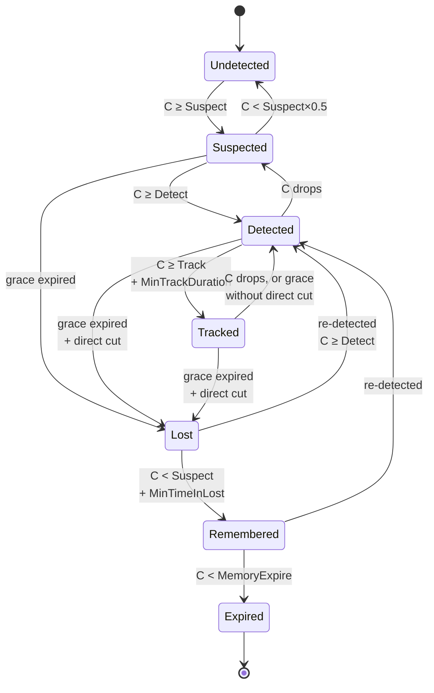

# Core Concepts

Read this page once and the rest of the system explains itself. Everything APS does revolves around six ideas: **confidence**, **fusion**, **the lifecycle**, **awareness**, **attention** and **memory**.

---

## 1. Confidence

Every sense, every tick, produces a number from **0.0 to 1.0** for every target it can perceive. That number is *how strongly this sense believes the target is there right now*.

- Vision at 5 m in bright light, target fully exposed → ~0.9
- Vision at 30 m, only a shoulder visible behind cover → ~0.15
- Hearing a footstep two rooms away through a wall → ~0.2
- Being shot → ~1.0

Confidence is not "distance" and it is not "visibility". It is a belief value that already accounts for distance falloff, angle falloff, light level, occlusion, target speed, and the sense's own quirks.

---

## 2. Fusion — how senses combine

Multiple senses do not average, and they do not multiply. **The strongest active sense sets the floor, and every additional active sense adds a small flat corroboration bonus on top.**

```
FusedConfidence = (best active sense × its weight)
                + (number of other active senses × CorroborationBonus)
```

<div class="aps-figure">
<svg viewBox="0 0 680 210" role="img" aria-labelledby="fig-fusion">
  <title id="fig-fusion">Fusion: the strongest active sense sets the floor and each extra active sense adds a flat bonus</title>
  <g class="lbl">
    <text x="100" y="45" text-anchor="end">Vision</text>
    <text x="100" y="85" text-anchor="end">Hearing</text>
    <text x="100" y="125" text-anchor="end">Smell</text>
    <text x="100" y="165" text-anchor="end">Touch</text>
  </g>
  <g class="track">
    <rect x="116" y="32" width="280" height="18" rx="4"/>
    <rect x="116" y="72" width="280" height="18" rx="4"/>
    <rect x="116" y="112" width="280" height="18" rx="4"/>
    <rect x="116" y="152" width="280" height="18" rx="4"/>
  </g>
  <g class="bar">
    <rect x="116" y="32" width="224" height="18" rx="4"/>
    <rect x="116" y="72" width="84" height="18" rx="4"/>
    <rect x="116" y="112" width="56" height="18" rx="4"/>
  </g>
  <g class="sub">
    <text x="404" y="45">0.80 · best active sense sets the floor</text>
    <text x="404" y="85">0.30 · active, adds the +0.10 bonus</text>
    <text x="404" y="125">0.20 · active, adds the +0.10 bonus</text>
    <text x="404" y="165">0.00 · silent, contributes nothing</text>
  </g>
  <line class="ln dim" x1="116" y1="184" x2="640" y2="184"/>
  <text class="lbl b" x="116" y="204">FUSED</text>
  <text class="lbl" x="200" y="204">0.80 + 2 × 0.10 = <tspan class="b">1.00</tspan></text>
</svg>
</div>

Worked example with `Corroboration Bonus = 0.1`:

| Situation | Result |
|---|---|
| Vision 0.8, nothing else | **0.80** |
| Vision 0.8 + Hearing 0.3 | **0.90** — hearing corroborates what it sees |
| Vision 0.8 + Hearing 0.3 + Smell 0.2 | **1.00** |
| Hearing 0.3 alone | **0.30** |
| Vision 0.0 (blocked) + Hearing 0.3 | **0.30** — a blind sense never drags the total down |

Two rules follow from this and they matter:

- **A silent sense costs you nothing.** Adding Smell to a guard cannot make it *worse* at seeing. Senses only ever add.
- **Corroboration is what makes multi-sense AI feel smart.** Something heard *and* half-seen is treated as more certain than either alone — which is exactly how people work.

Per-sense weights live in the profile's `Sense Weights` map. A guard dog might have `Smell → 1.5, Vision → 0.6`.

### Rise and decay

Raw fused confidence is then **smoothed** into `Smoothed Confidence`, and that is the value that drives everything downstream.

The rule that surprises people: **while any sense is active, confidence never goes down.** It rises, or it holds. Reduction happens only once every sense has gone silent.

<div class="aps-figure">
<svg viewBox="0 0 680 300" role="img" aria-labelledby="fig-curve">
  <title id="fig-curve">Smoothed confidence over time: rise while a sense is active, hold, then decay once every sense is silent</title>
  <g class="thr">
    <line x1="120" y1="118" x2="640" y2="118"/><text x="112" y="122" text-anchor="end">Track 0.60</text>
    <line x1="120" y1="173" x2="640" y2="173"/><text x="112" y="177" text-anchor="end">Detect 0.35</text>
    <line x1="120" y1="217" x2="640" y2="217"/><text x="112" y="221" text-anchor="end">Suspect 0.15</text>
  </g>
  <line class="ln" x1="120" y1="30" x2="120" y2="250"/>
  <line class="ln" x1="120" y1="250" x2="640" y2="250"/>
  <text class="sub" x="112" y="34" text-anchor="end">1.0</text>
  <text class="sub" x="112" y="254" text-anchor="end">0</text>
  <line class="ln dim" x1="340" y1="30" x2="340" y2="250" stroke-dasharray="4 5"/>
  <line class="ln dim" x1="430" y1="30" x2="430" y2="250" stroke-dasharray="4 5"/>
  <text class="lbl b" x="240" y="22" text-anchor="middle">RISE</text>
  <text class="lbl b" x="385" y="22" text-anchor="middle">HOLD</text>
  <text class="lbl b" x="535" y="22" text-anchor="middle">DECAY</text>
  <path class="curve" d="M140,250 C230,250 270,58 340,48 L430,48 C470,48 500,95 535,135 S610,228 640,239"/>
  <text class="sub" x="285" y="276" text-anchor="middle">a sense is active: confidence rises or holds, never falls</text>
  <text class="sub" x="535" y="276" text-anchor="middle">every sense silent: decay begins</text>
</svg>
<p class="aps-figure__caption">Ray-sampling noise makes the raw fused value dip a few percent between ticks. The hold phase is what stops that noise reaching the lifecycle.</p>
</div>

**Rising** (fused > smoothed, sense active):

```
Smoothed = Lerp(Smoothed, Fused, clamp(ConfidenceRiseRate × dt, 0, 1))
Smoothed += DwellRate × Fused × dt

where DwellRate = Lerp(StandingDwellRate, MovingDwellRate, clamp(TargetSpeed / 600, 0, 1))
```

**Holding** (fused ≤ smoothed, sense still active): nothing changes. This is deliberate — ray sampling noise makes fused confidence dip a few percent between ticks, and reacting to that would make the AI flicker.

**Decaying** (no sense active, or fused < 0.02):

```
no curve:   Smoothed ×= exp(-DefaultDecayExponent × SenseDecayMultiplier × dt)
with curve: Smoothed = Lerp(Smoothed, LastActiveConfidence × DecayCurve(TimeSinceLastSensed),
                            clamp(SenseDecayMultiplier × dt, 0, 1))
```

`SenseDecayMultiplier` is the `Confidence Decay Multiplier` from the **Loss** config of the sense that was last dominant.

!!! warning "Two Fusion settings do nothing in v3.0"
    `Confidence Decay Smoothing` and `Confidence Reduce Delay` are not read by any code path. Ignore them; use `Confidence Rise Rate` and the per-sense `Confidence Decay Multiplier` instead.

---

## 3. The lifecycle

Each tracked target sits in exactly one of seven states. Transitions fire Blueprint events.



| State | Meaning | Typical AI response |
|---|---|---|
| **Undetected** | Slot exists, confidence below threshold | Nothing |
| **Suspected** | Above `Suspect Threshold` (default 0.15) | Turn head, "what was that?", investigate slowly |
| **Detected** | Above `Detect Threshold` (default 0.35) | Confirmed contact — alert, take cover, call out |
| **Tracked** | Above `Track Threshold` (default 0.60) for `Min Track Duration` | Full engagement — chase, shoot, flank |
| **Lost** | Senses went silent, grace period expired | Search. **Read `Loss Reason` to know how.** |
| **Remembered** | Stale belief decaying in long-term memory | Patrol near last known position, stay alert |
| **Expired** | Below `Memory Expire Threshold` — slot freed | Fully forgotten. Return to normal patrol. |

The thresholds are all on the profile, so a jumpy civilian and a disciplined soldier can use exactly the same code with different numbers.

### Grace time and direct cut

When every sense goes quiet, the AI does not drop the target instantly. Each sense declares a **grace time** and whether it allows a **direct cut** to `Lost`:

| Sense | Grace | Direct cut | Why |
|---|---|---|---|
| Vision | 0.3 s | Yes | You ducked behind a wall — gone, immediately |
| Echolocation | 0.6 s | Yes | Sonar pulse missed |
| Touch | 0.5 s | No | Contact ended, fades out |
| Hearing | 3.0 s | No | The sound is still ringing in its ears |
| Damage | 8.0 s | No | It remembers being shot for a while |
| Smell | 20.0 s | No | The scent cloud lingers |
| Vibration | 0.0 s | No | You stopped moving — signal gone instantly |

**Direct cut = true** means it jumps straight to `Lost`. **False** means confidence decays down through `Tracked → Detected → Suspected` first, which reads as the AI gradually losing certainty. All of these are editable per archetype in the profile's **Loss** section.

### The exact transition rules

Worth knowing, because they explain most "why didn't it fire?" questions:

| From | To | Condition |
|---|---|---|
| Undetected | Suspected | `C ≥ SuspectThreshold` — also increments `Detection Count` and sets `b Was Ever Detected` |
| Suspected | Detected | `C ≥ DetectThreshold` |
| Suspected | Lost | No sense active and grace expired — **regardless of direct cut** |
| Suspected | Undetected | Sense active but `C < SuspectThreshold × 0.5` |
| Detected | Tracked | `C ≥ TrackThreshold` **and** `TimeInCurrentState ≥ MinTrackDuration` |
| Detected | Lost | No sense active, grace expired, **and direct cut** |
| Detected | Suspected | `C < SuspectThreshold − 0.04` |
| Tracked | Lost | No sense active, grace expired, **and direct cut** |
| Tracked | Detected | Grace expired without direct cut, **or** `C < DetectThreshold − 0.04` |
| Lost | Detected | Sense active **and** `C ≥ DetectThreshold` — clears loss reason and direction |
| Lost | Remembered | `C < SuspectThreshold` **and** `TimeInCurrentState ≥ MinTimeInLost` |
| Remembered | Detected | Sense active **and** `C ≥ DetectThreshold` |
| Remembered | Expired | `C < MemoryExpireThreshold` |

Two things fall out of this table:

- **A non-direct-cut sense can never jump straight to `Lost` from `Detected` or `Tracked`.** It always steps down first. That is what "gradual fade" means in practice.
- **Re-detection needs `DetectThreshold`, not `SuspectThreshold`.** A faint re-contact will not pull a target out of `Lost`.

All step-downs carry a **0.04 hysteresis margin** — confidence must fall that far *below* a threshold before the state drops. With `DetectThreshold` at 0.35, the step down happens at 0.31. This is what stops the state flickering when confidence hovers on a boundary.

---

## 4. Loss reason — the most useful thing in the plugin

When a target goes `Lost`, APS writes down **why**. Read it with **Get Loss Reason** and branch your search behavior on it.

| Loss Reason | What happened | What your BT should do |
|---|---|---|
| `Occluded` | Broke line of sight behind geometry | The AI knows exactly where you hid — go to `Last Known Position` and search the cover there |
| `OutOfRange` | Walked out of sense range | Move toward last known position and expand the search outward. Use `Get Loss Direction`. |
| `SoundFaded` | The noise stopped | Investigate the sound's area — do **not** chase |
| `ScentLost` | Scent dissipated | Follow `Loss Direction` as a scent trail; patrol the zone |
| `SensorDropout` | Signal just stopped, no geometric reason | Short investigation, then resume patrol |
| `TargetDestroyed` | The actor is gone | Clear the target entirely |
| `Unknown` | Fallback | Generic area search |

This one branch is the difference between an AI that runs to the exact corner you hid behind and an AI that wanders in a circle.

**`Get Loss Direction`** is written at every loss, not only for `OutOfRange` and `ScentLost`: it is the AI's smoothed velocity estimate for the target, normalised, at the moment contact was lost. It is the zero vector when the target was not moving — so always branch on `Is Nearly Zero` before using it.

---

## 5. Awareness level

While the lifecycle is **per target**, awareness is **per AI**. It is derived from the **top-scoring target's** smoothed confidence (see *Sort score* below), mapped onto five bands:

| Awareness | Condition |
|---|---|
| `Fully Aware` | `C ≥ Full Aware Threshold` (0.85) |
| `Alerted` | `C ≥ Track Threshold` (0.60) |
| `Suspicious` | `C ≥ Detect Threshold` (0.35) |
| `Peripheral` | `C ≥ Suspect Threshold` (0.15) |
| `Unaware` | below that, or no targets |

So awareness reuses the same thresholds as the lifecycle — tune those and awareness follows automatically.

Use it for global reactions: alert music, weapon-ready poses, HUD detection meters, lighting changes.

- **Get Awareness Level** → the AI's overall state
- **Get Awareness Level For Target** → the state relative to one specific actor
- **On AI Awareness Changed** → fires on every change with previous and new value

---

## 6. Attention — the target the AI is committed to

An AI may track eight targets at once. It can only *chase* one.

`Get Top Target` returns whichever target scores highest **this tick** — that flickers when two targets are close in score.

`Get Attention Target` returns the target the AI is **committed to**, and is the one your Behavior Tree should use. Attention is deliberately sticky:

- **Attention Stickiness Time** — the minimum seconds before the AI will even consider switching. Guard 2 s, zombie 5 s, robot 0.5 s, boss 1 s.
- **Attention Switch Threshold** — how much *better* a rival target's score must be to steal focus (default 0.2).

Attention also switches immediately if the current target goes `Lost`/`Remembered`/`Expired`, and you can force it with **Force Attention Target** — use that when the player shoots this specific AI, or trips a scripted trigger.

**On Attention Changed** gives you old and new target so the BT can cancel a pursuit and re-plan.

### Sort score

Which target *is* "top"? A weighted blend, configured in the profile's Performance section:

```
SortScore = Confidence × SortWeightConfidence      (default 0.5)
          + Recency    × SortWeightRecency         (default 0.3)
          + Proximity  × SortWeightProximity       (default 0.2)
```

Raise proximity weight for melee enemies, raise confidence weight for snipers.

---

## 7. Spatial belief — where the AI thinks you are

Even with zero senses active, APS keeps a model of the target's position.

| Value | What it is |
|---|---|
| **Last Known Position** | Position reported by the active sense with the **highest `Location Accuracy`** — not the highest confidence. A precise-but-faint gunshot beats a strong-but-vague scent. |
| **Estimated Velocity** | Smoothed velocity (EMA — see `Velocity EMA Weight`) |
| **Estimated Acceleration** | Rate of change of that velocity, smoothed at half the EMA weight |
| **Predicted Position** | While sensing: identical to last known. While lost with prediction on: `LastKnown + v·T + ½·a·T²`, where `T = clamp(PredictionHorizon, 0.1, MaxPredictionTime)`. Only extrapolates when the target was moving faster than ~10 cm/s. |
| **Uncertainty Radius** | While sensing: shrinks toward 0 in proportion to location accuracy. While lost: grows at `Uncertainty Growth Rate` cm/s up to `Max Uncertainty Radius`. With `b Velocity Scaled Uncertainty`, that rate is multiplied by `clamp(speed / 600, 1, 3)` — so a fleeing sprinter produces up to a 3× faster-growing search area. |

Uncertainty radius is your search radius. Feed it straight into an EQS query or a `GetRandomReachablePointInRadius` and the AI's search naturally widens the longer you stay hidden.

Prediction is **off by default** (`b Enable Prediction`) because for a slow patrolling guard it makes the AI feel psychic. Turn it on for pursuit-focused enemies. With it off, `Predicted Position` always equals `Last Known Position`.

---

## 8. Memory

Two layers:

**Short-term** — the smoothed confidence decaying after loss, driven by `Decay Curve` (or exponential fallback via `Default Decay Exponent`). This is the `Lost → Remembered` slide.

**Long-term** — `Long Term Memory Strength`, decaying far more slowly on its own curve. This is what makes an AI stay twitchy for a minute after an encounter.

Two knobs matter most:

- **Memory Refresh Bonus** — re-detecting a previously lost target gives a confidence head start. The AI locks back on faster the second time.
- **Min Time In Lost** — force the AI to spend at least N seconds searching before it is allowed to give up and move to `Remembered`.

### Episodic memory

Separately, the last **5 engagements** with each target are recorded. Read them with **Get Recent Episodes** or **Get Last Episode**:

| Field | Use |
|---|---|
| `How Lost` | The loss reason for that engagement |
| `State When Lost` | Was it `Tracked` or only `Detected`? |
| `Location When Lost` | Exact world position |
| `AI Camera Direction` | Which way the AI was facing — reveals its own blind spot |
| `Target Flee Direciton` | Which way you ran |
| `Engagement Duration` | **Cumulative** time this target has ever spent in `Tracked` — not the length of this one engagement. It only grows across episodes. |
| `Peak Threat Level` | How bad it got |
| `World Time Stamp` | For "was this recent?" checks |

The payoff: *"the last three times I lost this player, they were `Occluded` within 200 cm of the same pillar"* → bias the search there first.

---

## 9. Threat and emotion

**Threat** is a composite score per target, mapped onto `None / Low / Medium / High / Critical`:

```
ThreatScore = SmoothedConfidence            × ThreatWeight_Confidence      (0.35)
            + clamp(DamageReceived / 100)   × ThreatWeight_DamageReceived  (0.30)
            + (ActiveSenses / 8)            × ThreatWeight_Senses          (0.15)
            + RelationshipModifier          × ThreatWeight_Relationship    (0.10)
            + ApproachModifier              × ThreatWeight_Approach        (0.10)
```

Four details that matter when tuning:

- **100 points of damage saturates the damage term.** Scale your damage numbers to match, or reweight.
- **Sense corroboration divides by 8** — the maximum sense slots, not the number of senses this AI actually owns. A two-sense guard can never contribute more than `0.25` to that term.
- **Relationship modifier:** `Feared` 1.5 · `HighValue` 1.2 · `Enemy` 1.0 · `Unknown` 0.5 · `Neutral` 0.3 · `Friendly`/`Teammate` 0.
- **Approach modifier is effectively a constant in v3.0** — `1.0` while `Detected`/`Tracked`, `0` otherwise. With the default weight of 0.10 it acts as a flat bonus for having an active contact rather than a measure of closing speed.

`Friendly` and `Teammate` targets short-circuit to threat `None` with a score of 0, however confident the AI is and however much damage it has taken. So do `Expired` records.

While a target is unsensed, the accumulated damage term decays by `Threat Damage Decay Rate` and zeroes out once it falls below 1 point.

**Emotion** is five independent 0–1 channels on the AI itself, each with its own rise rate, decay rate and cap:

| Channel | Rises when | Decays when |
|---|---|---|
| **Fear** | Damage received from any target, **or** more than 2 active targets, **or** any `Critical` threat, **or** `Fear Input > 0` | No `High`+ threat **and** zero active targets |
| **Aggression** | Damage received, **or** any target `Tracked`, **or** any `High`+ threat | Zero active targets **and** no damage |
| **Curiosity** | A `Suspected` target, especially one heard but not seen | Any target reaches `Tracked`/`Lost`/`Expired`, or no targets |
| **Alertness** | Any target `Detected` or `Tracked` | Otherwise — always ticking down |
| **Panic** | `Fear > 0.8` with more than one active target, **or** `Fear Input > 0.9` | `Fear < 0.5` **and** `Fear Input < 0.3` |

`Set Fear Input` scales the fear rise rate by `(1 + FearInput)` as well as forcing it to rise, so it is both a trigger and an amplifier.

The **Dominant Emotion** is the highest channel strictly above `Emotion Active Threshold` — `Calm` if none qualify. `Panic` above `Panic Override Threshold` overrides everything and reports `Panicked`. Ties resolve in the order Fear → Aggression → Curiosity → Alertness.

Set every emotion cap to 0 on a robot archetype and it becomes emotionless without touching any code.

---

## 10. The tick

APS does **not** run every frame. The component ticks, but the perception pipeline only runs every `Base Update Interval` seconds (default 0.1 s), multiplied by the agent's LOD tier and by any quality profile. The tier comes from a significance score rather than raw distance; see [How It Works](how-it-works.md#significance-and-lod).

Order of operations per perception tick:

1. Gather candidate targets (every Pawn in max sense range, plus registered non-Pawn actors) — refreshed on its own slower cadence
2. `PreTick` every sense — accumulators, persistent contacts, health sampling
3. Owner-internal senses fire their events (Pain)
4. For each target: evaluate every sense → apply pain degradation → fuse → apply fairness rules → apply scripted evidence
5. Memory engine: smoothing, decay, lifecycle transitions
6. Spatial belief update
7. Threat assessment, relationship resolution
8. Player behavior model update
9. Emotion update, awareness update, attention update, squad auto-share
10. Fire delegates and listener events
11. Ledger maintenance (on its own interval)

Perception runs **server-side only** and is skipped entirely on clients.

---

## 11. Beliefs about places

A belief does not have to be about an actor. A gunshot with no known shooter, a body, a forced lock: these are beliefs about a **place**, and they live in the same ledger with the same lifecycle and their own confidence.

- `Emit Sound At Location` and discovered [evidence](evidence-and-search.md) create them automatically.
- **Report Location Belief** (`Location`, `Tag`, `Confidence`, `Accuracy`) creates one from your own logic. Reports close together with the same tag merge into one belief rather than piling up.
- **On Location Belief Changed** fires on every lifecycle transition with the location, tag, new state and confidence.
- **Get Strongest Location Belief** and **Get Location Beliefs** read them back.

Place beliefs are deliberately kept out of attention, awareness and `On AI All Clear`, so a noise cannot steal focus from a person or stop the AI standing down. Before this existed, an anonymous sound was scored against whichever actor was under evaluation, and one explosion made every bystander in earshot a suspect.

---

