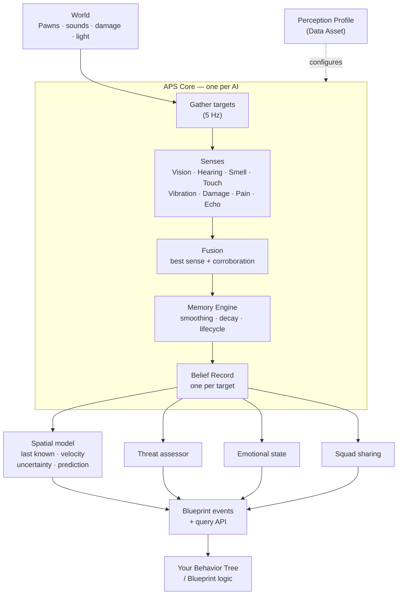
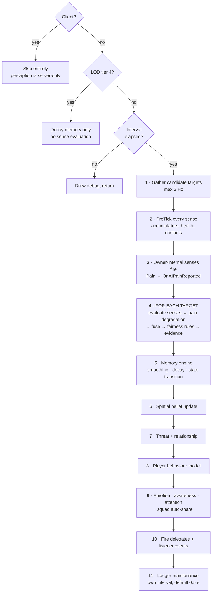
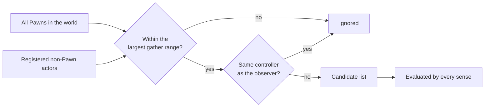

# How It Works

<div class="aps-meta" markdown>

**For:** developers who want the mental model before they start tuning, and anyone extending the plugin · **Read this if:** you have hit behaviour you cannot explain from the settings alone

</div>

---

## The system in one picture



The important shape: **senses produce numbers, the core turns numbers into belief, belief fires events, and your code decides what to do.** APS never moves your AI or makes a behavioural decision for you.

---

## The perception tick

The component ticks every frame, but the pipeline only *runs* every `Base Update Interval` seconds (default 0.1 s), scaled by distance LOD.



Two consequences worth internalising:

- **Your events fire on the perception tick, not the frame tick.** At the default 0.1 s interval, an event can be up to 100 ms late. That is fine for AI behaviour and is why the plugin scales; it is not fine if you expected frame-accurate reactions.
- **Fusion happens after pain degradation.** A blinded AI's vision contributes nothing to the fused value, and its sense is marked inactive — which is what lets the memory system correctly start losing you.

---

## Significance and LOD

Every subsystem tick, each agent is scored for **significance**, 0 to 1, and the score picks its LOD tier. No setup. The built-in score is:

```
Significance = 0.6 × (1 − distanceToNearestViewer / 30000 cm)
             + 0.55 if the agent is Suspicious or more alert
             + 0.25 × (awareness level / 4)
```

| Score | Tier | Perception interval | Behaviour |
|---|---|---|---|
| ≥ 0.75 | **0** | ×1 | Full rate |
| ≥ 0.50 | **1** | ×2 | |
| ≥ 0.30 | **2** | ×5 | |
| ≥ 0.15 | **3** | ×20 | Barely evaluating. Component tick throttled to 0.1 s |
| below | **4** | — | **Suspended** unless the crowd tier is on. Memory still decays. Component tick throttled to 0.25 s |

Two things follow from the weights, and both surprise people:

- **An idle agent never reaches tier 0.** With no engagement and no awareness the score tops out at 0.6, so an unaware guard runs at tier 1 out to 50 m, tier 2 to 150 m, tier 3 to 225 m, and is suspended beyond that. Half rate is the resting state.
- **An engaged agent almost never drops below tier 0.** Once it is Suspicious or more alert, the engagement bonus keeps it at full rate out to roughly 260 m, and at tier 1 beyond that. A chase does not stutter because the camera is far away.

*Viewer* means every local player camera, so split-screen and listen servers work. A dedicated server has no viewer and scores every agent as if it were at zero distance.

Tiers also gate sounds and stimuli: a sound whose `Max LOD Tier` is 1 is never even considered by a tier-2 agent. Setting sensible LOD tiers on sound assets is a free, large saving.

Replace the score with your own **APS Significance Policy** when your game has a different idea of what matters. Setting a tier directly does not stick; the subsystem rewrites it every pass. See [Scale & Crowds](scale-and-crowds.md).

---

## Where state lives

| State | Lives in | Lifetime |
|---|---|---|
| Per-target belief | `FBeliefRecord` in the ledger | Until `Expired` and the slot is reused |
| Per-sense accumulators | The sense object itself | Component lifetime |
| Emotion | `FEmotionalState` on the component | Component lifetime |
| Squad membership & roles | The world subsystem | World lifetime |
| Environment (light, wind, weather) | The world subsystem | World lifetime |
| Never-search zones | The world subsystem | World lifetime |
| Player behaviour models | The component, keyed by target | Component lifetime |
| Memory store | The component, keyed by subject | Component lifetime, bounded by `Memory Retention Seconds` |
| Scripted evidence | The component, keyed by target | Until it expires or is removed. Deliberately kept when a target leaves the ledger, so a disguise applied at level start survives |
| Place beliefs | `FBeliefRecord` in the ledger, like any target | Until `Expired` |
| Recorded frames | The component | The recording window |

**The ledger is pre-allocated** at `Max Tracked Targets` and slots are reused, so steady-state perception performs no heap allocation.

When the ledger is full, a new target evicts the lowest-scoring `Expired` or `Remembered` slot. If none exists, it may evict an active slot with a worse sort score. That is why `Max Tracked Targets` matters: set it too low in a crowd and the AI churns targets.

---

## How a target becomes visible to the system



- **Candidates come from a broadphase grid** the subsystem rebuilds five times a second: every Pawn plus every registered actor, bucketed in 15 m cells. An agent asks for the cells around it instead of walking the world, so gather cost no longer scales with agents times pawns. `aps.UseSpatialIndex 0` restores the exhaustive scan for A/B testing.
- **Pawns are automatic.** No registration needed.
- **Non-Pawn actors** must call `Register Perceivable Actor`, or carry an APS Target Component with auto-register on.
- **Gather range** is the largest of `Vision Max Range`, `Hearing Max Range`, and each sense's *declared* maximum. Vibration declares 800 cm and Echolocation 2000 cm regardless of their profile settings — so a long-range vibration build needs another sense reaching far enough to pull targets in.
- Targets already in the ledger stay in the candidate list even when out of range, so memory decays coherently instead of freezing.

---

## The sense contract

Every sense — built-in or yours — implements the same four-stage contract. `PerceptionCore` never casts to a concrete sense type, which is why adding one requires no changes anywhere else.

| Stage | Called | Purpose |
|---|---|---|
| `PreTick` | Once per AI | Accumulators, persistent contacts, health sampling |
| `Evaluate` | Once per target | Produce confidence, location, accuracy |
| `GetSenseDelegatePayload` | If active | Which built-in event to fire |
| `PostTickFlush` | After all targets | Clear per-tick caches |

A sense also declares its loss behaviour (grace time, direct cut, loss reason), its maximum sensing range and the stimulus tags it subscribes to. A Blueprint subclass of `Sense Unit` sets all of those in its class defaults and overrides `Evaluate` and `Get Sense ID`. Reacting to a stimulus, firing a built-in sense event, and event-driven or owner-internal senses are C++ only. See [Custom Senses](custom-senses.md).

---

## What the model looks like

The three pictures that explain most behaviour — how senses fuse, how confidence rises and decays, and the lifecycle state machine — live in [Core Concepts](core-concepts.md). This page covers the machinery underneath them.

Two properties of the machinery are worth stating here because they explain surprises:

- **Fusion runs after pain degradation**, so a suppressed sense contributes nothing *and* is marked inactive — which is what lets the memory system correctly start losing the target rather than freezing on a stale detection.
- **The memory engine is stateless.** It operates on a belief record passed by reference and holds nothing of its own, which is why swapping profiles at runtime is safe and why the same code serves every archetype.

---

## Threading and cost

- Everything runs on the **game thread** by default. `b Async Vision Traces` issues visibility traces asynchronously and reads them one evaluation later; it falls back to synchronous whenever surface transmission or more than one occlusion channel is configured.
- The dominant cost is **line traces**: `sample points × occlusion channels`, per target, per evaluation.
- Sound emission is O(agents) with a squared-distance cull first, so distant agents cost almost nothing.
- Candidate gathering is a grid lookup, not a world walk.
- Idle AI with no targets in range cost a distance check and an early out.
- `Max Perception Updates Per Frame` on the subsystem caps how many agents run a full pass per frame. The rest defer to the next frame with their accumulated time intact.

Full budget guidance is in [Performance](performance.md).

---

## Extension points

| You want to | Do this |
|---|---|
| Add a sense | Subclass `SenseUnit` (Blueprint or C++) |
| React to a custom stimulus | `Emit Stimulus` + a C++ sense with `GetStimulusTags` |
| Change how targets are scored | Sort weights in the profile's **Performance** section |
| Change confidence directly | `Set Target Confidence` (raises only) |
| Replace perception wholesale for a state | `Set Profile` at runtime |
| Read everything about a target | `Get Belief Data` |
| Change how senses fuse, how threat is scored, or which target gets attention | A [policy](policies.md) class on the profile |
| Tell APS where health or posture lives | An [adapter](adapters.md) interface |
| Lower, cap or clear belief from script | `Add Target Evidence` |
| Scale cost without resetting belief | A quality profile via `Set Quality Profile` |
| Decide which agents deserve CPU | An [APS Significance Policy](scale-and-crowds.md) on the subsystem |

---

