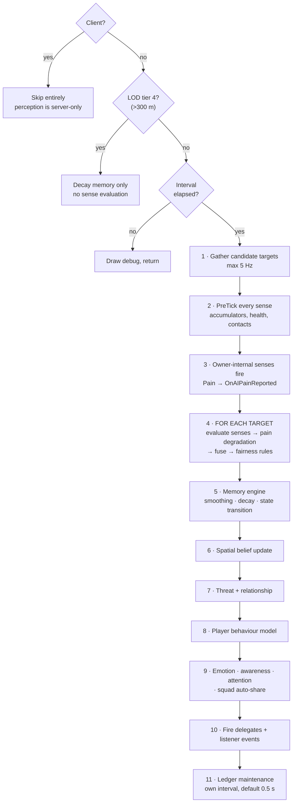
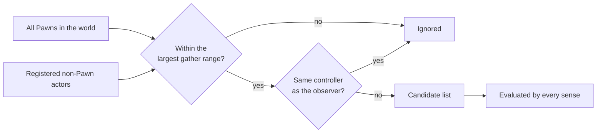

# How It Works

**For:** developers who want the mental model before they start tuning, and anyone extending the plugin.
**Read this if:** you've hit behaviour you can't explain from the settings alone.

---

## The system in one picture

The important shape: **senses produce numbers, the core turns numbers into belief, belief fires events, and your code decides what to do.** APS never moves your AI or makes a behavioural decision for you.

---

## The perception tick

The component ticks every frame, but the pipeline only *runs* every `Base Update Interval` seconds (default 0.1 s), scaled by distance LOD.

Two consequences worth internalising:

- **Your events fire on the perception tick, not the frame tick.** At the default 0.1 s interval, an event can be up to 100 ms late. That is fine for AI behaviour and is why the plugin scales; it is not fine if you expected frame-accurate reactions.
- **Fusion happens after pain degradation.** A blinded AI's vision contributes nothing to the fused value, and its sense is marked inactive — which is what lets the memory system correctly start losing you.

---

## Distance LOD

The subsystem assigns every agent a tier from its distance to the player camera, and the tier scales the tick interval. No setup.

| Tier | Distance | Interval | Behaviour |
|---|---|---|---|
| **0** | < 30 m | ×1 | Full rate |
| **1** | 30–80 m | ×2 | |
| **2** | 80–150 m | ×5 | |
| **3** | 150–300 m | ×20 | Barely evaluating |
| **4** | > 300 m | — | **Suspended.** Memory still decays. |

Tiers also gate sounds and stimuli: a sound whose `Max LOD Tier` is 1 is never even considered by a tier-2 agent. Setting sensible LOD tiers on sound assets is a free, large saving.

---

## Where state lives

| State | Lives in | Lifetime |
|---|---|---|
| Per-target belief | `FBeliefRecord` in the ledger | Until `Expired` and the slot is reused |
| Per-sense accumulators | The sense object itself | Component lifetime |
| Emotion | `FEmotionalState` on the component | Component lifetime |
| Squad membership & roles | The world subsystem | World lifetime |
| Environment (light, wind, weather) | The world subsystem | World lifetime |
| Never-search zones | The world subsystem | World lifetime |
| Player behaviour models | The component, keyed by target | Optionally saved to `Saved/APS/` |

**The ledger is pre-allocated** at `Max Tracked Targets` and slots are reused, so steady-state perception performs no heap allocation.

When the ledger is full, a new target evicts the lowest-scoring `Expired` or `Remembered` slot. If none exists, it may evict an active slot with a worse sort score. That is why `Max Tracked Targets` matters: set it too low in a crowd and the AI churns targets.

---

## How a target becomes visible to the system

- **Pawns are automatic.** No registration needed.
- **Non-Pawn actors** must call `Register Perceivable Actor`, or carry an APS Target Component with auto-register on.
- **Gather range** is the largest of `Vision Max Range`, `Hearing Max Range`, and each sense's *declared* maximum. Vibration declares 800 cm and Echolocation 2000 cm regardless of their profile settings — so a long-range vibration build needs another sense reaching far enough to pull targets in.
- Targets already in the ledger stay in the candidate list even when out of range, so memory decays coherently instead of freezing.

---

## The sense contract

Every sense — built-in or yours — implements the same four-stage contract. `PerceptionCore` never casts to a concrete sense type, which is why adding one requires no changes anywhere else.

| Stage | Called | Purpose |
|---|---|---|
| `PreTick` | Once per AI | Accumulators, persistent contacts, health sampling |
| `Evaluate` | Once per target | Produce confidence, location, accuracy |
| `GetSenseDelegatePayload` | If active | Which built-in event to fire |
| `PostTickFlush` | After all targets | Clear per-tick caches |

A sense also declares its loss behaviour (grace time, direct-cut, loss reason) and its maximum sensing range. Blueprint subclasses can override `Evaluate` and `Get Sense ID`; the rest is C++ only. See [Custom Senses](custom-senses.md).

---

## What the model looks like

The three pictures that explain most behaviour — how senses fuse, how confidence rises and decays, and the lifecycle state machine — live in [Core Concepts](core-concepts.md). This page covers the machinery underneath them.

Two properties of the machinery are worth stating here because they explain surprises:

- **Fusion runs after pain degradation**, so a suppressed sense contributes nothing *and* is marked inactive — which is what lets the memory system correctly start losing the target rather than freezing on a stale detection.
- **The memory engine is stateless.** It operates on a belief record passed by reference and holds nothing of its own, which is why swapping profiles at runtime is safe and why the same code serves every archetype.

---

## Threading and cost

- Everything runs on the **game thread**. There is no async trace path.
- The dominant cost is **line traces**: `sample points × occlusion channels`, per target, per evaluation.
- Sound emission is O(agents) with a squared-distance cull first, so distant agents cost almost nothing.
- Idle AI with no targets in range cost a distance check and an early out.

Full budget guidance is in [Performance](performance.md).

---

## Extension points

| You want to | Do this |
|---|---|
| Add a sense | Subclass `SenseUnit` (Blueprint or C++) |
| React to a custom stimulus | `Emit Stimulus` + a C++ sense with `GetStimulusTags` |
| Change how targets are scored | Sort weights in the profile's **Performance** section |
| Change confidence directly | `Set Target Confidence` (raises only) |
| Replace perception wholesale for a state | `Set Profile` at runtime |
| Read everything about a target | `Get Belief Data` |

---

