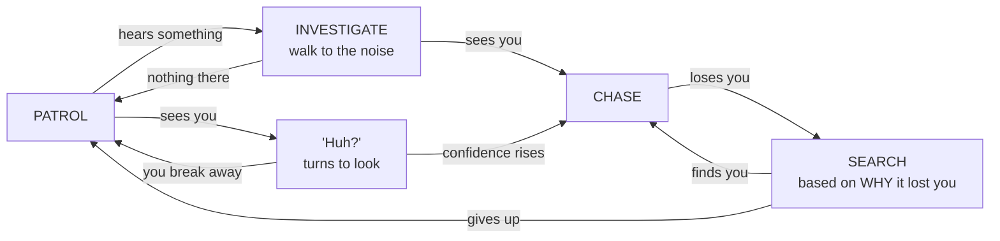

# Tutorial: A Complete Guard

<div class="aps-meta" markdown>

**Time:** about 45 minutes · **You'll need:** [Install & Your First AI](getting-started.md) done, a level with some cover, and a player character you can walk around with · **No C++**

</div>

> **▶ Video walkthrough** — *Build a complete guard (20 min).* Coming soon.
> When it is live, delete this block and uncomment the embed below.

<!-- VIDEO EMBED — replace VIDEO_ID with your YouTube id, then delete the comment markers
<div class="video">
  <iframe src="https://www.youtube.com/embed/VIDEO_ID" title="Build a complete guard" allowfullscreen></iframe>
</div>
-->

---

## What you're building

By the end the guard runs a full perception loop, and every step of it is something you can watch happen:



The interesting part is `SEARCH`. A guard that always runs the same search looks stupid. This one checks the cover object you actually hid behind when it lost sight of you, and investigates the *area* — without chasing — when it only lost a sound.

---

## Part 1 — The profile (5 min)

Content Browser → right-click → **Miscellaneous → Data Asset** → **PerceptionProfile** → name it `DA_Profile_Guard`.

Open it and set these. Everything not listed stays at its default.

| Section | Setting | Value |
|---|---|---|
| Ranges | `Vision Max Range` | `2200` |
| Ranges | `Hearing Max Range` | `1800` |
| Detection | `Vision Half Angle Deg` | `55` |
| Detection \| Cones | `b Enable Peripheral Cone` | ✅ |
| Detection \| Eyes | `Eye Turn Rate Deg Per Sec` | `200` |
| Awareness | `Suspect Threshold` | `0.18` |
| Awareness | `Detect Threshold` | `0.40` |
| Awareness | `Track Threshold` | `0.65` |
| Loss | `Vision Loss → Grace Time` | `0.8` |
| Memory | `Min Time In Lost` | `8.0` |
| Fairness | `First Spot Reaction Time` | `0.4` |
| Fairness | `Telegraph Threshold` | `0.22` |

**Why these:** `Grace Time` at 0.8 means a thin pillar doesn't instantly erase you — the guard keeps staring at where you were. `Min Time In Lost` at 8 forces it to actually search rather than shrug and walk off. The two Fairness values are what make detection feel readable rather than arbitrary.

---

## Part 2 — The guard actor (5 min)

Open your AI character Blueprint (`BP_Guard`).

**Add Component ×2:**
- **APS Core** → Details → `Profile` = `DA_Profile_Guard`
- **APS Perception Listener**

On the APS Core, also tick `Debug Settings → b Enabled`. Leave `Agent Scope` on its default; the overlay stays readable once you add a second guard.

**On your player character:** Add Component → **APS Target Component**. Leave everything default.

!!! success "Checkpoint 1"
    Press Play and walk into the guard's view. You should see a vision cone drawn from the guard's eyes and a status panel in the top-left corner reading something like `DETECTED 62%`, with a bar per sense underneath. If you see nothing, the profile is not assigned. That is the cause nine times out of ten.

---

## Part 3 — Make your footsteps audible (5 min)

Hearing does nothing until you emit sound. This is deliberate: the guard hears exactly what you decide is audible.

**1.** Content Browser → **Data Asset → SoundTypeDefinition** → `DA_Sound_Footstep`:

| Field | Value |
|---|---|
| `Sound Name` | `Footstep` |
| `Category` | `Enemy` |
| `Alert Level` | `Normal` |
| `Base Loudness` | `1.0` |
| `Max Range` | `900` |
| `Max LOD Tier` | `1` |

**2.** In your player's walk/run animation, add an anim notify named `Footstep`.

**3.** In the player Blueprint:

```
Event AnimNotify_Footstep
  └─► Emit Sound
        World Context : Self
        Source        : Self
        Sound Type    : DA_Sound_Footstep
```

!!! success "Checkpoint 2"
    Stand behind a wall, out of sight, and walk on the spot. The `HEARING` row in the panel should climb above 0% and the state chip should reach `SUSPECTED`. Stop moving and watch it decay. If Hearing stays at 0%, your notify is not firing. Test it with a Print String first.

---

## Part 4 — Push perception into the Blackboard (10 min)

The pattern: **events write to the Blackboard, the Behavior Tree reads it.** Never poll APS from a BT service every tick when an event already tells you.

### 4a. Create the Blackboard

New **Blackboard** asset → `BB_Guard`. Add these keys:

| Key | Type |
|---|---|
| `TargetActor` | Object *(base class: Actor)* |
| `bHasTarget` | Bool |
| `LastKnownPosition` | Vector |
| `SearchRadius` | Float |
| `LossReason` | Enum → `ELossReason` |
| `LossDirection` | Vector |
| `LastCoverActor` | Object *(base class: Actor)* |
| `InvestigateLocation` | Vector |
| `PatrolPoint` | Vector |

### 4b. Wire the events

In `BP_Guard`'s Event Graph. Get the Blackboard once and promote it to a variable to keep the graph readable:

```
Event Begin Play
  └─► Get Controller → Cast to AIController → Get Blackboard
        └─► Promote to variable "BB"
```

#### Attention changed → set the target

```
Event On Attention Changed (Old Target, New Target)
  ├─► BB → Set Value as Object ("TargetActor", New Target)
  └─► BB → Set Value as Bool   ("bHasTarget", New Target → Is Valid)
```

**Use this, not `On AI Detect`, for the target key.** Attention is sticky — it won't thrash between two equally-scored targets and force the tree to re-plan every tick.

#### Telegraph → the "huh?" moment

```
Event On AI Telegraph (Target, Confidence)
  ├─► Play Sound at Location (your "hmm?" cue)
  └─► Get Controller → Cast to AIController → Set Focus (Target)
```

#### Heard something → investigate, but don't interrupt a chase

```
Event On AI Hear (Location, Loudness, Sound Type Name)
  └─► Branch: BB → Get Value as Bool ("bHasTarget") == false
        True → BB → Set Value as Vector ("InvestigateLocation", Location)
```

#### Lost the target → set up the search

This is the important one.

```
Event On AI Lost (Target, Last Known, Predicted, Last Cover Actor)
  └─► Sequence
        ├─ BB → Set Value as Vector ("LastKnownPosition", Last Known)
        ├─ BB → Set Value as Object ("LastCoverActor",    Last Cover Actor)
        ├─ BB → Set Value as Float  ("SearchRadius",
        │                             APS Core → Get Uncertainty Radius (Target))
        ├─ BB → Set Value as Enum   ("LossReason",
        │                             APS Core → Get Loss Reason (Target))
        └─ BB → Set Value as Vector ("LossDirection",
                                      APS Core → Get Loss Direction (Target))
```

#### Gave up → clear everything

```
Event On AI Forget (Target)
  ├─► BB → Set Value as Bool ("bHasTarget", false)
  ├─► BB → Clear Value ("TargetActor")
  ├─► BB → Clear Value ("LastKnownPosition")
  └─► Get Controller → Cast to AIController → Clear Focus (Gameplay)
```

!!! success "Checkpoint 3"
    Add a temporary `Print String` to each of the five events. Play, get spotted, then break line of sight and hide. You should see the sequence
    `Telegraph → Detect → Track → Lost → (8+ seconds) → Remember → Forget`.

    If `Lost` fires the instant you step behind cover, your `Vision Loss → Grace Time` did not save. If `Forget` fires immediately after `Lost`, check `Min Time In Lost`.

---

## Part 5 — The Behavior Tree (15 min)

New **Behavior Tree** → `BT_Guard`, set its Blackboard to `BB_Guard`.

### The shape

```
Root
└── Selector
    ├── [Blackboard: bHasTarget is set]  ────────── CHASE
    ├── [Blackboard: LastKnownPosition is set]  ─── SEARCH
    ├── [Blackboard: InvestigateLocation is set]  ─ INVESTIGATE
    └── PATROL
```

A Selector runs its children left to right and stops at the first that succeeds. Because the decorators get progressively less specific, the guard naturally prioritises: chase beats search, search beats investigate, investigate beats patrol.

### CHASE branch

```
Sequence
├── Task: Move To         (Blackboard Key: TargetActor, Acceptable Radius: 150)
└── Task: Wait            (0.5)
```

Add a **Blackboard** decorator on the Sequence: Key `bHasTarget`, Key Query `Is Set`, and set **Observer Aborts → Both**. That last part matters — it lets the tree bail out of a chase the moment the target is lost.

### SEARCH branch — the part that makes it look smart

```
Selector  [decorator: LastKnownPosition Is Set, Observer Aborts: Lower Priority]
│
├── Sequence  [decorator: LossReason == Occluded]
│   ├── Move To (LastKnownPosition)
│   ├── Move To (LastCoverActor)          ← the actual object you hid behind
│   ├── Wait (2.0)
│   └── Task: Search Step  ×2
│
├── Sequence  [decorator: LossReason == SoundFaded]
│   ├── Move To (LastKnownPosition)
│   ├── Wait (3.0)
│   └── Task: Give Up                     ← investigate, don't chase
│
├── Sequence  [decorator: LossReason == OutOfRange]
│   ├── Move To (LastKnownPosition)
│   ├── Task: Move Along Loss Direction
│   └── Task: Search Step  ×3
│
└── Sequence                              ← default
    ├── Move To (LastKnownPosition)
    └── Task: Search Step  ×3
```

For the `LossReason` decorators use **Blackboard → Key: LossReason, Key Query: Is Equal To**, and pick the enum value.

#### Task: Search Step

New **BTTask Blueprint** → `BTT_SearchStep`:

```
Event Receive Execute AI
  └─► Get Random Reachable Point In Radius
        Origin = BB "LastKnownPosition"
        Radius = BB "SearchRadius"
  └─► AI Move To (that point)
        On Success → Wait 1.0 → Finish Execute (Success)
        On Fail    → Finish Execute (Success)     // don't stall the tree
```

`SearchRadius` grows the longer you stay hidden, so repeating this task naturally spirals the search outward. No timer logic of your own.

#### Task: Move Along Loss Direction

```
Event Receive Execute AI
  └─► Branch: BB "LossDirection" → Is Nearly Zero
        True  → Finish Execute (Success)          // target wasn't moving
        False → AI Move To (LastKnownPosition + LossDirection × 600)
                  → Finish Execute (Success)
```

#### Task: Give Up

```
Event Receive Execute AI
  ├─► BB → Clear Value ("LastKnownPosition")
  ├─► BB → Clear Value ("InvestigateLocation")
  └─► Finish Execute (Success)
```

### INVESTIGATE branch

```
Sequence  [decorator: InvestigateLocation Is Set, Observer Aborts: Lower Priority]
├── Move To (InvestigateLocation)
├── Wait (3.0)
└── Task: Give Up
```

### PATROL branch

Whatever you already have. If you have nothing:

```
Sequence
├── Task: Pick Patrol Point     (Get Random Reachable Point In Radius around home, → BB PatrolPoint)
├── Move To (PatrolPoint)
└── Wait (2.0)
```

### Run the tree

In `BP_Guard`'s AI Controller:

```
Event On Possess
  └─► Run Behavior Tree (BT_Guard)
```

!!! success "Checkpoint 4"
    Play. The guard should patrol. Walk into view: it turns and says "huh?", then commits and chases. Break line of sight behind a crate. It should go to the crate, look around, then spiral outward. After about 8 seconds it gives up and returns to patrol.

    Now hide *and stay still* somewhere it never had sight of you, and just make a noise. It should walk to the noise, look around for 3 seconds, and go back to patrol **without** chasing. That difference, chasing when it saw you and investigating when it only heard you, is the whole point.

---

## Part 6 — Watch what it's thinking (5 min)

Bind these to keys in your player controller for live inspection:

```
Key 1 → APS Core → Debug Cycle Display Mode
Key 2 → APS Core → Debug Toggle Freeze Snapshot
Key 3 → APS Core → Debug Toggle Pause
```

Then cycle through the modes while playing:

| Mode | What to look for |
|---|---|
| **Sense** | Which sense is driving detection, and the fused vs smoothed values |
| **Memory** | Time since sensed, uncertainty radius growing while you hide |
| **Brain** | Threat level, dominant stimulus, encounter count |
| **Delegates** | Which event fired last and when — settles "is my BP not bound, or did it never fire?" |

Freezing the snapshot mid-chase and reading the Sense panel is the fastest way to understand why the guard did what it did.

For a written answer instead of a panel, print **Explain Perception** (Player). It lists every sense and says why each one is or is not contributing. See [Explaining & Recording](explaining-and-recording.md).

---

## What to change next

You now have the full loop. Each of these is a small edit with a big behavioural change:

| Try this | Effect |
|---|---|
| `Min Time In Lost` → `20` | A far more persistent, tense guard |
| `b Keyhole Vision` ✅ | You can slip past at distance but not up close |
| Add `Sense: Vibration`, `Vibration Min Speed` `150` | Crouch-walking becomes meaningful |
| Add a second guard, `Set Squad ID` on both, `b Auto Share On Detect` ✅ | One spots you, both converge |
| `First Spot Reaction Time` → `0.0` | Feel how much less fair it becomes |
| Register a never-search zone around a room | A guaranteed safe space (see the recipe) |

Ready-made settings for other archetypes — dog, zombie, sniper, horror stalker — are in the [Archetype Cookbook](archetype-cookbook.md).

---

